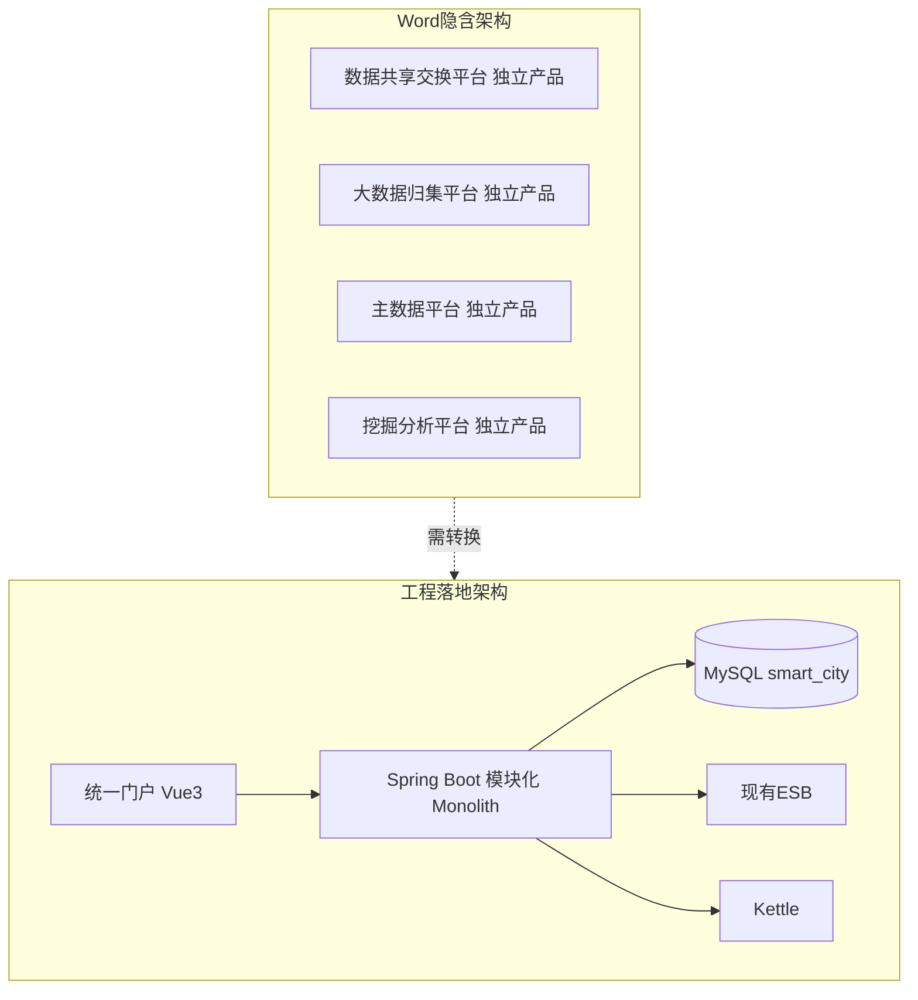
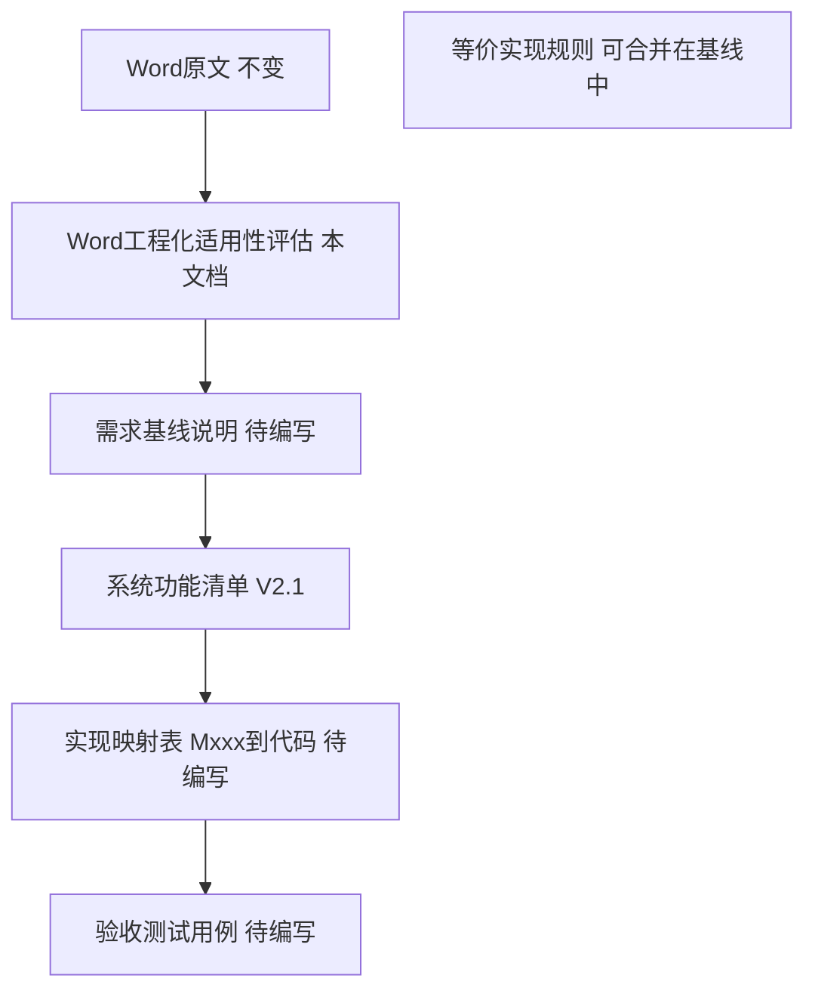

# 《承德高新区智慧城市基础平台建设》Word 文档 — 工程化适用性评估

| 属性 | 说明 |
|------|------|
| **文档编号** | **D01** |
| **评估对象** | 《承德高新区智慧城市基础平台建设(1).docx》 |
| **文本依据** | [`_doc_extract.txt`](_doc_extract.txt)（Word 全文提取，约 6.9 万字） |
| **评估日期** | 2026-06-22 |
| **评估目的** | 判断该 Word 能否作为软件开发的基础依据；明确与软件工程化落地的差异；给出是否修改、如何修改、后续文档链建议 |
| **关联文档** | [`D05-系统功能清单.md`](D05-系统功能清单.md) V2.6；索引见 [`D00-文档索引与编号规范.md`](D00-文档索引与编号规范.md) |

---

## 一、评估结论（Executive Summary）

### 1.1 总体结论

| 问题 | 结论 |
|------|------|
| Word 能否作为软件开发依据？ | **可以，但仅适合作为「建设目标与能力范围」的上位依据，不能直接作为编码规格说明（SRS）或任务分解的唯一输入。** |
| 能否原样工程落地？ | **不能。** 按字面理解为多套独立商业产品（自研 ESB、Web ETL 设计器、多租户 SaaS、百万级分布式调度等）同时建设，在单团队、MySQL 单体、政务云 VM 自管中间件条件下**不可行或成本/周期不可控**。 |
| 是否需要修改 Word？ | **不建议改甲方原件**；应新增 **《需求基线说明》** 与 **《等价实现规则》**，在合同/验收附件中与 Word 并列，书面约定差异。 |
| 正确后续顺序 | ① 本评估 → ② 需求基线说明 → ③ 功能清单（已有 V2.1，需标注为评估后产物）→ ④ 实现映射表 → ⑤ 开发 |

### 1.2 一句话定位

> Word 文档 = **「要建成什么样」的可行性/方案描述**；  
> 工程落地 = **「用一套统一平台 + 集成 + 分期」实现等价能力**；  
> 二者之间必须有一层 **工程化转换与书面约定**，否则开发阶段必然反复扯皮。

---

## 二、评估方法与范围

### 2.1 评估维度

| 维度 | 说明 |
|------|------|
| 文档性质 | 方案/投标级 vs 可测试 SRS |
| 范围与边界 | 四大平台是四套系统还是一套系统的四个域 |
| 技术假设 | 中间件、部署、集成 vs 自研 |
| 一致性 | 重复描述、术语冲突（租户/机构） |
| 可测试性 | 能否写出通过/不通过验收用例 |
| 非功能 | 性能、安全、部署、运维 |
| 工程缺失 | Word 未写但开发必需的内容 |

### 2.2 已确认的工程约束（评估前提）

以下为用户/项目组已明确决策，本评估以此为落地边界：

- MySQL 8.0+ 自部署；政务云 VM；中间件手工安装；**不用 Docker**
- **自建 JWT 登录**；**不做多租户**
- **ESB 不对接自研**，对接现有 ESB 系统
- **ETL 集成 Pentaho Kettle**（GitHub 开源）
- 代码暂不同步 Gitee

---

## 三、Word 文档性质分析

### 3.1 文档类型判定

| 特征 | Word 文档表现 | 工程含义 |
|------|---------------|----------|
| 篇幅与结构 | 约 6.9 万字；四大平台、24+ 子系统、120+ 功能模块叙述 | 覆盖**广度**足够，适合立项与验收范围界定 |
| 描述方式 | 「提供…支持…包括…」能力列举为主 | 偏**产品功能清单**，非接口/表结构/状态机 |
| 产品参照 | 多处类似 DataWorks + API 网关 + ESB 套件 + 多租户数据中台 | 隐含**成熟商业产品**能力水平 |
| 重复出现 | 数据质量、目录编目、ETL、门户在归集与主数据重复 | 方案整合痕迹，**非四套独立系统设计** |
| 租户模型 | 大量「租户/租户所有者/集群账号绑租户」 | 面向 **SaaS 多租户**，与当前工程约束冲突 |
| 集成环境 | Kafka、MongoDB、ES、分布式文件、HSM 密码机 | 部分为**可选或二期**，非一期 VM 必装 |

**判定**：文档属于 **政务信息化建设项目方案 / 功能建设描述**，不是 **软件详细设计说明书** 或 **接口规格书**。

### 3.2 作为各类依据的适用性

| 用途 | 适用性 | 说明 |
|------|--------|------|
| 立项/招标范围 | ★★★★★ | 可直接引用四大平台与子系统名称 |
| 对上汇报「建什么」 | ★★★★★ | 能力描述完整 |
| 合同验收「能力语义」 | ★★★★☆ | 需配功能清单 + 等价实现规则 |
| 开发任务分解（WBS） | ★★☆☆☆ | 需经映射表转换 |
| 数据库/接口设计直接输入 | ★☆☆☆☆ | 几乎无表结构、API、错误码 |
| 工期/人力估算唯一输入 | ★★☆☆☆ | 字面理解会严重高估 |

---

## 四、与软件工程化落地的核心差异

### 4.1 架构层面

| 差异项 | Word 文档 | 工程落地建议 |
|--------|-----------|--------------|
| 系统数量 | 四大平台像四套系统 | **一套系统**，四平台为菜单/权限域 |
| 后端形态 | 未明确 | **模块化 Monolith** + 共用中心 |
| 前端 | 各子系统各自门户描述 | **统一门户**登录与 Layout |
| 数据存储 | 数据湖、分布式、多库暗示 | **一期 MySQL 单库** + 文件存储；主题库逻辑分区 |
| 模块重复 | 质量/目录/ETL 多处重复 | **共用中心只建一次** |

### 4.2 必须「集成而非自研」的能力

| Word 描述 | 字面理解风险 | 工程决策 | 验收口径 |
|-----------|--------------|----------|----------|
| ESB 开发编排系统（拖拽编排、多版本、依赖调度） | 自研第二套 ESB | **对接现有 ESB** | 本平台：适配层查询/启停/监控；编排：ESB 方 |
| ETL 开发编排系统（Web 拖拽设计器） | 自研 Kettle/DataWorks 级设计器 | **集成 Pentaho Kettle** | Spoon 设计；平台：注册/调度/日志 |
| 智能 BI 平台（大屏、地图、自助分析） | 自研完整 BI 引擎 | **一期骨架 + ECharts/可选开源 BI** | 能力等价，深度分期 |
| 百万级任务调度、分布式弹性扩容 | 自建大数据调度集群 | **Kettle + 平台 Cron + 合理并发上限** | 政务数据量级够用即可 |
| 统一用户 SSO、指纹等 | 完整 IAM 联邦 | **一期 JWT**；SSO 二期/占位 | 登录与权限先闭环 |

### 4.3 术语与模型冲突：多租户

Word 中至少以下位置使用「租户」逻辑（节选）：

- 项目/集群账号：「绑定给**租户**的集群账号」（约第 23 行）
- 业务系统：「按**租户**隔离」（约第 27 行）
- 数据源：「**租户**配置的数据源」（约第 31～39 行）
- 访问控制：「**租户**之间资源隔离」（约第 110～114 行）
- 数据质量绩效：「针对当前**租户**」（约第 460 行）

| 冲突 | 处理决策 |
|------|----------|
| Word 多租户 | **不实现 SaaS 多租户** |
| 等价语义 | **机构/部门 + 项目** 数据权限 |
| 人口/法人「双重授权」 | 一级管理员不替其他部门授数据权；跨部门须申请—审批（**保留 Word 安全意图**） |

**必须在《需求基线说明》中书面约定**，不能仅在开发内部替换。

### 4.4 中间件与环境差异

| Word 提及 | 一期工程建议 | 说明 |
|-----------|--------------|------|
| MySQL | ✅ 必装 | 与决策一致 |
| Kafka / MongoDB / ElasticSearch 实时接入 | ⚠️ 占位 + 配置表 | 文档有完整描述；VM 全装成本高，**接口与任务模型预留，联调二期** |
| 分布式文件系统 | ⚠️ 政务云 NAS/本地目录 | 功能等价，非必 Hadoop |
| HSM 硬件密码机 | ⚠️ 软件加密或对接现有 | 文档写「国密局认证硬件」；需甲方是否已有 |
| Redis | 建议装 | Word 未强调；会话/限流常用 |
| Nginx + JDK | ✅ 必装 | Word 弱描述，工程必需 |

### 4.5 Word 重复描述 → 工程合并策略

| 重复能力 | Word 出现位置 | 工程策略 |
|----------|---------------|----------|
| 数据质量（规则/任务/监控/报告） | 归集平台 + 主数据平台 | **一个数据质量中心**（M078～M105） |
| 资源目录编目/审批 | 归集指标目录 + 主数据目录 + 交换门户 | **归集侧重接入编目；主数据侧重治理订阅闭环**；门户侧重展示申请 |
| 可视化 ETL/治理 | 交换 ETL + 主数据治理 + 归集接入 | **Kettle 执行 + 平台台账**；治理流程用同一套任务模型 |
| 后台管理/登录/等保 | 各子系统后台 | **统一 sys 模块 + M049/M210** |

### 4.6 Word 缺失但开发必需的内容

| 缺失项 | 工程必需原因 | 建议补充文档 |
|--------|--------------|--------------|
| 统一 API 规范（REST、错误码、分页） | 前后端协作 | 《技术设计说明》 |
| 数据库表结构与迁移策略 | 实现与版本管理 | Flyway 脚本 + ER 说明 |
| 部署拓扑（VM、端口、进程） | 政务云上线 | `docs/deploy` |
| 模块间联动（事件/状态机） | 供需→交换、目录→门户 | 平台事件总线设计 |
| 一期/二期/占位范围 | 排期与验收 | 《需求基线说明》 |
| ESB/Kettle 环境依赖 | 联调验收 | 环境清单 + 接口契约 |
| 分析模型数据来源 | 40 个模型能否出数 | 主题表/Mock 策略 |

---

## 五、差异分级与处置策略

### 5.1 四级分类

| 级别 | 含义 | 处置 |
|------|------|------|
| **A 可直接实现** | Word 描述与单体 Web + MySQL 一致 | 按功能清单自研 CRUD 与流程 |
| **B 等价实现** | Word 写法不同，能力可等价满足 | 书面等价规则 + 验收测业务动作 |
| **C 集成实现** | Word 像自研，实际应接外部系统 | ESB、Kettle、GIS、SSO |
| **D 分期/占位** | 一期成本高或依赖未就绪 | 配置占位 + 接口就绪；二期全功能 |

### 5.2 典型条目分级（节选）

| Word 能力块 | 级别 | 工程处置 |
|-------------|------|----------|
| 数据资产登记、供需对接、清单中心 | A | 自研业务模块 |
| 访问控制、等保开关、菜单字典 | A/B | 自研；租户→机构映射（B） |
| API 网关、交换任务、ESB 编排 | C | **AEAI ESB 实现 M001～M019**；M214 门户集成 |
| 可视化 ETL 拖拽（服务总线） | C | **ESB MessageFlow**（非 Kettle） |
| 可视化 ETL 拖拽（M099 治理） | C | Kettle Spoon + M215 |
| 数据质量、标准体系 | A/B | 共用中心一套 |
| Kafka/Mongo/ES 接入 | D | 任务配置 + Mock/二期 |
| 智能 BI、城市大脑 GIS | D | 大屏骨架 + iframe/二期 |
| 人口/法人 40 分析模型 | A/D | 一期图表 + seed/Mock；真实数据二期 |
| 双重授权、批量数据服务 | B | 保留语义，用机构权限实现 |

---

## 六、不可按字面承诺的风险项（需在基线中免责或二期）

以下若合同/验收仍按 Word **字面「自研全套」**理解，则与当前工程约束**不可同时满足**：

1. **自研 ESB 可视化编排引擎**（与「对接现有 ESB」矛盾）  
2. **自研 Web 版 ETL 设计器**（与 Kettle 集成矛盾）  
3. **多租户 SaaS 隔离**（与「不做多租户」矛盾）  
4. **一期全量上线 Kafka+Mongo+ES+分布式文件+HSM**（与 VM 自管、周期矛盾）  
5. **189/215 模块全部深度功能一期交付**（与合理工期矛盾）  
6. **百万级分布式调度集群**（与 Kettle + 单体调度矛盾，除非单独立项）

**建议**：在《需求基线说明》中列为 **「不适用字面实现」清单**，并指向等价方案。

---

## 七、Word 是否需修改？如何与功能清单关系？

### 7.1 是否修改 Word 原件

| 选项 | 建议 |
|------|------|
| 修改甲方 Word | ❌ 一般不修改原件 |
| 新增配套文档 | ✅ **推荐** |
| 功能清单定位 | **评估与基线确定后的验收模块清单**，不是 Word 复印件 |

### 7.2 推荐文档体系

### 7.3 对现有《系统功能清单》V2.1 的定位修正

| 原定位（隐含） | 修正后定位 |
|----------------|------------|
| Word 的功能翻译 | **经本评估约束后的验收基线** |
| 215 模块均需一期深度实现 | 须配 **一期/二期/占位** 标记（待《需求基线说明》补充） |
| 与 Word 逐字一致 | 与 Word **能力语义等价**；实现方式可以不同 |

V2.1 已部分体现评估结论（ESB/Kettle 边界、双重授权、模型拆分等），**在基线说明完成前可暂用，但不宜单独作为合同唯一附件**。

---

## 八、评估意见与建议行动

### 8.1 对「前提是否搞错」的回答

- **搞错的是顺序**：应先评估 Word → 再出清单；清单 V2.0/V2.1 仍有价值，但应**回溯标注**为评估后产物。  
- **没搞错的是方向**：Word 仍是**能力范围的权威来源**，不能丢弃。

### 8.2 建议立即开展的后续工作（按优先级）

| 序号 | 文档/动作 | 负责人建议 | 产出 |
|------|-----------|------------|------|
| 1 | ✅ 本《Word 工程化适用性评估》 | 已完成 | 本文档 |
| 2 | 《需求基线说明》 | 产品/甲方确认 | 与 Word 差异的书面约定、一期范围 |
| 3 | 《等价实现规则》 | 可合并进基线 | ESB/Kettle/租户/BI 等逐条映射 |
| 4 | 功能清单 V2.1 增补 | 加「一期/二期/占位」列 | 与基线一致 |
| 5 | 《Mxxx 实现映射表》 | 架构/开发 | 模块→代码包→自研/集成 |
| 6 | 《验收测试用例》 | 测试 | 每 Mxxx 至少 1 条 |

### 8.3 需甲方或业主方确认的关键问题

1. 验收是否接受 **「能力等价」** 而非 **「字面自研」**？  
2. 现有 **ESB** 品牌、环境、接口文档 — **已提供**（[`ESB接口说明文档.docx`](ESB接口说明文档.docx)、[`D03-ESB集成说明.md`](D03-ESB集成说明.md)）；待确认生产环境地址  
3. **一期** 必须通过的模块范围（建议 60～90 项核心流程，非 215 项全深度）？  
4. 分析模型 **40 项** 一期是否允许 **Mock/样例数据** 展示？  
5. **双重授权** 是否作为必验安全场景？

---

## 九、附录

### 附录 A：Word 四大平台与子系统对照（结构层面对齐）

| 原文档一级 | 主要子系统（节选） | 工程包/module 建议 |
|------------|-------------------|-------------------|
| 数据共享交换平台 | 服务总线、应用平台（供需/清单/考核/门户） | `exchange`、`portal` |
| 大数据归集平台 | 资产登记、采集汇聚 | `collection` |
| 主数据平台 | 融合治理、非结构化、资源中心 | `mdp` |
| 大数据挖掘分析平台 | 统一用户、智能 BI、业务支撑 | `sys`、`analytics`、`bi` |

### 附录 B：参考文档索引

| 文件 | 路径 |
|------|------|
| Word 全文提取 | `e:\myProject\承德\_doc_extract.txt` |
| 系统功能清单 V2.6（D05） | `e:\myProject\承德\D05-系统功能清单.md` |
| 验收清单对齐分析报告 | `C:\Users\ming\WorkBuddy\2026-06-22-16-59-17\验收清单对齐分析报告.md` |

### 附录 C：修订记录

| 版本 | 日期 | 说明 |
|------|------|------|
| V1.0 | 2026-06-22 | 首版，作为功能清单与开发的前置评估 |

---

*评估完成。下一步建议编写《需求基线说明》，再对功能清单增加分期标记。*
