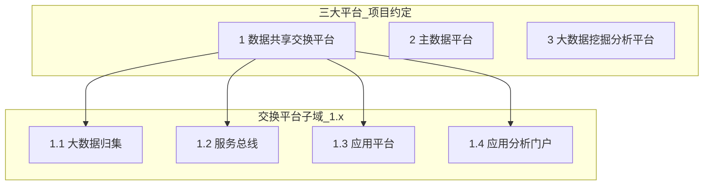

# 承德高新区智慧城市基础平台 — 需求基线说明

| 属性 | 说明 |
|------|------|
| **文档编号** | **D02** |
| **文档版本** | V2.3 |
| **编制日期** | 2026-06-23 |
| **文档性质** | 投标文件经工程化转化后的**正式需求基线**，与 Word 原件并列，作为开发、验收、合同附件依据 |
| **上位文档** | 《承德高新区智慧城市基础平台建设-V3.0-20260622.docx》（**甲方投标文件**，能力范围与板块名称参考） |
| **历史参考** | 《承德高新区智慧城市基础平台建设(1).docx》（旧版，仅作对照） |
| **文档索引** | [`D00-文档索引与编号规范.md`](D00-文档索引与编号规范.md) |
| **前置文档** | [`D01-Word工程化适用性评估.md`](D01-Word工程化适用性评估.md) |
| **转化参考** | WorkBuddy《需求转化基线文档》《需求基线审阅报告》（已并入修订） |
| **功能清单** | [`D05-系统功能清单.md`](D05-系统功能清单.md) **V2.6**（M001～M215，含实现方式） |
| **框架选型** | [`D04-开源框架选型评估.md`](D04-开源框架选型评估.md) V1.0（终版开发路径） |
| **项目期次** | **仅一期**（无合同意义上的二期；本期验收即项目终验） |

---

## 一、基线定位与核心决策

### 1.1 为什么需要本基线

投标文件（V3.0）属于**方案/投标级能力描述**，与固定工程约束（MySQL 自部署、JWT、**AEAI ESB 全栈服务总线**、Kettle 仅 M099、不做 SaaS 多租户）之间存在表述差异。本基线约定：**功能范围 1:1 对齐投标文件，实现方式按工程约束等价替换**，避免开发验收阶段反复扯皮。

### 1.2 核心决策确认

| 决策项 | 结论 | 基线影响 |
|--------|------|----------|
| **D1 原文档性质** | 甲方投标文件 | 每个功能点在清单中有对应 M 模块；验收时甲方可逐条核对 V3.0 板块 |
| **D2 业务模型范围** | 实际业务场景与指标算法不明确 | **40 个分析模型全部独立交付**（页面可达）；允许样例数据；5 个代表模型加深演示 |
| **D3 项目分期** | 只有一期 | 全量交付，不分二期合同；L1/L2/L3 均为**本期终验深度**，非「二期再做」 |
| **D4 等保等级** | 三级 | 非功能按 GB/T 22239-2019 第三级补全（见第十节） |
| **D5 非结构化规模** | 中等规模政务 | 文档 10 万～50 万份、总存储 2～10TB 等（见 4.3） |
| **D6 集成对接** | ESB 接口文档已提供 | M001～M019 由 **AEAI ESB** 实现；M214 统一集成；终验须真实 ESB 环境 |

### 1.3 文档效力（优先级）

```
本需求基线说明 V2.3 ＞ 系统功能清单 V2.5 ＞ V3.0 投标文件（能力语义与板块结构参考）
```

| 文档 | 作用 |
|------|------|
| **V3.0 投标文件** | 板块名称、功能点语义（验收定位以原文板块名称为准） |
| **功能清单 Mxxx** | 可验收模块枚举与验收要点 |
| **本基线** | 转化原则、术语映射、工程约束、非功能基线、交付深度、等价实现规则 |

### 1.4 验收基本原则

1. **功能 1:1 对齐**：投标文件每个功能点在 M001～M215 中有对应模块；**不因工程约束删除功能模块**。  
2. **能力等价实现**：验收「用户能否完成投标文件描述的业务动作」，不验收「是否自研第二套 ESB/ETL 引擎」。  
3. **原文档编排优先**：对外引用优先使用 V3.0 **原文板块名称**；模块编排与投标文件结构一致，不随意合并章节。  
4. **验收可测试**：关键模块验收要点须含**输入 → 输出 → 判断标准**三要素（见第八节）。  
5. **安全必达**：等保三级应用层控制项本期必须落地。

---

## 二、平台与章节结构

### 2.1 三大平台（项目约定 · 对外/合同口径）

> **约定**：V3.0 原文为 **14 个并列板块**（如数据共享交换平台、大数据归集平台、数据资产登记管理系统、主数据平台、人口大数据支撑系统等），**无显式「三大平台」章节划分**。本文「三大平台」为**项目约定的逻辑归纳**，用于合同口径、统一门户菜单域划分与实施分工。  
> **验收定位**：功能点仍按 V3.0 **原文板块名称**核对（如「数据资产登记管理系统」「主数据平台」），**不强制**甲方接受「1/2/3」编号体系。

| 逻辑一级 | 平台名称 | 说明 |
|----------|----------|------|
| **1** | 数据共享交换平台 | 含归集、总线、应用、门户四个子域（见 2.2） |
| **2** | 主数据平台 | 融合治理、非结构化、资源中心 |
| **3** | 大数据挖掘分析平台 | 统一用户、智能 BI、业务支撑（40 分析模型） |

**实现口径**：**一套系统**、统一门户；三大平台为菜单/权限域；交换平台下再分四个子域。



### 2.2 子系统与 M 模块映射（概要）

> **说明**：表中 **1.1/1.2/1.3/1.4** 等为**项目内部逻辑编号**，非 V3.0 原文章节号，用于模块定位与验收引用。各范围**互不重叠**；完整逐条映射见**附录 B**。

| 逻辑编号 | 子系统 / 板块 | M 范围 | 模块数 | 本期目标 |
|----------|---------------|--------|--------|----------|
| **1.1** | 大数据归集平台 | M039～M077 | 39 | 资产登记、采集汇聚、规范设计 |
| **1.2** | 服务总线 | M001～M019 | 19 | **AEAI ESB** 全栈（API/编排/交换/监控）；M214 集成 |
| **1.3** | 应用平台 | M020～M030、M037～M038 | 12 | 供需、考核、基础库/重点领域统计 |
| **1.4** | 应用分析门户 | M031～M036 | 6 | 部门共享门户、领导决策门户 |
| **2.1** | 大数据融合治理平台 | M078～M122 | 45 | 质量（共用）、元数据、治理、融合、目录 |
| **2.2** | 非结构数据融合治理平台 | M123～M129 | 7 | 接入、治理、检索（中等规模） |
| **2.3** | 大数据平台资源中心 | M130～M138 | 9 | 主题库、分区、备份、存储管理 |
| **3.1** | 通用支撑 + 智能 BI | M139～M151 | 13 | JWT 登录、审计、BI 大屏 |
| **3.2** | 业务支撑平台 | M152～M209 | 58 | 人口/法人/宏观/重点领域 + 40 模型 |
| **跨平台** | 公共能力 | M210～M215 | 6 | 门户登录、系统管理、事件总线、适配层 |
| **合计** | — | **M001～M215** | **215** | 全量交付 |

### 2.3 结构特别约定

| 约定项 | 说明 |
|--------|------|
| **1.3.3 基础库统计 vs 1.4.2 领导决策门户** | M037 为业务统计页；M036 为综合态势大屏；数据可复用，**页面分开展示** |
| **数据清单中心归属** | M024～M026（目录/异议/供需清单）为 **数据供需对接系统子功能**，不单独作为子系统或平级菜单域 |
| **领导决策 7 子态势** | 一期单页或 Tab 展示，**不建 7 套独立后端** |
| **归集后台管理**（访问控制/字典/系统维护） | 与平台级系统管理**合并一套**（M048～M050、M139、M210～M211）；可在归集域下挂入口 |
| **质量/目录中心** | M078～M105、M112～M122 **全平台共用一套**，不重复建设 |

---

## 三、转化原则

### 3.1 五条铁律

| # | 原则 | 说明 | 反例（禁止） |
|---|------|------|-------------|
| 1 | **1:1 功能对齐** | 投标文件每个功能点在清单中有对应模块 | 砍掉甲方未提但己方认为「不需要」的功能 |
| 2 | **原文档编排优先** | 模块编排严格按 V3.0 内容结构，不重新分组 | 把人口/法人/宏观合并成一个大章节验收 |
| 3 | **术语映射不删功能** | 「租户」映射为「机构/部门」，功能保留、实现替换 | 删除所有含「租户」的功能点 |
| 4 | **工程约束只影响实现** | JWT/ESB 对接/Kettle/MySQL 等只影响实现方式 | 因「不做多租户」删除租户隔离相关模块 |
| 5 | **验收口径可测试** | 每个模块须有输入→输出→判断的验收三要素 | 验收要点只写「支持 XX 功能」四字 |

### 3.2 两条弹性规则

| # | 规则 | 说明 |
|---|------|------|
| 6 | **非功能需求可补充** | 投标文件未明确的性能、安全等，按行业标准与等保三级补全 |
| 7 | **集成规范待确认后补** | 承德现有政务系统对接清单由甲方提供后补入；当前按投标文件预留接口 |

---

## 四、项目边界（一期 · 中等规模）

### 4.1 建设形态（固定）

| 项 | 基线约定 |
|----|----------|
| 架构 | 统一门户 + Spring Boot 3 模块化单体 + Vue3 + **MySQL 单库** `smart_city` |
| 部署 | 政务云 **VM**，Nginx + JDK17 + MySQL8；中间件手工安装；**不用 Docker** |
| 用户规模 | 组织机构 ≤50 个部门级单位；注册用户 ≤500；设计目标并发在线 **≥200**（见第十一节） |
| 数据规模 | 结构化设计参考单表千万级以下；交换/ETL 任务 ≤500 个在册；审计日志保留 ≥6 个月 |
| 缓存 | Redis **必需**（等保会话控制：Token 黑名单、会话超时、并发限制、接口限流）；部署方式可单机或哨兵，**功能上不可省略** |
| 代码托管 | 暂不同步 Gitee（项目组内部管理） |

> 若不部署 Redis，须提供书面替代方案，满足第十节身份鉴别、访问控制与安全审计的会话管理要求。

### 4.2 三大平台本期目标（摘要）

| 平台 | 本期目标 |
|------|----------|
| **1 数据共享交换平台** | 1.1 归集主流程 + 1.2 网关/ESB 适配/Kettle + 1.3 供需考核统计 + 1.4 双门户 **可演示** |
| **2 主数据平台** | 元数据/治理/目录核心 CRUD；非结构化中等规模；资源中心主题库逻辑管理 |
| **3 大数据挖掘分析平台** | 统一用户（JWT）、BI 大屏、**40 分析模型独立页面** + 指标配置框架 |

### 4.3 非结构化数据 — 中等规模基线

| 维度 | 基线值 | 说明 |
|------|--------|------|
| **文档总量** | 10 万～50 万份 | 公文、审批材料、政策文件等 |
| **图片总量** | 5 万～20 万张 | 证照、扫描件、现场照片 |
| **视频总量** | 1,000～5,000 条 | 监控片段、培训录像；**元数据 + 路径为主** |
| **音频总量** | 500～2,000 条 | 会议录音等 |
| **总存储量** | **2 TB～10 TB** | 分项可配置上限告警 |
| **单文件上传** | ≤500 MB | 超大文件支持分片上传 |
| **全文检索** | 响应 ≤2 秒（设计目标）；并发 50～100 QPS | 百万级文档为设计参考 |
| **接入方式** | FTP 为主 + API + 本地上传 | 按投标文件 |
| **OCR** | ≤10 页/分钟 | 中等规模政务文档 OCR |
| **NLP** | ≤1,000 文档/批次 | 关键词提取、主题识别等 |
| **明确不做** | Hadoop 集群、PB 级扩展、大规模视频转码/深度学习 | 见 4.5 |

**模块交付**：M123～M129 **L2 标准**；M132 文件目录库/索引库 **逻辑管理**。

### 4.4 业务分析模型 — 40 模型全量交付策略

| 类别 | 编号 | 数量 | 交付要求 |
|------|------|------|----------|
| 人口分析模型 | M161～M174 | 14 | **全部独立页面**；样例数据 + 可配置指标 |
| 法人分析模型 | M184～M192 | 9 | 同上 |
| 宏观经济模型 | M193～M203 | 11 | 同上 |
| 重点领域模型 | M204～M209 | 6 | 同上；空间类静态 GIS 或散点图 |
| **代表模型（加深 L2）** | 见下表 | 5 | 从 MySQL 主题表 **实时查询** 完整链路 |

**代表模型（验收重点演示）**：

| 编号 | 模型 | 说明 |
|------|------|------|
| M161 | 户籍人口统计分析 | 人口类代表 |
| M186 | 企业所得税统计分析 | 法人类代表 |
| M193 | 地方生产总值分析 | 宏观代表 |
| M205 | 应急突发事件统计分析 | 重点领域代表 |
| M037 | 基础库统计分析（1.3.3） | 跨库汇总代表 |

**无详细正文描述的模型**（按总览功能名称出图验收）：M168 重点人口、M172 死亡同比、M173 空间分析、M174 义务教育空间。

**指标配置框架**（M151/M137 支撑）：模型名称、SQL/数据源、维度、指标、图表类型可配置。**不承诺**一期每个模型绑定全部生产级算法与外部系统自动取数。

**交付深度汇总**：40 模型全部交付；**5 个 L2**、**其余 35 个 L3**（独立页面 + 样例 + 配置框架）。

> **L3 语义限定**：L3 允许使用样例数据，但**页面展示内容必须与投标文件模型名称语义对应**（如「户籍人口统计分析」须展示户籍相关人口维度图表，不可用无关数据填充）；验收时逐一核对页面与模型名称的语义匹配。

### 4.5 明确不在本期范围（实现方式层面）

| 项 | 说明 |
|----|------|
| SaaS 多租户产品形态 | 不做；机构/部门 + 项目 + 双重授权（见第五节） |
| 自研 ESB 编排引擎 / Web ETL 拖拽设计器 | 不做；**M001～M019 由 AEAI ESB**；Kettle 仅 M099/M215 |
| M099 可视化 ETL 治理 | **待确认**：建议与 Kettle 集成等价（见第十二节） |
| Kafka/MongoDB/ES **生产级实时集群** | 不做；M058 任务配置 + 接口占位 |
| 百万级分布式调度 | 不做 |
| HSM 硬件密码机 | 不做；TLS + 应用层加密/脱敏配合等保 |
| 完整城市大脑 GIS | 不做；静态底图/散点占位 |
| 政务统一身份 SSO 联邦 | 不做；JWT 自建；预留扩展点 |
| 合同二期 | **本项目无二期** |

---

## 五、术语映射与工程约束

### 5.1 核心术语映射表

| 投标文件术语 | 项目实现术语 | 验收口径 |
|-------------|-------------|---------|
| **租户** | **机构**（组织维度） | 不同机构创建的业务系统彼此不可见 |
| **租户所有者** | **机构管理员** | 机构管理员可为本机构用户授权 |
| **多租户** | **多机构** | 机构间资源彼此隔离 |
| **项目** | **项目**（保留） | 项目内资源管理 |
| **超级管理员** | **系统管理员** | 可管理全部资源 |
| **管理员** | **平台管理员 / 机构管理员** | 验收时明确权限层级 |

> **清单声明**：功能清单中「机构/部门」对应投标文件中「租户」，**功能口径按投标文件 1:1 对齐**。

### 5.2 投标文件「租户」表述映射（15 个功能语境）

> **说明**：投标文件全文「租户」出现 **42 次**；本表按 **15 个独立功能语境**归类映射，同一语境内多处「租户」表述统一映射为「机构」，**非按出现次数逐条列举**。

| # | 功能域 | 映射后表述 | 验收口径 |
|---|--------|-----------|---------|
| 1 | 数据源管理 | 系统管理员配置的数据源各机构用户可用；机构管理员配置的仅本机构可用 | 机构间数据源访问隔离 |
| 2 | 业务系统 | 业务系统按机构隔离 | 跨机构业务系统不可见 |
| 3 | 业务服务组件 | 业务服务组件按机构隔离 | 跨机构组件不可见 |
| 4 | 访问控制 | 针对不同机构 | 机构级权限隔离 |
| 5 | 资源独立管理 | 通过机构实现资源独立管理、多机构间隔离 | 机构间资源隔离 |
| 6 | 系统标识 | 支持机构自定义标识 | 机构级标识定制 |
| 7 | 水印设置 | 支持机构自定义水印 | 机构级水印定制 |
| 8 | 主题设置 | 机构自定义仅在本机构生效 | 机构级主题定制 |
| 9 | 数据质量绩效 | 规则针对当前机构及机构下所有表 | 机构级质量规则 |
| 10 | 例外处理 | 例外管理针对机构 | 机构级例外规则 |
| 11 | 锁定机制 | 锁定后仅锁定者、机构管理员、系统管理员可解锁 | 三方解锁机制 |
| 12 | 集群账号 | 只能选择绑定给机构的集群账号 | 机构级集群绑定 |
| 13 | 生产调度 | 为所有机构提供生产作业调度管理 | 多机构调度管理 |
| 14 | 权限体系 | 功能授权控制机构和用户 | 机构 + 用户双层 |
| 15 | 数据授权 | 数据授权控制机构、项目和用户 | 机构 + 项目 + 用户三层 |

### 5.3 双重授权机制（原文保留）

> 数据管理端一级系统管理员，可以为各部门管理员授予管理员权限，但不能为用户授予信息访问权限；各部门信息的访问权限由各部门管理员掌控。

| 角色 | 实现映射 | 模块示例 |
|------|----------|----------|
| 一级系统管理员 | 系统管理员：全平台管理，**不直接授予信息访问权** | M048、M158、M181 |
| 各部门管理员 | 部门管理员：掌管本部门数据访问权 | M158、M181 |
| 跨部门访问 | 须获得对方部门管理员授权或审批 | M211、M048 |

### 5.3.1 人口/法人六大核心操作

投标文件对人口、法人各描述 **6 项核心操作**；除双重授权外，基线明确如下：

| 操作 | 人口模块 | 法人模块 | 验收口径 |
|------|----------|----------|----------|
| 更新维护 | M155 | M178 | 多部门汇聚、定时维护、原始库→标准库流程可演示 |
| 校核 | M156 | M179 | 基准校核→多源校核→反馈闭环 |
| 存储管理 | M157 | M180 | 垂直/水平分区、存储策略可配置 |
| 双重授权 | M158 | M181 | 见 5.3 |
| 服务方式-接口 | M159 | M182 | 小数据量 API 可调用 |
| 服务方式-批量 | M160 | M183 | 前置系统→交换→结果库→返回全链路 |
| 数据区管理 | M153 | M176 | 五区架构 + 7 维度可配置（见 5.7） |

### 5.4 工程约束注入清单

| # | 约束项 | 投标文件描述 | 实际实现 | 对清单影响 |
|---|--------|-------------|---------|-----------|
| 1 | 登录认证 | 统一用户中心 | **自建 JWT** | 统一用户模块保留，实现改 JWT |
| 2 | 权限体系 | 多租户 + 功能 + 资源 + 数据 | **机构/部门 + 项目 + 功能 + 资源 + 数据** | 功能点不变 |
| 3 | ESB / 服务总线 | API 网关 + ESB 编排 + 交换 ETL | **外购 AEAI ESB 实现 M001～M019**；M214 门户集成 | 验收在 ESB 设计器+SMC；详见 ESB集成说明 |
| 4 | ETL | Web 拖拽 ETL（服务总线） | **M011～M013 由 ESB MessageFlow** | 不用 Kettle |
| 4b | ETL（治理） | M099 可视化治理 ETL | **Kettle Spoon + M215** | 不验 Web 拖拽设计器 |
| 5 | 数据库 | 分布式存储等 | **MySQL 8.0+ 自部署** | 存储按 MySQL 实现 |
| 6 | 部署 | 政务云 | 政务云 VM；不用 Docker | 部署文档补充 |
| 7 | 代码管理 | 无 | 暂不同步 Gitee | 不影响功能清单 |

### 5.5 等价实现规则（摘要）

| 投标文件能力 | 等价实现 | 验收要点 |
|-------------|----------|----------|
| 可视化 ETL 拖拽（M099 治理） | Kettle Spoon + M215 平台作业列表/调度/日志 | M099 治理任务可注册、可执行、可查日志 |
| 服务总线 M001～M019 | **AEAI ESB**（设计器+SMC+Runtime）+ M214 集成 | ESB 环境完成投标文件业务动作；M214 可深链/代理 |
| ESB 工作流/交换编排 | ESB MessageFlow / FileTrans；**非本平台自研** | SMC 可查询/启停/监控；终验真实 ESB |
| 智能 BI 大屏 | Vue + ECharts（+ 可选开源 BI 嵌入） | 可配置大屏至少 3 套模板 |
| 数据质量全流程 | 统一质量中心 M078～M105 **一套** | 规则—任务—报告闭环 |
| 40 个分析模型 | 40 个独立页面；5 个 L2 + 35 个 L3 | 逐页可打开、语义匹配、有图有数 |
| 非结构化治理 | 中等规模（见 4.3） | 上传、分类、检索、预览、基础 OCR/NLP |
| 租户隔离 | 机构/部门 + 项目数据权限 | 跨机构不可见、双重授权可演示 |
| **数据对账服务** | M064 对外 4 个子接口 | 见 5.6 |

### 5.6 数据对账服务验收口径（M064）

投标文件「数据对账」包含 **4 个对外服务接口**，须逐一验收：

| 接口 | 功能 | 验收要求 |
|------|------|----------|
| 对账分析接口服务 | 提供对账分析结果 | 可调用；返回结构化 JSON |
| 异常告警接口服务 | 提供对账异常告警 | 异常场景可触发告警 |
| 日志及统计信息查询服务 | 提供日志查询 | 可按条件查询对账日志 |
| 异常数据查询服务 | 提供异常数据查询 | 可查询异常明细 |

### 5.7 数据区七维度设计框架

投标文件对人口/法人/宏观/重点领域各描述 **5 类数据区**（定位、基础、加工、主题、服务；人口/法人清单中为采集/治理反馈/核心/内部服务/共享服务等五区），每区含 **7 个设计维度**：

| 维度 | 说明 |
|------|------|
| 定位 | 数据区在整体架构中的位置和作用 |
| 数据模型 | 数据区包含的数据实体和关系 |
| 加工处理 | 数据进入数据区后的处理流程 |
| 存储周期 | 数据的保留时间策略 |
| 数据来源 | 数据从哪里来、怎么来 |
| 使用者 | 哪些角色/系统使用该数据区的数据 |
| 更新频度 | 实时 / T+1 / 月度等 |

**实现口径**：

- 每类数据区在资源中心（M130～M138）中对应**逻辑分区**；人口/法人五区由 **M153、M176** 管理。  
- 7 维度信息以**配置表**形式存储，支持查看与编辑。  
- **验收**：每个数据区 7 维度配置可查看、可编辑；M153/M176 验收要点覆盖逐项核对。

### 5.8 投标文件 vs 实际业务

| 问题 | 基线决策 |
|------|----------|
| 分析模型多、场景未细化 | 40 模型全部交付页面；样例数据 + 配置框架；**不因此阻塞终验** |
| 归集/主数据/交换能力重叠 | **合并建设**；质量/目录只验一套 |
| 生产数据未就绪 | 内置演示库/seed；生产接入为运维扩展 |

---

## 六、功能模块交付深度（L1 / L2 / L3）

> **本项目仅一期**：L1/L2/L3 均为本期终验标准。  
> **编号规则**：下表每个 M 编号**仅出现一次**，且**仅归属一个交付级别**；任务分配以本表为准。

| 级别 | 含义 | 验收标准 |
|------|------|----------|
| **L1 完整** | 核心业务流程可生产使用 | CRUD + 审批/状态机 + 权限 + 审计；关键接口可用 |
| **L2 标准** | 主流程可用，部分高级能力简化 | 主路径演示通过；复杂算子/外部依赖可 Mock |
| **L3 框架** | 入口、页面、配置、样例数据齐全 | 菜单可达；页面语义匹配；可配置扩展 |

### 6.1 分域交付深度汇总

| 逻辑域 | 模块范围 | L1 | L2 | L3 |
|--------|----------|----|----|-----|
| **1.2 服务总线（ESB）** | M001～M003、M005～M007、M014～M019 | 同上 | M004、M008～M013 | — |
| **跨平台 ESB/Kettle** | M214、M215 | M214、M215 | — | — |
| **1.3 应用平台** | M020～M030、M037～M038 | M020～M026、M028～M030 | M027、M037～M038 | — |
| **1.4 应用分析门户** | M031～M036 | M031～M035 | M036 | — |
| **1.1 归集-资产登记** | M039～M050 | M039～M050 | — | — |
| **1.1 归集-采集汇聚** | M051～M077 | M051～M054、M059～M060、M065～M068 | M055～M057、M061～M063、M069～M077 | M058 |
| **质量中心（共用）** | M078～M105 | M078～M080、M082～M083、M102～M105 | M081、M084～M085 | — |
| **2.1 元数据** | M086～M097 | M086～M097 | — | — |
| **2.1 数据治理** | M098～M101 | M098、M100～M101 | M099 | — |
| **2.1 数据融合** | M106～M111 | M106～M111 | — | — |
| **2.1 数据目录** | M112～M122 | M112～M122 | — | — |
| **2.2 非结构化** | M123～M129 | — | M123～M129 | — |
| **2.3 资源中心** | M130～M138 | M130～M132 | M133～M138 | — |
| **3.1 统一用户** | M139～M145、M210～M211 | M139、M140、M143～M145、M210～M211 | M141～M142 | — |
| **3.1 智能 BI** | M146～M151 | — | M149 | M146～M148、M150～M151 |
| **人口大数据支撑** | M152～M174 | M152～M160 | M161 | M162～M174 |
| **法人大数据支撑** | M175～M192 | M175～M183 | M186 | M184～M185、M187～M192 |
| **宏观经济支撑** | M193～M203 | — | M193 | M194～M203 |
| **重点领域支撑** | M204～M209 | — | M205 | M204、M206～M209 |
| **跨平台公共** | M212～M213 | M212～M213 | — | — |

**代表模型 L2 汇总**（与上表一致）：M161、M186、M193、M205、M037。

### 6.2 本期必须跑通的端到端场景（演示必过）

1. **登录 → 统一门户 Hub**（`/dashboard`：四平台窄柱抽屉卡片，RBAC 过滤）→ **点子系统**进入业务/占位页；**系统管理**经 Hub 或侧栏进入（用户/角色/机构/审计）  
2. **数据资产登记（1.1）→ 数据源配置 → 采集任务 → 执行记录**  
3. **目录编目 → 发布审批 → 部门共享门户（1.4.1）可见 → 订阅申请 → 审批**  
4. **数据需求填报（1.3.1）→ 确认 → 交换/归集任务台账**  
5. **ESB MessageFlow 交换任务 → SMC 启停/监控 → 日志查看**；**M099 Kettle 治理任务**另验 M215；（M214 Mock 仅开发期，终验真实 ESB）

---

## 七、一期全量交付与里程碑

### 7.1 交付范围

**交付范围 = 投标文件全部功能点，共 M001～M215（215 个模块）**，不做功能裁剪；实现深度按第六节 L1/L2/L3。

| 功能清单章节 | 对应逻辑域 | M 范围 | 模块数 |
|-------------|-----------|--------|--------|
| 一、数据共享交换平台 | 1.2～1.4 | M001～M038 | 38 |
| 二、大数据归集平台 | 1.1 | M039～M077 | 39 |
| 三、主数据平台 | 2.1～2.3 | M078～M138 | 61 |
| 四、大数据挖掘分析平台 | 3.1～3.2 | M139～M209 | 71 |
| 五、跨平台公共能力 | 跨平台 | M210～M215 | 6 |
| **合计** | — | **M001～M215** | **215** |

### 7.2 交付里程碑（实施节奏，非合同分期）

| 里程碑 | 内容 | 交付物 |
|--------|------|--------|
| **M1 基础平台** | JWT 统一用户 + 数据源 + Kettle 基础 | 登录、权限、ETL 基础配置 |
| **M2 归集与交换** | 资产登记 + 采集 + 交换（ESB 适配层） | 入库、API 网关、共享门户骨架 |
| **M3 数据治理** | 元数据 + 治理 + 质量 + 标准 + 目录 | 治理平台全套 |
| **M4 非结构化** | 接入 + 治理 + 检索 + 元数据 | 全文检索、基础 OCR/NLP |
| **M5 资源中心** | 资产区 + 分区 + 备份恢复 | 主题库、存储管理 |
| **M6 分析模型** | 人口 14 + 法人 9 + 宏观 11 + 重点 6 | BI 大屏 + 40 模型页面 |
| **M7 智能 BI** | BI 平台全功能 | 大屏设计、自助分析 |
| **M8 全量验收** | 全系统联调 + 等保配合 | 验收报告 + 等保自查表 |

---

## 八、验收标准框架

### 8.1 验收三要素模板

```
验收要点 = 输入 + 输出 + 判断标准
```

**示例（数据标签管理）**：

- **输入**：用户在标签管理页点击新增，输入标签名称和分类  
- **输出**：标签创建成功，列表显示新标签，元数据页可选择该标签  
- **判断**：① 名称不可重复 ② 删除后关联自动解除 ③ 支持批量新增  

### 8.2 四类验收要点

| 类型 | 说明 | 示例 |
|------|------|------|
| **功能验收** | 输入→输出→判断 | 数据源：支持库/文件/内存型，创建后可编辑删除 |
| **安全验收** | 等保三级相关 | 等保开关：5 次错误锁定 60 分钟；**备份恢复演练**（见下） |
| **性能验收** | 性能基线相关 | 全文检索：设计目标 ≤2 秒 |
| **集成验收** | 外部对接 | ESB 适配层可监控状态 |

**备份恢复验证（RPO/RTO）**：

验收测试中执行 **1 次完整备份恢复演练**，记录：① 备份耗时 ② 恢复耗时 ③ 恢复后数据完整性校验（比对源表与恢复表行数 + 关键字段哈希）。**RTO 实测 ≤4 小时**方为通过；RPO 以备份策略配置（≤24 小时）与演练记录为证。

### 8.3 特殊验收口径

| 情况 | 验收口径 |
|------|----------|
| **ESB** | M001～M019 在 **AEAI ESB** 验收；M214 验集成；终验须真实环境 |
| **ETL** | 服务总线 **ESB MessageFlow**；**Kettle 仅 M099/M215** |
| **双重授权** | 系统管理员可授管理员权但不授信息访问权；部门管理员掌控本部门数据权 |
| **租户→机构** | 按投标文件功能口径验收，实现用机构替代 |
| **无详细描述模型** | M168/M172/M173/M174 按总览功能名称出图验收 |
| **数据对账** | M064 四个子接口逐一可调用、返回结构化结果（见 5.6） |

---

## 九、技术基线（开发不可偏离）

| 类别 | 基线 |
|------|------|
| 后端 | Java 17、Spring Boot 3.2+、MyBatis-Plus、Flyway、Spring Security + JWT |
| 前端 | Vue 3、TypeScript、Element Plus、ECharts |
| 数据库 | MySQL 8.0+，库名 `smart_city`，utf8mb4 |
| 缓存 | Redis **必需**（见 4.1） |
| 集成 | **AEAI ESB**（M001～M019）；**OpenMetadata、DataEase、DolphinScheduler、Kettle、SeaweedFS、ES、Canal**（见开源框架选型评估）；门户统一封装 |
| 文件 | 本地/NAS；非结构化路径可配置 |
| API | REST JSON；统一 `{code,message,data}`；OpenAPI 文档 |

---

## 十、等保三级符合性基线

> 按 GB/T 22239-2019 第三级补全；以下为应用层必须实现或配合项。

### 10.1 安全功能映射（扩展）

| 等保域 | 投标文件已有 | 本期验收基线 | 对应模块/实现 |
|--------|------------|-------------|---------------|
| **身份鉴别** | 等保开关 | ① 密码 8 位以上含大小写数字特殊字符 ② 5 次错误锁定 60 分钟 ③ 超期 5 天警告、10 天强制改密 ④ 暴力登录拦截 ⑤ **双因素认证**（依赖 12.2 第 7 项确认结果） | M049、M139、M184 |
| **访问控制** | 功能+资源+数据权限 | ① 最小权限 ② 按钮级 ③ 双重授权 ④ 跨部门须授权 | M048、M158、M181、M211 |
| **安全审计** | 登录/操作日志 | ① 保存 ≥6 个月 ② 防篡改（见 10.1.1） ③ 全覆盖 ④ 查询报表 | M144、M185 |
| **入侵防范** | 无 | ① 异常访问告警 ② 恶意请求拦截 ③ 限流、IP 黑白名单 | M005、M007 |
| **通信安全** | 无 | ① 全站 HTTPS/TLS ② API 加密 ③ 敏感字段传输加密 | 部署 + 网关 |
| **数据保密性** | 脱敏、水印 | ① 敏感分级 ② 存储加密（AES-256 关键字段） ③ 动态/静态脱敏 | M014、M070 |
| **数据完整性** | 校验规则 | ① 传输完整性 ② 关键数据哈希 ③ 失败告警 | 质量稽核、M073 |
| **备份恢复** | 周期性备份 | ① 自动周期备份 ② 备份加密 ③ 恢复演练 ≥每季度 1 次 ④ RPO≤24h ⑤ RTO≤4h | M073、M134；见 8.2 |
| **恶意代码** | 无 | ① 上传文件病毒扫描 ② 防脚本注入 | 文件上传、非结构化接入 |
| **个人信息保护** | 脱敏 | 最小采集、加密存储、访问审计 | 数据安全模块 |

**身份鉴别 ⑤ 双因素（条件式）**：

> 如短信网关可用，则采用**密码 + 短信验证码**；如不可用，则降级为**密码 + 邮箱验证码**或**密码 + 动态令牌（TOTP）**。具体方式在项目启动时与甲方确认（见 12.2 第 7 项）。

#### 10.1.1 审计日志防篡改技术方案

| 实现项 | 方案 |
|--------|------|
| **DB 层防篡改** | `audit_log` 表 **INSERT-ONLY**；应用层无 UPDATE/DELETE 权限；DB 触发器禁止修改 |
| **归档防篡改** | 每月归档至只读存储（NAS）；归档文件 **SHA256 校验链** |
| **异常检测** | 定期比对 `audit_log` 记录数与归档记录数；差异告警 |

### 10.2 等保与 Word「等保开关」

- M049 等保开关纳入本期 **L1 完整实现**；  
- 等保测评 = 环境 + 管理制度 + 应用控制项；本平台负责应用层落地，并输出《等保三级差距自查表》。

### 10.3 运维配合项（非应用内）

主机加固、防火墙、WAF、数据库审计、物理安全、管理制度文档等由运维与管理制度满足。

### 10.4 等保测评文档交付清单

| 文档 | 责任方 |
|------|--------|
| 等保三级差距自查表 | 开发团队 |
| 应用层安全功能说明文档 | 开发团队 |
| 安全策略与操作规程 | 开发团队 + 甲方 |
| 管理制度文档 | 甲方 |
| 等保测评配合材料（网络拓扑、系统架构图、数据流图） | 开发团队 + 运维 |

---

## 十一、性能基线

| 指标 | 基线值 | 说明 |
|------|--------|------|
| **并发用户数** | ≥200 | 设计目标上限 |
| **页面响应** | ≤3 秒（一般页）；≤10 秒（报表/大屏） | 用户体验基线 |
| **API 响应** | ≤500 ms（单条）；≤5 s（批量） | REST 通用基线 |
| **全文检索** | ≤2 秒（百万级文档，设计参考） | 非结构化 |
| **数据导入** | ≥10 万条/分钟（批量导入） | ETL 参考 |
| **系统可用性** | ≥99.9%（年停机 ≤8.76 小时） | 等保 + 政务基线 |
| **数据规模** | 结构化 ≤500 GB；非结构化 ≤10 TB | 中等规模 |

---

## 十二、外部依赖、假设与待确认事项

### 12.1 外部依赖

| 依赖 | 假设 | 若不满足 |
|------|------|----------|
| 现有 ESB | **接口文档已提供**（ESB接口说明文档.docx）；待生产环境地址 | M214 开发期可 Mock；**M001～M019 终验须真实 ESB** |
| Kettle | VM 可安装 PDI + Carte | **仅 M099 治理 ETL**；最低 CLI + M215 台账 |
| 政务云 VM | ≥4C8G 应用 + 独立 MySQL；磁盘满足 4.3 | 调整并发与容量上限 |
| 业务部门 | 提供机构树、样例指标 | 使用内置 seed |
| **数据标准基线数据** | 甲方提供政务数据分类编码标准（见 12.2 第 2 项）；数据元/字典/模型标准由项目组内置**国标 + 政务常用标准 seed** | 内置 seed 验收；甲方后续可增量导入 |
| 真实业务数据 | 不假设一期全部就绪 | 样例数据 + 配置框架验收 |

### 12.2 待确认事项（建议甲方/项目组确认）

| # | 待确认项 | 影响 | 紧急度 |
|---|---------|------|--------|
| 1 | **与承德现有政务系统的对接清单** | 系统、数据、接口、频率 | 高 — 影响 M2 |
| 2 | **承德高新区政务数据分类编码标准** | 数据标准模块基线数据 | 中 — 影响 M3 |
| 3 | **人口/法人/宏观/应急数据来源部门清单** | 采集区与模型取数设计 | 高 — 影响 M4～M6 |
| 4 | **政务云 VM 规格和数量** | 部署架构与性能 | 中 — 影响 M1 |
| 5 | **M099 可视化 ETL 治理是否按 Kettle 等价** | 若不自研 Web 拖拽，改为配置式 + Kettle | 中 — 需项目组定夺 |
| 6 | **甲方对「租户→机构」映射口径的认可** | 验收是否按投标文件功能口径、机构实现 | 高 — 建议提前沟通 |
| 8 | **AEAI ESB 生产环境**（SMC 地址、账号、M005 限流） | M001～M019、M214 | 高 — 影响 MS2 |
| 9 | **双因素认证具体方式** | 短信 / 邮箱 / TOTP | 中 — 项目启动时确认 |

---

## 十三、文档关系与后续工作

```
V3.0 投标文件（甲方，无 D 编号）
    │  1:1 功能对齐 + 术语映射 + 工程约束
    ▼
D01 Word 工程化适用性评估
    ▼
D02 需求基线说明 V2.3（本文）  ← 开发验收最高优先级
    ▼
D03 ESB 集成说明 V1.0
    ▼
D04 开源框架选型评估 V1.0（终版开发路径）
    ▼
D05 系统功能清单 V2.6（含实现方式列）
    ▼
D06 Mxxx 实现映射表 V1.0（终稿）
    ▼
D07 总体技术架构设计 V1.1（合并版）
    ▼
D08 验收测试用例 V1.1 / D09 等保三级差距自查表 V1.0 / D10 OM 菜单名映射表 V1.0
    ▼
D11 统一门户技术方案 V0.6 / D12 数据库设计 V0.1 / MS1 工程代码
    ▼
验收交付基准（甲方确认签字）
```

| 编号 | 文档 | 状态 | 说明 |
|:----:|------|------|------|
| D00 | [文档索引与编号规范](D00-文档索引与编号规范.md) | ✅ V1.0 | 总索引与命名规则 |
| D01 | Word 工程化适用性评估 | ✅ 已有 | 建议上位对象更新为 V3.0 |
| **D02** | **需求基线说明** | ✅ **V2.3（本文）** | 正式基线 |
| D03 | ESB 集成说明 | ✅ V1.0 | M001～M019 映射 |
| D04 | **开源框架选型评估** | ✅ **V1.0（终版）** | 7 框架 + 215 M 实现方式 |
| D05 | 系统功能清单 | ✅ **V2.6** | 含「实现方式」列 |
| D06 | Mxxx 实现映射表 | ✅ **V1.0（终稿）** | 215 模块 → 框架/代码包/门户集成/V3板块；[`D06-Mxxx实现映射表.md`](D06-Mxxx实现映射表.md)、[`Mxxx实现映射表_V1.0.xlsx`](Mxxx实现映射表_V1.0.xlsx) |
| D07 | **总体技术架构设计** | ✅ **V1.1（合并版）** | 架构原则/菜单树/License/JWT/Redis/审计/验证项；[`D07-总体技术架构设计.md`](D07-总体技术架构设计.md) |
| D08 | 验收测试用例 | ✅ **V1.1（P0）** | 44 条；等保补遗 + 业务入口；[`D08-验收测试用例.md`](D08-验收测试用例.md) |
| D09 | 等保三级差距自查表 | ✅ **V1.0** | 应用层 40+ 项；[`D09-等保三级差距自查表.md`](D09-等保三级差距自查表.md) |
| D10 | OM 菜单名映射表 | ✅ **V1.0** | 29 条；[`D10-OM菜单名映射表.md`](D10-OM菜单名映射表.md) |
| D11 | 统一门户技术方案 | ✅ **V0.6（MS1）** | Hub 窄柱抽屉 + 子系统侧栏；[`D11-统一门户技术方案.md`](D11-统一门户技术方案.md) |
| D12 | 数据库设计 | ✅ **V0.1（MS1）** | [`D12-数据库设计.md`](D12-数据库设计.md) |

---

## 十四、基线确认事项（建议甲方/项目组签字）

| 序号 | 确认项 | 基线建议值 |
|------|--------|------------|
| 1 | 项目仅一期，无二期合同 | 是 |
| 2 | 上位文档为 V3.0 投标文件；以本基线为准实施 | 是 |
| 3 | 「三大平台」为项目逻辑归纳；验收按 V3.0 原文板块名称定位 | 是 |
| 4 | 功能 1:1 对齐；租户→机构映射；不做 SaaS 多租户 | 是 |
| 5 | 40 分析模型全部独立交付；5 L2 + 35 L3 | 是 |
| 6 | 非结构化中等规模（2～10 TB 总存储等，见 4.3） | 是 |
| 7 | 等保三级应用层控制本期落地（双因素方式见 12.2 第 7 项） | 是 |
| 8 | M001～M019 由 AEAI ESB 实现；M214 开发期可 Mock，**终验须真实 ESB** | 是 |
| 9 | 双重授权机制完整验收 | 是 |

---

## 十五、合同附件建议条款

若本基线作为合同附件，建议约定以下法律效力要点：

| 条款 | 内容 |
|------|------|
| **功能范围** | 以 V3.0 投标文件功能点为范围基准，1:1 对齐，不做裁剪 |
| **等价实现** | ESB/ETL 等可采用等价集成方案，验收口径以本基线 5.5 为准 |
| **术语映射** | 投标文件「租户」对应本项目「机构/部门」，功能口径不变 |
| **板块定位** | 验收功能点按 V3.0 **原文板块名称**核对；「三大平台」为项目逻辑归纳 |
| **ESB 验收** | M001～M019 在 AEAI ESB 环境验收；M214 可 Mock 仅用于开发联调 |
| **模型交付** | 40 分析模型全部独立页面；5 个 L2 + 35 个 L3 |
| **等保三级** | 应用层控制项本期落地；测评配合材料由乙方交付（见 10.4） |

---

## 十六、修订记录

| 版本 | 日期 | 说明 |
|------|------|------|
| V1.0 | 2026-06-22 | 首版 |
| V2.0 | 2026-06-22 | 对齐三大平台；并入 WorkBuddy 转化基线 |
| V2.1 | 2026-06-22 | 按审阅报告修订 |
| **V2.2** | 2026-06-23 | M001～M019 全 AEAI ESB；Kettle 仅 M099/M215；新增 ESB集成说明 |
| V2.3 | 2026-06-24 | §6.2 演示路径与 D11 V0.6 对齐（统一门户 Hub + 子系统直达） |

## 附录 A：验收测试用例格式

| 字段 | 说明 |
|------|------|
| 用例编号 | 如 TC-M064-001 |
| 模块编号 | Mxxx |
| 用例名称 | 简要描述 |
| 前置条件 | 环境、账号、数据准备 |
| 操作步骤 | 逐步操作说明 |
| 预期输出 | 系统应呈现的结果 |
| 判断标准 | 通过/不通过判定条件 |
| 用例类型 | 功能 / 安全 / 性能 / 集成 |

---

## 附录 B：逻辑域 → M 模块完整映射

> 与第二节 2.2、第六节 6.1 一致；验收时按 **M 编号**引用，按 **V3.0 原文板块名称**向甲方说明归属。

| 逻辑编号 | V3.0 原文板块（验收定位名） | M 范围 | 数量 |
|----------|---------------------------|--------|------|
| 1.1 | 大数据归集平台（含数据资产登记、数据资源采集汇聚） | M039～M077 | 39 |
| 1.2 | 数据共享交换平台-服务总线 | M001～M019 | 19 |
| 1.3 | 数据共享交换平台-应用平台 | M020～M030、M037～M038 | 12 |
| 1.4 | 应用分析门户 | M031～M036 | 6 |
| 2.1 | 大数据融合治理平台 | M078～M122 | 45 |
| 2.2 | 非结构数据融合治理平台 | M123～M129 | 7 |
| 2.3 | 大数据平台资源中心 | M130～M138 | 9 |
| 3.1 | 通用支撑平台 + 智能 BI 平台 | M139～M151 | 13 |
| 3.2 | 业务支撑平台（人口/法人/宏观/重点领域） | M152～M209 | 58 |
| 跨平台 | 跨平台公共能力（归纳） | M210～M215 | 6 |
| **合计** | — | **M001～M215** | **215** |

*V3.0 块级板块（`V3板块` 列）已纳入 [`D06-Mxxx实现映射表.md`](D06-Mxxx实现映射表.md) V1.0；OM 菜单映射见 [`D10-OM菜单名映射表.md`](D10-OM菜单名映射表.md) V1.0。*

---

*基线 V2.3（§6.2 门户 Hub 路径）。MS1 工程骨架已初始化（`platform-backend` / `platform-web`）；门户 UI 见 D11 V0.6。编号见 [`D00-文档索引与编号规范.md`](D00-文档索引与编号规范.md)。*
