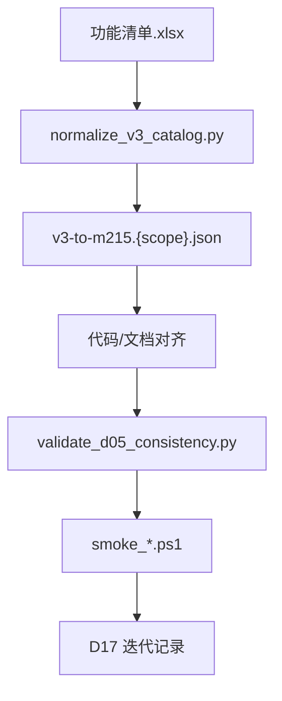

# 系统优化流程及方式

| 属性 | 说明 |
|------|------|
| **文档编号** | **D17** |
| **文档版本** | V1.2 |
| **编制日期** | 2026-07-13 |
| **文档性质** | **活文档**：各业务板块迭代优化的统一指导；每完成一轮优化须更新本文「迭代记录」与对应 mapping |
| **关联** | [`D00`](D00-文档索引与编号规范.md)、[`D04`](D04-开源框架选型评估.md)、[`D05`](D05-系统功能清单.md)、[`D06`](D06-Mxxx实现映射表.md)、[`D16`](D16-基线与外部依赖确认单.md)、[`功能清单.xlsx`](功能清单.xlsx) |

---

## 一、文档用途

1. **单一语义基线**：V3.0 [`功能清单.xlsx`](功能清单.xlsx) 为功能描述最高来源；D05 M 编号为验收编号，二者通过 `catalog/v3-to-m215.*.json` 可追溯。
2. **分块优化**：按「平台 → 子系统 → Tab/Hub」缩小范围，避免改一块牵动全局。
3. **实现方式口径**：四类实现方式全项目统一；「二开」= 自研适配层，**禁止 fork** 开源源码。
4. **持续更新**：每轮优化完成后更新 mapping、冒烟脚本、本文 §四 迭代记录。

---

## 二、优化总流程



| 步骤 | 动作 | 产出 |
|:----:|------|------|
| 1 | 划定 scope（如 collect Tab M051～M077） | scope 说明写入本文 §四 |
| 2 | 运行 `normalize_v3_catalog.py` | `catalog/v3-catalog.{scope}.json` |
| 3 | 编制/更新 mapping | `catalog/v3-to-m215.{scope}.json` |
| 4 | 对齐 D05/D06/D08、前端 IA、后端 API | 代码与文档 diff |
| 5 | CI 门禁 | `validate_d05_consistency.py --scope {scope}` |
| 6 | 冒烟 | `smoke_ingestion.ps1` 等 |
| 7 | 更新 D17 §四 迭代记录 | 版本号 +1 |

**本地门禁（采集域示例）**：

```bash
python scripts/normalize_v3_catalog.py --scope collect
python scripts/validate_d05_consistency.py --scope collect
pwsh scripts/smoke_ingestion.ps1 -CollectOnly
```

---

## 三、实现方式与跨域处理

### 3.1 四类实现方式

| 类型 | 含义 | 改开源源码 | 典型 |
|------|------|:----------:|------|
| **纯自研** | Vue + Spring Boot 业务 | 否 | 采集段 M051～M056、M059、M061～M071、M073～M077 |
| **开源集成** | 部署组件 + API/健康检查适配 | 否 | M057/M058/M060/M072 |
| **集成+自研** | 框架底座 + 自研壳（审批/权限/中文化） | **否** | M078+、M098、M112～M122、M036/M161+ |
| **外购** | 商业产品；本平台 M214 代理 | 否 | M001～M019 |

### 3.2 mapping 必填字段

| 字段 | 说明 |
|------|------|
| `mCode` | M001～M215 |
| `moduleName` | D05「功能模块」列 |
| `implMode` | 与 D05「实现方式」一致 |
| `collectPage` / `sectionKey` | 采集 Hub 路由（如适用） |
| `ownerView` / `ownerApi` | 前端视图 + 后端 API |
| `frameworkRef` | 开源组件名（如有） |
| `integrationPattern` | `api-adapter` / `portal-proxy` / `iframe` |
| `ossProbe` / `bizProbe` | 双轨验收探针 |
| `status` | `match` / `rename` / `impl-gap` / `boundary-split` |

**集成+自研** 项还须填 `customLayer`、`ownerAdapter`、`externalDep`（D16 编号）。

### 3.3 集成+自研五步处理

1. **分类**：`implMode` 写入 mapping，禁止 UI/文档与 mapping 矛盾。
2. **边界拆分**：框架 → `integration/*`；政务定制 → 自研 Service/Vue。
3. **归属登记**：改 M 仅动 `owner*` 列文件 + D08 对应用例。
4. **双轨验收**：`ossProbe`（框架健康）+ `bizProbe`（自研业务动作）。
5. **CI**：全量 mapping 校验 `customLayer` + 双探针非空。

### 3.4 xlsx 与 D05 边界冲突

以 **D05 M 编号 + D16 B7** 为准。示例：xlsx 第 27 行「数据质量管控」→ M078+ 治理域，collect Tab **不实施**，mapping 标 `boundary-split`。

---

## 四、迭代记录（持续更新）

| 轮次 | 日期 | Scope | 状态 | 说明 |
|:----:|------|-------|:----:|------|
| **R1** | 2026-07-13 | 采集汇聚 Tab 对齐（M051～M068 为主） | ✅ 已完成 | mapping + validate + smoke |
| **R1.2** | 2026-07-13 | IA 重构：3 侧栏项；配置表单化；M069～M077 移出采集验收 | ✅ 已完成 | 见下文 R1.2 |

### R1.2 采集汇聚 IA 调整（2026-07-13）

- **侧栏**：去掉「数据资源采集汇聚」分组标题；仅保留 **数据汇聚接入 / 规范设计 / 指标与目录体系构建** 三项。
- **数据上传**（M051～M053）并入 **数据汇聚接入 → 结构化数据接入 → 手动上传数据**。
- **FTP/本地** 合并为 **文件上传**；**非结构化/API/CDC 等** 合并为 **其他数据接入**；通道配置改为**前台表单**，不再展示 JSON。
- **定时调度**：即 Cron 表达式，控制接入任务自动执行时间（如 `0 2 * * *` = 每天凌晨 2 点）。
- **规范设计 / 目录编目**：复用登记侧数据源、表、字典；探查与编目在界面配置。
- **M069～M077（数据资产管理）**：**移出采集 Tab，不作为本期采集汇聚验收项**；分级/标签/备份等能力在登记侧（M046/M045 等）验收。

### R1 采集汇聚要点

- **纳入**：`system=collect`，**3 侧栏项**（汇聚接入 / 规范设计 / 目录编目），页内 Tab 覆盖 M051～M068。
- **移出采集验收**：M069～M077（数据资产管理）。
- **产物**：`catalog/v3-catalog.collect.json`、`catalog/v3-to-m215.collect.json`、`scripts/validate_d05_consistency.py`。

### 后续轮次（预留）

| 轮次 | Scope | 触发 |
|:----:|-------|------|
| R2 | 登记 Tab M039～M050 | R1 采集域 CI 稳定后 |
| R3 | 治理域 M078+（集成+自研·OM） | D16-E3 就绪 |
| R4 | 全平台 `v3-to-m215.full.json` | R1～R3 模板验证通过 |

---

## 五、目录与脚本索引

| 路径 | 说明 |
|------|------|
| [`catalog/`](catalog/) | xlsx 规范化 + V3↔M mapping |
| [`scripts/normalize_v3_catalog.py`](scripts/normalize_v3_catalog.py) | xlsx 向前填充与 scope 筛选 |
| [`scripts/validate_d05_consistency.py`](scripts/validate_d05_consistency.py) | mapping / nav / d05-modules 一致性 |
| [`scripts/smoke_ingestion.ps1`](scripts/smoke_ingestion.ps1) | 归集 Hub 冒烟 |
| [`.cursor/rules/d05-ui-labels.mdc`](.cursor/rules/d05-ui-labels.mdc) | UI 禁止 M 编号 |

---

## 六、修订记录

| 版本 | 日期 | 说明 |
|------|------|------|
| V1.0 | 2026-07-13 | 初版：优化总流程、实现方式四类、集成+自研五步、R1 采集汇聚迭代 |
| V1.1 | 2026-07-13 | R1 完成：catalog mapping、validate、collect smoke 门禁 |
