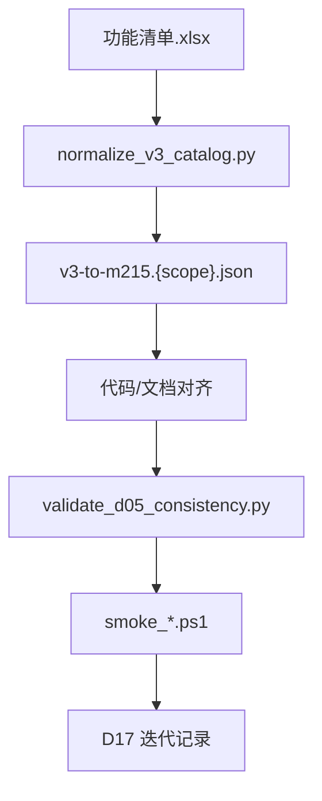

# 系统优化流程及方式

| 属性 | 说明 |
|------|------|
| **文档编号** | **D17** |
| **文档版本** | V1.6 |
| **编制日期** | 2026-07-17 |
| **文档性质** | **活文档**：各业务板块迭代优化的统一指导；每完成一轮优化须更新本文「迭代记录」与对应 mapping |
| **关联** | [`D00`](D00-文档索引与编号规范.md)、[`D04`](D04-开源框架选型评估.md)、[`D05`](D05-系统功能清单.md)、[`D06`](D06-Mxxx实现映射表.md)、[`D07`](D07-总体技术架构设计.md)、[`D16`](D16-基线与外部依赖确认单.md)、[`功能清单.xlsx`](功能清单.xlsx) |

---

## 一、文档用途

1. **单一语义基线**：V3.0 [`功能清单.xlsx`](功能清单.xlsx) 为功能描述最高来源；D05 M 编号为验收编号，二者通过 `catalog/v3-to-m215.*.json` 可追溯。
2. **分块优化**：按「平台 → 子系统 → Tab/Hub」缩小范围，避免改一块牵动全局。
3. **实现方式口径**：四类实现方式全项目统一；「二开」= 自研适配层，**禁止 fork** 开源源码。
4. **持续更新**：每轮优化完成后更新 mapping、冒烟脚本、本文 §四 迭代记录。

---

## 二、优化总流程



| 步骤 | 动作 | 产出 |
|:----:|------|------|
| 1 | 划定 scope（如 collect Tab M051～M077） | scope 说明写入本文 §四 |
| 2 | 运行 `normalize_v3_catalog.py` | `catalog/v3-catalog.{scope}.json` |
| 3 | 编制/更新 mapping | `catalog/v3-to-m215.{scope}.json` |
| 4 | 对齐 D05/D06/D08、前端 IA、后端 API | 代码与文档 diff |
| 5 | CI 门禁 | `validate_d05_consistency.py --scope {scope}` |
| 6 | 冒烟 | `smoke_ingestion.ps1` 等 |
| 7 | 更新 D17 §四 迭代记录 | 版本号 +1 |

**本地门禁（采集域示例）**：

```bash
python scripts/normalize_v3_catalog.py --scope collect
python scripts/validate_d05_consistency.py --scope collect
pwsh scripts/smoke_ingestion.ps1 -CollectOnly
```

---

## 三、实现方式与跨域处理

### 3.1 四类实现方式

| 类型 | 含义 | 改开源源码 | 典型 |
|------|------|:----------:|------|
| **纯自研** | Vue + Spring Boot 业务 | 否 | 采集段 M051～M056、M059、M061～M071、M073～M077 |
| **开源集成** | 部署组件 + API/健康检查适配 | 否 | M057/M058/M060/M072 |
| **集成+自研** | 框架底座 + 自研壳（审批/权限/中文化） | **否** | M078+、M098、M112～M122、M036/M161+ |
| **外购** | 商业产品；本平台 M214 代理 | 否 | M001～M019 |

### 3.2 mapping 必填字段

| 字段 | 说明 |
|------|------|
| `mCode` | M001～M215 |
| `moduleName` | D05「功能模块」列 |
| `implMode` | 与 D05「实现方式」一致 |
| `collectPage` / `sectionKey` | 采集 Hub 路由（如适用） |
| `ownerView` / `ownerApi` | 前端视图 + 后端 API |
| `frameworkRef` | 开源组件名（如有） |
| `integrationPattern` | `api-adapter` / `portal-proxy` / `iframe` |
| `ossProbe` / `bizProbe` | 双轨验收探针 |
| `status` | `match` / `rename` / `impl-gap` / `boundary-split` |

**集成+自研** 项还须填 `customLayer`、`ownerAdapter`、`externalDep`（D16 编号）。

### 3.3 集成+自研五步处理

1. **分类**：`implMode` 写入 mapping，禁止 UI/文档与 mapping 矛盾。
2. **边界拆分**：框架 → `integration/*`；政务定制 → 自研 Service/Vue。
3. **归属登记**：改 M 仅动 `owner*` 列文件 + D08 对应用例。
4. **双轨验收**：`ossProbe`（框架健康）+ `bizProbe`（自研业务动作）。
5. **CI**：全量 mapping 校验 `customLayer` + 双探针非空。

### 3.4 xlsx 与 D05 边界冲突

以 **D05 M 编号 + D16 B7** 为准。示例：xlsx 第 27 行「数据质量管控」→ M078+ 治理域，collect Tab **不实施**，mapping 标 `boundary-split`。

---

## 四、迭代记录（持续更新）

| 轮次 | 日期 | Scope | 状态 | 说明 |
|:----:|------|-------|:----:|------|
| **R1** | 2026-07-13 | 采集汇聚 Tab 对齐（M051～M068 为主） | ✅ 已完成 | mapping + validate + smoke |
| **R1.2** | 2026-07-13 | IA 重构：3 侧栏项；配置表单化；M069～M077 移出采集验收 | ✅ 已完成 | 见下文 R1.2 |
| **R2** | 2026-07-13 | 应用平台对齐（M020～M030、M037～M038；xlsx 44～62 行） | ✅ 已完成 | 见下文 R2 |
| **R2.1** | 2026-07-13 | 应用门户壳美化 + 系统管理同构配置树 + 供需双路径 L1/L2 | ✅ 已完成 | 见下文 R2.1 |
| **R2.2** | 2026-07-14 | 供需五 Tab：需求模型化 / 供给三栏 / 清单中心并列 | ✅ 已完成 | 见下文 R2.2 |
| **R2.3** | 2026-07-14 | 应用分析门户：共享门户 + 决策门户两大板块 | ✅ 已完成 | 见下文 R2.3 |
| **R2.4** | 2026-07-14 | 按规格书重构应用平台：门户/统计/驾驶舱三壳 | ✅ 已完成 | 见下文 R2.4 |
| **R3** | 2026-07-14 | 元数据子系统按 M089～M096 拆页加深（OM+本地台账） | ✅ 已完成 | 见下文 R3 |
| **R4** | 2026-07-14 | 融合治理其余四块（质量/目录/治理ETL/融合）按任务拆解落地 | ✅ 已完成 | 见下文 R4 |
| **R5** | 2026-07-17 | 融合治理端到端双路径架构口径对齐 | ✅ 文档已完成 | D07 V1.3；代码贯通按 P0/P1 后续实施 |
| **R6** | 2026-07-17 | P0 直通共享 + P1 加工共享黄金路径端到端贯通 | ✅ 已完成 | 见下文 R6 |
| **R7** | 2026-07-17 | D 多表多源泛化 + C 资源中心实用闭环 | ✅ 已完成 | 见下文 R7 |
| **R8** | 2026-07-17 | 元数据定时采集运行摘要溢出修复 | ✅ 已完成 | 见下文 R8 |
| **R9** | 2026-07-17 | 元数据管理七子模块实用化 + 分层库改造 | ✅ 已完成 | 见下文 R9；作为其他模块实用化改造模板 |

### R5 融合治理双路径架构口径对齐（2026-07-17）

本轮先完成架构与实施顺序定稿，不宣称端到端代码已贯通。详细架构见 [`D07`](D07-总体技术架构设计.md) V1.3 §8.5.3、§9.1～§9.4。

#### 业务主链

数据来源统一从归集域进入：**资产登记**负责结构、连接与责任申报；**资源采集汇聚**负责搬运业务行数据；**元数据采集**只探测结构并写入治理台账/OM，不搬运业务行。

- **路径 A · 直通共享**：已登记/已汇聚表 → 元数据入账 → 源数据质量 → 源资源编目审批 → 门户订阅 → ESB 分发/授权。
- **路径 B · 加工共享**：源表 → 治理 ETL/模型融合 → 主题库/专题库落表 → 产出元数据再采集 → 产出质量 → 融合资源编目审批 → 门户订阅 → ESB 分发/授权。
- 两条路径共用一套元数据、质量与目录中心；路径 B 的产出表须生成独立 `entry_code` 并保留源表、任务和产出血缘。

#### 模块边界

- 治理 ETL/模型融合（M098～M111）负责加工和写入主题/专题表；资源中心（M130～M138）负责库区、分区、备份与存储管理。
- 服务总线（M001～M019、M214）是订阅审批后的真实对外交换通道；Kettle M099/M215 不覆盖 ESB MessageFlow M011～M013。
- 本地 `gov_*` 是政务治理流程的控制面与验收主路径；OpenMetadata 保留为技术元数据、血缘和检索的增强数据源/可选同步目标，OM DOWN 不阻断本地治理流程。

#### 实施顺序与验收原则

1. **P0 先打通路径 A**：稳定贯通 `ing 源/表` → `gov_metadata_registry` → `gov_quality_*` → `gov_catalog_resource` → `gov_catalog_subscription`。
2. **P0 后半/P1 打通路径 B**：INPUT 接真实源，产出写真实主题表，再完成二次元数据、质量和编目。
3. ESB、资源中心先纳入总图和接口触点，不在 P0 同时展开其全部内部功能。
4. 以场景验收替代菜单验收：至少证明一张表可入账、可稽核、可发布、可订阅并形成可核对的授权/分发结果。

### R6 双路径黄金路径端到端贯通（2026-07-17）

在 R5 架构口径基础上，按「先打通逻辑、再补模块」的顺序把两条路径都做成可逐步执行、可幂等重跑、可脚本验收的黄金路径。统一对象标识贯穿各模块：`entry_code` 串起元数据、质量、目录、订阅授权。

#### P0 · 直通共享（已贯通）

- 后端 `DirectShareGoldenPathService` / `DirectShareGoldenPathController`（`/api/v1/governance/direct-share`）：样例表 → 元数据入账 → 质量挂表 → 编目审批发布（`source_path_type=DIRECT`）→ 订阅审批生成本地授权台账。
- Flyway V49：`ing_data_table` / `ing_ingest_task` / `gov_metadata_registry` / `gov_quality_*` / `gov_catalog_resource` 增加互联字段；新增 `gov_catalog_authorization` 授权台账；植入 `ods_enterprise_base` 样例（含 1 条空名用于质量闭环）。
- 前端 `DirectShareGoldenPathView.vue`（治理 Hub「直通共享」）。脚本 `scripts/smoke_direct_share.ps1` 端到端通过。

#### P1 · 加工共享（本轮贯通）

- 后端 `ProcessedShareGoldenPathService` / `ProcessedShareGoldenPathController`（`/api/v1/governance/processed-share`）：源表 → 治理 ETL 融合入库（清洗去空 + 信用代码脱敏 + 资本等级派生，写入主题库落地表）→ 产出二次元数据（独立 `entry_code` + 源→产出 `LINEAGE` 血缘）→ 产出质量 → 融合资源编目审批发布（`source_path_type=PROCESSED`）→ 订阅审批生成本地授权台账。
- Flyway V50：新建主题库落地表 `dws_enterprise_theme`，登记 `rc_theme_library` 企业主题库，挂接 `gov_fusion_logic_entity` / `gov_fusion_physical` 融合模型映射；融合运行记录写入 `gov_governance_task` / `gov_governance_task_run`。
- 前端 `ProcessedShareGoldenPathView.vue`（治理 Hub「加工共享」，六步引导）。脚本 `scripts/smoke_processed_share.ps1` 端到端通过：源 3 行经清洗产出 2 行、产出表质量 100 分、编目 PROCESSED 门户可见、授权台账 ACTIVE。

#### 产物联动（资产 360）

- 后端 `AssetProfileService` / `AssetProfileController`（`GET /api/v1/governance/asset/360?entryCode=`）：以 `entry_code` 为枢纽，聚合元数据条目+字段、聚焦血缘（上/下游）、质量任务/最近运行/问题、目录资源（含 `source_path_type`/`quality_score`）、订阅+授权台账，实现跨域一屏联动。
- 前端 `AssetProfileDrawer.vue`（复用组件），在元数据「目录」检索结果「资产360」按钮打开；资源编目列表补展示来源路径/质量分/元数据条目；订阅「我的申请」补展示授权码/授权状态。脚本 `scripts/smoke_asset360.ps1` 端到端通过。

#### 边界与后续

- 订阅授权当前仅落「本地授权台账」（`credential_ref`），尚未对接真实 ESB；资源中心仅登记主题库元信息，未展开库区/分区/备份内部功能——与 R5 边界一致，留作后续接入。
- 下一步计划：**D 多表多源扩展**（黄金路径从固定样例泛化为可选任意已登记表）、**C 资源中心内部功能**（库区/分区/备份/存储策略）。

### R7 D 多表多源 + C 资源中心实用闭环（2026-07-17）

在 R6 双路径黄金路径基础上，将直通/加工共享泛化为**任意已登记且已汇聚表**，并落地资源中心主题/专题纳管、分区 DDL 预检、JDBC 逻辑备份与真实容量监控。

#### D · 多表多源泛化

- **资格判定**：`SharePathSupportService` 统一候选表规则（`ing_data_table.status=ACTIVE`、合法 `physical_table_name`、关联 `ing_ingest_task.status=SUCCESS`、JDBC 验证物理表存在）；`collect_status` 仅作汇聚成功写回缓存。
- **统一编码**：源表/产出表/列/任务/目录资源由稳定业务键派生（`TBL_ING_*` / `TBL_FUS_*` 等），超长追加短哈希，避免静默截断冲突。
- **直通共享**：`DirectShareGoldenPathService` 全步骤接受 `tableId`；质量规则可配置（默认 `RECORD_COUNT`，可选 `NULL_CHECK`/`UNIQUENESS`/`ACCURACY`），不再硬编码企业字段。
- **加工共享**：声明式 `fusionSpec` + `FusionSqlCompiler` 白名单编译（列名、`MASK`/`CASE_LEVEL`、有限过滤）；`fusion/preview` 预检 + `fusion/run` 事务执行；Flyway V51 增加第二张验收表 `ods_project_base`。
- **前端**：`DirectShareGoldenPathView.vue` / `ProcessedShareGoldenPathView.vue` 首步选表、懒加载字段与步骤状态；加工路径支持字段映射/过滤/脱敏预检 UI。
- **验收脚本**：`scripts/smoke_multi_share.ps1`（项目表直通 + 加工至 `dws_project_theme`、非法表达式拒绝、资产360 血缘）。

#### C · 资源中心实用闭环

- **数据模型**：Flyway V52 扩展 `rc_theme_library`（`THEME`/`TOPIC`、库区、责任方）；新增 `rc_managed_table`、`rc_backup_artifact`；扩展 `rc_partition_def` 预检字段与 `rc_storage_policy` 纳管表绑定。
- **后端**：`ResourceCenterPlatformService` / `ResourceCenterPlatformController`（主题/专题 CRUD、候选产出表、纳管/解绑、分区策略 CRUD + **DDL 预检仅展示不执行**、JDBC 流式逻辑备份 + SHA-256 校验、保留期清理、`information_schema` 容量刷新）；全接口 `@PreAuthorize`；`DESTROY` 策略禁止自动执行。
- **加工联动**：融合成功后 `ProcessedShareGoldenPathService` 自动将产出表纳管至对应主题/专题库（幂等）。
- **前端**：`ResourceCenterHubView.vue` 重构——基础库 Tab 含主题/专题与纳管；分区 Tab 含策略 CRUD/预检/备份历史校验；监控 Tab 真实容量刷新；inline 表单与状态中文化。
- **验收脚本**：`scripts/smoke_resource_center.ps1`（纳管 → 分区预检 → 逻辑备份 → SHA-256 校验 → 监控刷新）。

#### 安全边界（本阶段）

- 分区策略：**仅保存审核结果与候选 DDL，不自动执行 `ALTER TABLE ... PARTITION`**。
- 逻辑备份：JDBC 导出至 `data/nas-demo/backups/*.cdbak`，凭据不入命令行；**不提供自动覆写业务表恢复**。
- ESB 真实分发/授权仍留待后续接入；本地授权台账与资源中心台账为验收主路径。

### R8 元数据定时采集摘要溢出修复（2026-07-17）

元数据定时任务完成 JDBC 探库和台账写入后，会把全部新增、删除、变更条目编码序列化到 `gov_meta_collect_run.summary`。当一次采集产生数百条变更时，内容超过原 `VARCHAR(512)`，触发 `MysqlDataTruncation`；失败处理再次写入过长异常文本，导致任务按 Cron 周期反复失败并持续输出告警。

- **后端收敛**：`MetadataSubsystemService` 的 `summary` 改存压缩 JSON，包括新增、删除、变更总数、各类最多 8 个样例编码、上次运行 ID 和截断标记；完整 diff 明细转存 `log_text`。
- **防御性截断**：运行摘要、任务/连接器最近消息、审计消息及异常摘要在写入有限长度字段前统一截断，避免失败处理再次触发字段溢出。
- **数据库迁移**：Flyway `V57__meta_collect_run_summary_text.sql` 将 `gov_meta_collect_run.summary` 从 `VARCHAR(512)` 扩展为 `TEXT`，与应用层压缩形成双重保护。
- **前端兼容**：`MetaMonitorView.vue` 优先使用 `addedCount`、`removedCount`、`changedCount` 展示真实总数，并兼容历史运行记录中仅含数组的旧摘要格式。
- **生效方式**：重启后端，由 Flyway 自动执行 V57；下一次定时采集应正常落为 `SUCCESS`，且不再出现 `Data too long for column 'summary'`。

### R9 元数据管理七子模块实用化与通用改造方法（2026-07-17）

本轮在满足 D05 M089～M096 验收需求的基础上，将元数据管理从“菜单和薄功能可演示”调整为可接真实数据源、可形成数据台账、可支撑质量/治理/编目/共享的实际业务模块。本节同时作为后续其他模块调整的统一参考：**先明确业务边界和对象主键，再打通真实数据流，最后补齐任务、监控、版本、目录和分析闭环**。

#### 1. 模块定位与边界

元数据管理在本项目中的定位是数据中台的“数据地图 + 数据台账 + 数据管家”，负责统一登记和关联数据源、表、字段、任务、血缘及业务属性，但不代替归集汇聚搬运业务行数据。

| 环节 | 负责内容 | 是否搬运业务行 | 主要落库 |
|------|----------|:--------------:|----------|
| 数据资产登记 | 首次登记外部系统连接、库表结构、字段、主键、责任信息 | 否 | `smart_city.ing_*` |
| 数据资源采集汇聚 | 按任务从外部系统读取真实业务数据 | 是 | 结构化数据写 `smart_city_ods`；文件/半结构化数据按类型写 SeaweedFS、MongoDB、ES 等 |
| 元数据采集 | 通过 JDBC / `information_schema` 探测表、字段、类型、主键、注释等技术结构 | 否 | `smart_city.gov_*`，OM 为可选同步目标 |
| 治理/融合加工 | 清洗、转换、标准化、聚合并形成新数据资产 | 是 | `smart_city_dwd` / `smart_city_dws` / `smart_city_ads` |

结构化外部数据的标准主链固定为：

```text
登记外部数据源（地址/端口/库名/用户名/加密密码）
→ 测试连接
→ 探库并勾选源表
→ 登记表和字段（collect_status=PENDING）
→ 手动或定时执行 Kettle 汇聚
→ 业务行写入 smart_city_ods
→ 汇聚成功回写 SUCCESS、physical_table_name
→ 自动登记 SOURCE/TABLE/COLUMN 元数据并生成血缘
```

必须遵守以下边界：

1. 外部系统连接参数只允许在“数据源登记”首次接入时填写；密码后端加密保存，不回显明文、不写日志。
2. 元数据采集、质量、治理、融合、编目等后续模块必须从已登记对象下拉选择，不得重复要求用户填写 JDBC 地址、账号或密码。
3. 数据资产登记只写控制台账，不因登记动作自动搬运业务行；真正落 ODS 必须经过汇聚任务。
4. 元数据采集只采结构和描述，不调用 Kettle、不复制业务行；Kettle 汇聚成功后可触发一次目标表元数据自动入账。
5. OpenMetadata 是技术元数据、血缘和检索增强源；本地 `gov_*` 是政务流程控制面。OM 不可用不得阻断本地采集、维护、目录和分析主流程。

#### 2. 数据库分层规则

项目数据分层改为物理数据库（MySQL schema）隔离，表名前缀只作兼容提示，不再作为分层真值：

| 数据库 | 定位 | 典型写入者 |
|--------|------|------------|
| `smart_city` | 平台控制面：`sys_*`、`ing_*`、`gov_*`、审计、配置、任务台账 | Spring Boot / Flyway |
| `smart_city_ods` | 原始汇聚层，尽量保留源数据形态 | Kettle 采集 |
| `smart_city_dwd` | 清洗、标准化后的明细层 | 治理 ETL |
| `smart_city_dws` | 主题与汇总层 | 融合任务 |
| `smart_city_ads` | 面向报表、接口和应用的服务层 | 应用加工任务 |

落地规则：

- `compose/init-layer-databases.sql` 和 Flyway V58 创建四个分层库；账号须具有相应跨库权限。
- Kettle 采集默认目标库为 `smart_city_ods`；融合 SQL 使用全限定名，例如 `smart_city_ods.ods_x` → `smart_city_dws.dws_x`。
- `gov_metadata_registry` 记录 `database_name`、`schema_name`、`data_layer`；平台分层由物理库自动推导，普通用户不可随意修改。
- 历史位于 `smart_city` 的 `ods_*` / `dws_*` 演示表不视为已自动迁移；应重新汇聚或经受控脚本迁移。
- 前端数据源按“外部业务源、平台 ODS、平台 DWD、平台 DWS、平台 ADS”分组展示。

#### 3. 统一对象标识与跨模块联动

`entry_code` 是元数据、血缘、质量、版本、目录、订阅和共享之间的稳定业务键：

- 汇聚表：`TBL_ING_{dataSourceId}_{physicalTableName}`。
- 融合产出表：`TBL_FUS_{physicalTableName}`。
- 字段编码由父表 `entry_code` + 字段名稳定派生；超长编码追加短哈希。
- 普通业务页面隐藏 `entry_code`，只在详情“高级信息”中提供查看/复制；API 和跨模块跳转仍传该编码。
- Kettle 汇聚成功后幂等 upsert SOURCE/TABLE/COLUMN，并建立“数据源 → ODS 表”的 `LINEAGE` 边。
- 融合成功后登记独立产出条目，并建立“源表 → 产出表”的 `LINEAGE` 边；不得复用源表编码。

后续模块改造时，禁止再新建无法与 `entry_code` 对齐的孤立对象编号；确需内部主键时采用“数据库自增 ID + 稳定业务编码”双键模式。

#### 4. 七个子模块交付能力

##### 4.1 元模型管理

- 元模型是可复用的标准结构模板，不是每张源表的机械副本；ODS 原始表允许不绑定模型。
- 新建/编辑使用弹窗，字段设计器支持编码、名称、类型、长度、必填、主键。
- 支持草稿、发布、下线；只有已发布模型可绑定采集任务。
- 支持 JSON 导入导出、两模型字段级差异比较、从已入账 TABLE 条目生成模型草稿。
- 模型详情可查看绑定资产和采集任务；新版本发布后可批量重跑符合度。
- 绑定模型的采集结果记录 `PASS/PARTIAL/FAIL` 与差异报告，但源表元数据仍可入账。

##### 4.2 元数据采集

- 主路径选择已有 `ing_data_source`；平台 ODS/DWD/DWS/ADS 作为虚拟分层数据源参与选择。
- 选中数据源后实时探库，以列表多选表或选择整库；禁止以手填逗号分隔表名作为主路径。
- 元模型可选绑定；Cron 可选且默认关闭。默认使用“手动执行 + 汇聚成功自动入账”。
- 采集通过 JDBC 读取系统目录，upsert SOURCE/TABLE/COLUMN，并生成本次运行版本和新增/删除/变更 diff。
- Kettle 汇聚成功调用 `registerAfterCollect` 自动登记 ODS 表和字段；元数据登记失败只记录告警，不把已成功的数据汇聚伪装成失败。
- 定时采集只用于发现外部库 DDL 变化，不表示每天重做业务语义元数据。

##### 4.3 元数据采集监控

- 展示手动/自动运行、任务状态、最近运行、日志下钻和 OpenMetadata 健康状态。
- 支持停止运行中任务；页面顶部展示最近失败摘要。
- diff 同时展示新增、删除、变更总数及少量样例；完整明细写 `log_text`，摘要采用压缩 JSON。
- 状态、条目类型、变更类型全部中文展示，API 仍使用稳定英文码。

##### 4.4 元数据维护

- 主路径先从现有条目下拉或列表点选再编辑，手工补录仅作为次要入口。
- 可维护中文名、描述、业务域、责任人、标签、关键字和安全分级；物理库和分层自动识别并只读展示。
- 安全分级固定为公开、内部、敏感、核心；标签支持主数据、共享数据、高频使用、个人信息等多选。
- “标准候选”统计跨表重复且定义相近的字段；人工确认后沉淀为标准项，不自动修改现有资产。
- 每次维护生成版本、变更通知和审计日志；页面名称统一为“元数据条目”，不再另造“维护台账”概念。

##### 4.5 元数据版本管理

- 先选择 MODEL 或 ENTRY 及具体对象，再查询版本历史。
- 支持两版本基础属性和字段级 diff。
- 支持订阅变更；维护或结构变化生成站内通知。
- 回滚生成新的草稿版本，不直接覆盖已发布模型或当前正式条目。
- 本期不包含跨环境复制。

##### 4.6 元数据目录

- 使用“左树右表”：树节点只筛选右侧列表，不自动打开抽屉。
- 支持名称、字段、关键字、标签和资产类型检索；表格展开行展示字段。
- 展示物理库、分层、密级、责任人、符合度和更新时间。
- 盘点条展示总表数、各层数量及无下游血缘的闲置数量。
- 支持下线，已下线条目默认不参与检索；支持携带 `entry_code` 发起质量任务或资源编目。
- 元数据目录 UI 移除“资产 360”按钮、预览抽屉和 `AssetProfileDrawer`；历史后端聚合接口可保留，但不作为当前目录主入口。

##### 4.7 元数据分析

- 分析起点、关系起止点均从已有 TABLE/ENTRY 下拉选择，不要求普通用户手填编码。
- 支持表级血缘图、递归影响分析、手工补充 LINEAGE/IMPACT/ASSOC/FK 关系。
- 支持查看条目关联的汇聚/治理任务摘要。
- 下线前评估下游引用；无下游关系时才提示“可下线”。
- 本期不实现字段级自动血缘和通用 SQL 全量解析。

#### 5. 全模块交互与工程规则

1. **选择代替重复录入**：数据源、表、模型、条目、关系起止点一律优先下拉或探库勾选；内部 ID 不暴露为手填项。
2. **首次接入例外**：只有“数据源登记”允许填写外部地址、端口、库名、用户名和密码；后续模块复用加密凭据。
3. **按视图懒加载**：首屏及 Tab 切换只请求当前可见区块，同轮并行请求控制在 1～3 个；探库、详情、连接器等在用户操作时加载。
4. **局部刷新**：保存、执行、下线成功后只刷新受影响的数据，不执行全页无差别 reload。
5. **中文展示、英文传输**：统一通过 `status-label.ts` 转换状态、类型、密级和关系码，禁止向业务用户裸显英文码。
6. **敏感信息安全**：密码密文保存，接口不回传明文，日志和审计信息不得记录凭据。
7. **真实失败**：外部连接、Kettle、数据库操作失败必须返回真实失败，不生成伪成功数据；可选 OM 同步失败不阻断本地已完成事务。

#### 6. 后端、前端与迁移落点

- Flyway V58：创建分层库并扩展 `gov_metadata_registry` 的物理定位、业务维护和符合度字段。
- `DataLayerSupport`：统一数据库常量、表名前缀兼容判断和全限定名生成。
- `KettleCollectService`：结构化数据写 ODS，成功后回写归集台账并自动登记元数据。
- `MetadataSubsystemService` / `MetadataSubsystemController`：选源探表、任务、模型绑定、符合度、版本回滚、盘点、下线评估和任务关联。
- `FusionSqlCompiler` / `ProcessedShareGoldenPathService`：跨库 ODS → DWS SQL 与 Kettle 目标库处理。
- `MetaModelView.vue`、`MetaCollectView.vue`、`MetaMonitorView.vue`、`MetaMaintainView.vue`、`MetaVersionView.vue`、`MetaCatalogView.vue`、`MetaAnalyzeView.vue`：七子模块实用化交互。
- `meta-labels.ts` / `status-label.ts`：元数据选项、字段模型解析和中文状态映射。

#### 7. 验收口径

至少使用一个真实或可控测试数据源完成以下闭环：

1. 首次填写连接信息并测试成功，探库后勾选一张表登记；验证仅写 `ing_*`，ODS 尚无业务行。
2. 手动执行汇聚；验证业务行进入 `smart_city_ods`，任务为 SUCCESS，`physical_table_name` 回写。
3. 验证 `gov_metadata_registry` 自动生成 SOURCE/TABLE/COLUMN，库名和分层为 ODS，并存在汇聚血缘。
4. 创建并发布元模型，绑定采集任务后得到可解释的符合度报告。
5. 修改源表结构后再次采集，监控页能展示 diff，版本页能比较变化。
6. 维护业务域、责任人、标签和密级；验证生成版本、通知和审计记录。
7. 目录可检索、展开字段、盘点分层、识别闲置，并携带 `entry_code` 发起质量或编目。
8. 分析页可查看血缘、影响范围、关联任务和下线评估。
9. 后端执行 `mvn compile` 通过；前端无新增 lint 错误；OM 关闭时本地主流程仍可使用。

#### 8. 其他模块按此思路调整的模板

后续质量、治理 ETL、融合、资源编目、共享交换等模块统一按以下顺序实施：

1. **对齐需求**：先建立 D05 M 编号、页面、API、表和验收动作映射。
2. **明确边界**：写清该模块管理“配置/台账/元数据”还是实际搬运、加工业务数据，禁止职责重叠。
3. **确定主对象**：明确稳定业务编码及与 `entry_code`、物理表、任务 ID 的映射。
4. **复用上游对象**：下游从已登记对象选择，不重复录入数据源、表名、账号和连接参数。
5. **打通真实主链**：输入、执行、物理产出、状态回写、日志、审计必须可核验，不用随机数据伪造成功。
6. **补齐操作闭环**：列表 → 新建/配置 → 执行 → 监控 → 版本/通知 → 下线/影响评估。
7. **统一交互**：中文展示、下拉勾选、懒加载、局部刷新、敏感信息不回显。
8. **可选集成降级**：开源组件提供增强能力；组件不可用时说明降级边界，不破坏本地控制面。
9. **场景验收**：以一条真实业务对象从上游进入、处理、产出并被下游引用为验收，而不是只检查菜单和空页面。
10. **回写 D17**：记录数据流、边界、实现文件、迁移版本、脚本和已知限制，供下一模块复用。

### R4 融合治理四系统落地（2026-07-14）

依据 WorkBuddy《融合治理平台Cursor任务拆解（元数据除外）.md》完成 **A1～A10、B1～B7、C1～C5、D1～D4**：

- **质量**：标准体系、数据元/码表/命名/对标；`rule-mgmt` / `task-mgmt` / `reports-mgmt`
- **目录**：分类树、`resources-mgmt` 审批流、订阅分发门户、版本与导入导出（V40、V46～V48）
- **治理 ETL**：`gov-tasks` + Vue Flow + 执行器（含融合 6 组件）+ 定时（V41/V42）
- **融合**：逻辑物理模型、脚本执行与版本（V43～V45）
- **入口**：`/governance` 各 Tab 内子区；与旧 Demo API 路径隔离

### R3 元数据子系统拆页加深（2026-07-14）

主数据平台 · 数据融合治理 · **元数据** Tab 由薄 POC 拆为七子区（`?tab=metadata&section=`）：

- **子区**：元模型 / 采集 / 监控 / 维护 / 版本 / 目录 / 分析（M089～M096；M094 并入版本导入导出）
- **Flyway V29**：`gov_meta_model`、`gov_meta_collect_task`、`gov_meta_collect_run`、`gov_meta_version`、`gov_meta_relation`；扩展 `gov_metadata_registry`
- **后端**：[`MetadataSubsystemService`](platform-backend/src/main/java/com/chengde/smartcity/masterdata/service/MetadataSubsystemService.java) + [`MetadataSubsystemController`](platform-backend/src/main/java/com/chengde/smartcity/masterdata/controller/MetadataSubsystemController.java)；未发布元模型不可绑采集；运行日志可停止
- **OpenMetadata**：加深 pipeline 列表/停止、表目录、lineage；OM DOWN 时本地假数据仍可演示
- **边界**：≠ 归集「资产登记」库表项；≠ 归集「资源采集汇聚」行数据任务；治理壳 `gov_*` 作台账/审计，OM 作可选真相源
- **前端**：[`MetadataSubsystemView.vue`](platform-web/src/views/governance/metadata/MetadataSubsystemView.vue) 按子区懒加载，并行请求 ≤3

### R2.4 应用平台三壳改造（2026-07-14）

按《应用平台改造工程规格书》改造 `/exchange/application`：

- 顶栏三按钮：`portal` 数据共享门户 / `stats` 统计分析 / `cockpit` 决策驾驶舱（按 `analytics:*` 权限显隐）
- [`PortalHomeView.vue`](platform-web/src/views/exchange/application/PortalHomeView.vue)：Banner 四统计+热词+推荐；Tab=资源目录 / 订阅(+供需 `SupplyDemandView` 兜底) / 考核 / 我的空间
- [`CockpitView.vue`](platform-web/src/views/exchange/application/CockpitView.vue)；统计合并基础库+重点领域
- 旧 `/exchange/portal` 跳转应用平台；Flyway **V28** 角色与权限码；旧 `system=supply|assessment|base-stats|domain-stats` 兼容映射

### R2.3 应用分析门户两大板块（2026-07-14）

- **顶层两大板块**：[`PortalHubView.vue`](platform-web/src/views/exchange/PortalHubView.vue) 用 `board=share|decision` 切换；不改路由。
- **数据共享门户**：首页（四统计 + 热词 + 最新/最热 + 主题/单位）/ 全文检索 / 资源目录（数据·服务双目录、表卡视图、挂接预览）/ 订阅申请（TABLE/FILE/API）。
- **领导决策门户**：八态势卡片 + 领域深链 + DataEase `boardUrl` iframe 占位（未配置时空态）。
- **目录扩展**（Flyway V27）：`catalog_kind` / `theme_*` / `provider_org` / `share_modes` / `resource_count` / `hot_score` / `published_at`；态势表 `board_url`。
- **订阅→任务台账**：审批通过写入 `biz_demand_supply_task`（`ref_flow_code=PORTAL_SUB_{id}`），回写目录热度；不下发下游。
- **API**：`/exchange/portal/home|search|catalog` 支持主题/单位/种类/共享方式过滤；接口加 `@PreAuthorize("isAuthenticated()")`。
- **R2.4 后**：上述能力迁入应用平台门户壳；`PortalHubView` 改为跳转入口。

### R3.1 元数据管理 P0～P2（2026-07-14）

- **后端**：`MetadataSubsystemService` 扩展 JDBC 探库采集、任务 CRUD、目录搜索/下线、版本字段级 diff、影响递归、FK 解析、订阅与变更通知、标准沉淀建议；`MetaCollectScheduler` 按 Cron 调度；Flyway V30。
- **前端**：M090～M096 子视图补齐编辑/删除、Cron 可视化、监控下钻、目录左树右表、ECharts 血缘图、维护标签分级与通知。
- **冒烟**：[`scripts/smoke_metadata.ps1`](scripts/smoke_metadata.ps1) 覆盖 models/tasks/run/catalog/search/analyze。
- **后续修复（R8）**：JDBC 全库首次采集 diff 条目过多时，`gov_meta_collect_run.summary` 曾整包写入 entryCode 列表导致 `VARCHAR(512)` 溢出、Cron 每分钟反复失败；见上文 **R8**（Flyway V57 + 压缩摘要 + `MetaMonitorView` 计数展示）。

### R2.2 供需五 Tab 与清单中心（2026-07-14）

- **页内并列五 Tab**（无侧栏）：数据需求管理 / 需求分析 / 需求确认 / 数据供给查看 / **数据清单中心**。
- **需求模型化**：结构化按模板 `fieldSchema` 填报；非结构化录入 `demandContent`；模板 CRUD 在系统管理·供需配置（含字段模型 JSON）。
- **数据供给查看**：分栏展示交换作业、接口、通用共享页面（`supplyView.exchangeJobs/apiEndpoints/sharePages`）。
- **清单中心子清单**：部门目录 / 服务 / 开放 / 异议；`GET /exchange/supply/list-center?listType=`。
- **Flyway**：V26 `demand_content` / `model_fields`。

### R2.1 应用门户与配置树（2026-07-13）

- **统一门户壳**：[`ApplicationHubView.vue`](platform-web/src/views/exchange/application/ApplicationHubView.vue) 单页顶栏切换四应用（供需/考核/基础库统计/重点领域），美化为应用门户风格（非卡片入口）。
- **系统管理同构配置树**：`系统管理 → 数据共享交换平台 → 应用平台 → 供需配置 / 考核评估配置`（菜单 6100～6103，Flyway V23）；角色勾选菜单授权。
- **供需双路径**：分析/分发设定 `fulfill_path=AUTHORIZE_EXISTING|NEED_COLLECT`；确认后写 `biz_data_duty` 数据责任；按路径生成任务（路径 B 才含 COLLECT）。
- **L1 验收口径**：任务台账 + 责任台账可查即可；模板/目录发布在供需配置，前台清单只读+异议登记。
- **L2 真下发**：`app.exchange.supply.dispatch-downstream=true` 时写入 `biz_collect_task` 并回写任务状态（默认关闭）。
- **考核切开**：前台仅看结果/明细；来源/周期/指标/执行发布在考核评估配置。
- **uiHost**：业务 `application-ops`（`/exchange/application`）；配置 `system-config-tree`（`/system/exchange/application/*-config`）；逻辑域仍属 L1.3。

### R2 应用平台 IA 调整（2026-07-13）

- **顶栏四分系统**：数据供需对接 / 考核评估系统 / 基础库统计分析 / 重点领域统计分析（与 xlsx 四个子系统并列，无「大数据统计分析」中间层）。
- **供需页内五 Tab**（R2.2）：需求管理 / 分析 / 确认 / 供给查看 / 清单中心；侧栏收拢为单项「供需对接」。
- **考核侧栏**：前台仅考核结果；配置在系统管理。
- **统计无侧栏**：基础库、重点领域各占顶栏一项，页内按 xlsx 第 52～62 行专题 Tab 组织。
- **产物**：`catalog/v3-catalog.application.json`、`catalog/v3-to-m215.application.json`、`validate --scope application`。

### R1.2 采集汇聚 IA 调整（2026-07-13）

- **侧栏**：去掉「数据资源采集汇聚」分组标题；仅保留 **数据汇聚接入 / 规范设计 / 指标与目录体系构建** 三项。
- **数据上传**（M051～M053）并入 **数据汇聚接入 → 结构化数据接入 → 手动上传数据**。
- **FTP/本地** 合并为 **文件上传**；**非结构化/API/CDC 等** 合并为 **其他数据接入**；通道配置改为**前台表单**，不再展示 JSON。
- **定时调度**：即 Cron 表达式，控制接入任务自动执行时间（如 `0 2 * * *` = 每天凌晨 2 点）。
- **规范设计 / 目录编目**：复用登记侧数据源、表、字典；探查与编目在界面配置。
- **M069～M077（数据资产管理）**：**移出采集 Tab，不作为本期采集汇聚验收项**；分级/标签/备份等能力在登记侧（M046/M045 等）验收。

### R1 采集汇聚要点

- **纳入**：`system=collect`，**3 侧栏项**（汇聚接入 / 规范设计 / 目录编目），页内 Tab 覆盖 M051～M068。
- **移出采集验收**：M069～M077（数据资产管理）。
- **产物**：`catalog/v3-catalog.collect.json`、`catalog/v3-to-m215.collect.json`、`scripts/validate_d05_consistency.py`。

### 后续轮次（预留）

| 轮次 | Scope | 触发 |
|:----:|-------|------|
| R2.1 | 登记 Tab M039～M050 | R2 应用域 CI 稳定后 |
| R3 | 治理域 M078+（集成+自研·OM） | D16-E3 就绪 |
| R4 | 全平台 `v3-to-m215.full.json` | R1～R3 模板验证通过 |

---

## 五、目录与脚本索引

| 路径 | 说明 |
|------|------|
| [`catalog/`](catalog/) | xlsx 规范化 + V3↔M mapping |
| [`scripts/normalize_v3_catalog.py`](scripts/normalize_v3_catalog.py) | xlsx 向前填充与 scope 筛选 |
| [`scripts/validate_d05_consistency.py`](scripts/validate_d05_consistency.py) | mapping / nav / d05-modules 一致性 |
| [`scripts/smoke_ingestion.ps1`](scripts/smoke_ingestion.ps1) | 归集 Hub 冒烟 |
| [`.cursor/rules/d05-ui-labels.mdc`](.cursor/rules/d05-ui-labels.mdc) | UI 禁止 M 编号 |

---

## 六、修订记录

| 版本 | 日期 | 说明 |
|------|------|------|
| V1.0 | 2026-07-13 | 初版：优化总流程、实现方式四类、集成+自研五步、R1 采集汇聚迭代 |
| V1.2 | 2026-07-13 | R1.2 采集 IA；R2 应用平台 M020～M038 对齐 |
| V1.3 | 2026-07-13 | R2.1 应用门户壳、系统管理同构配置树、供需双路径与数据责任 |
| V1.4 | 2026-07-17 | R5～R7：融合治理双路径、多表多源及资源中心实用闭环 |
| V1.5 | 2026-07-17 | R8：修复元数据定时采集 summary 超长导致的周期性失败 |
| V1.6 | 2026-07-17 | R9：元数据七子模块实用化、独立分层库、归集/元数据边界及其他模块通用改造模板 |
