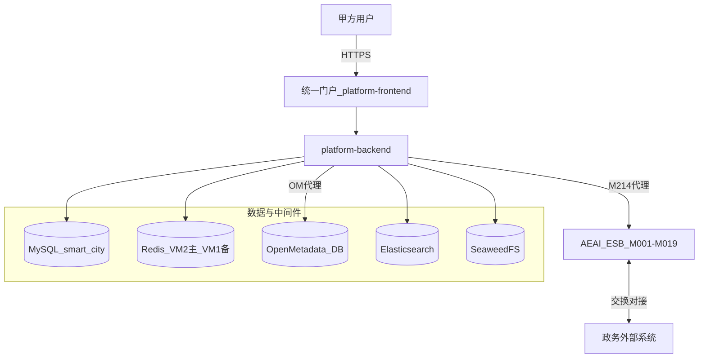
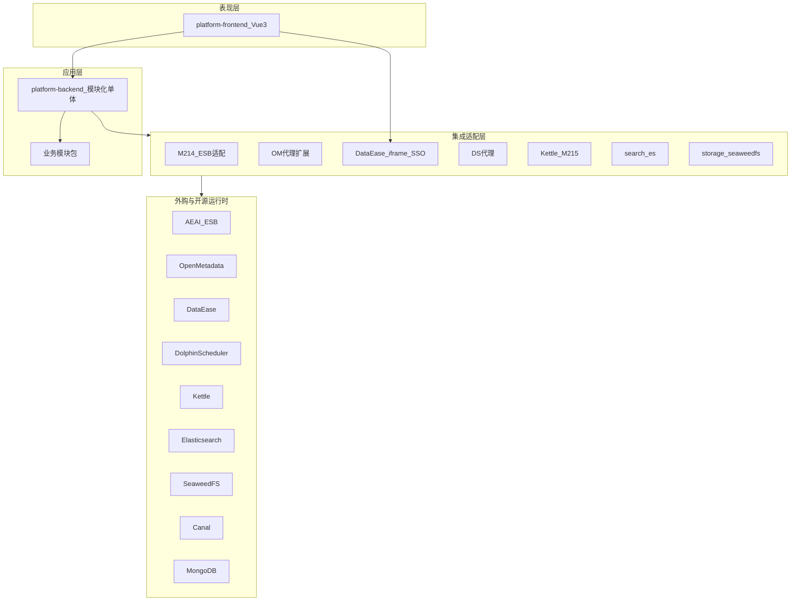
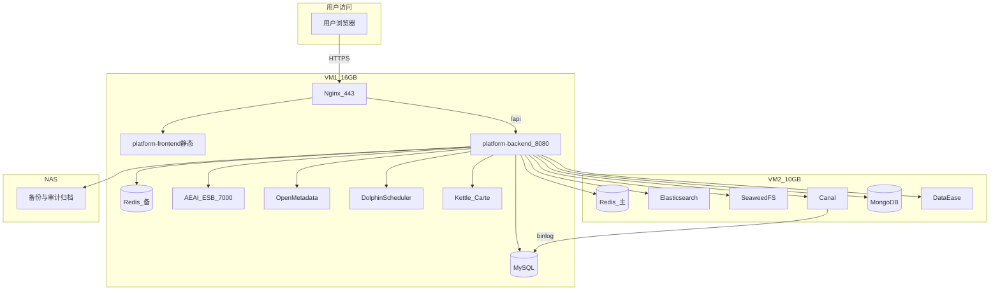
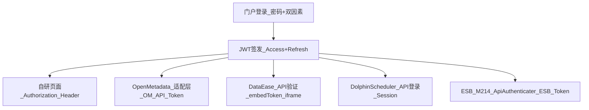
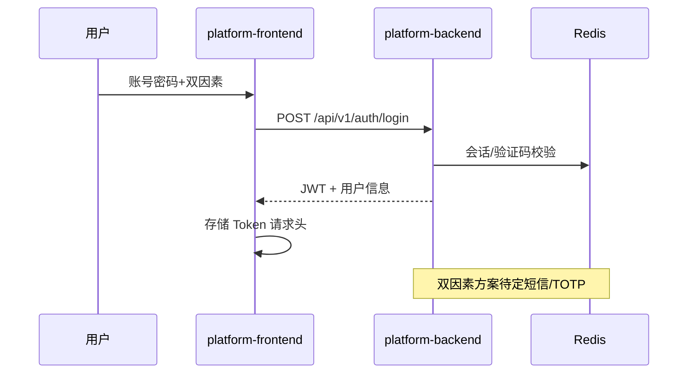
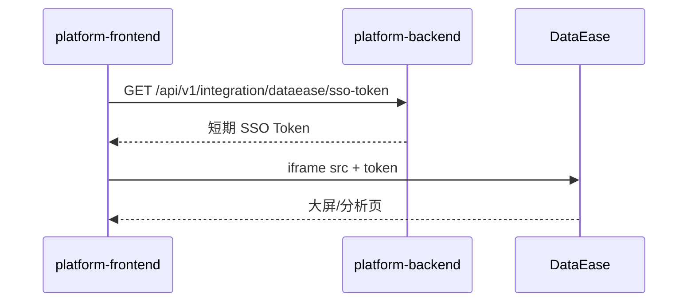
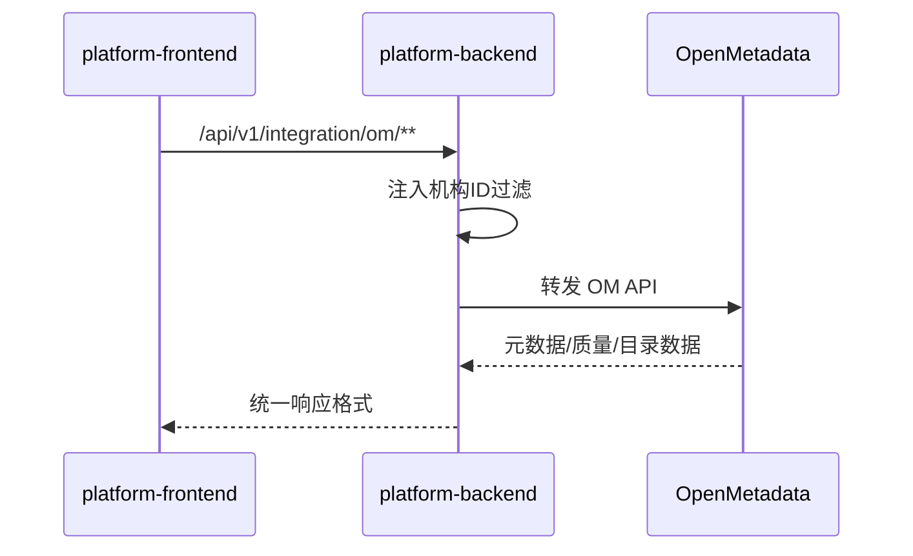
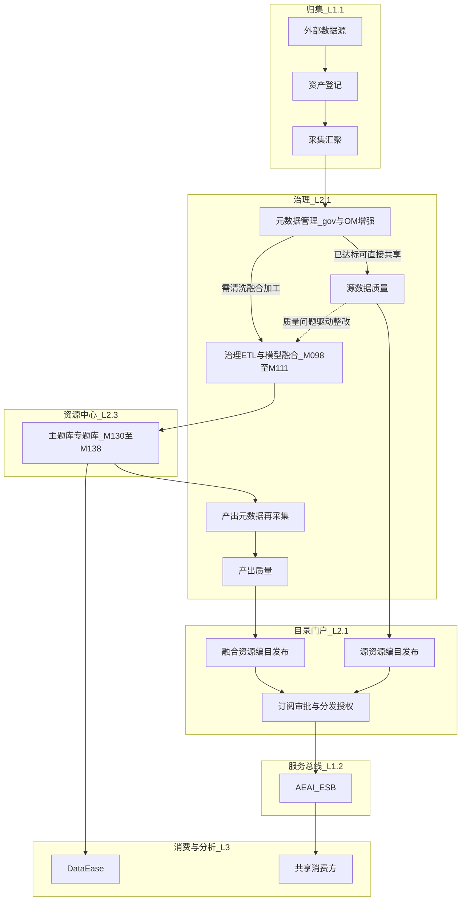
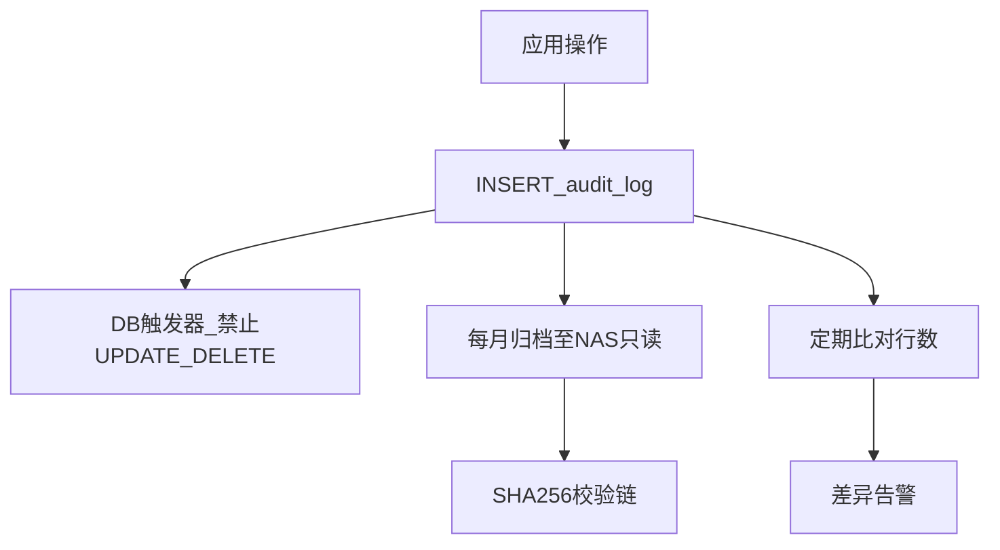

# 承德高新区智慧城市基础平台 — 总体技术架构设计

| 属性 | 说明 |
|------|------|
| **文档编号** | **D07** |
| **文档版本** | V1.5 |
| **编制日期** | 2026-07-17 |
| **文档性质** | MS1 可开发的**技术架构契约**；供开发、集成、运维与等保测评配合 |
| **编制依据** | V1.0 + WorkBuddy《总体技术架构设计_对比分析与整改建议》 |
| **上位基线** | [`D02-需求基线说明.md`](D02-需求基线说明.md) V2.3 |
| **配套文档** | [`D05-系统功能清单.md`](D05-系统功能清单.md) V2.6、[`D06-Mxxx实现映射表.md`](D06-Mxxx实现映射表.md) V1.0、[`D04-开源框架选型评估.md`](D04-开源框架选型评估.md) V1.0、[`D03-ESB集成说明.md`](D03-ESB集成说明.md)、[`D11-统一门户技术方案.md`](D11-统一门户技术方案.md) V0.6、[`D00-文档索引与编号规范.md`](D00-文档索引与编号规范.md) |

---

## 一、文档说明

### 1.1 文档定位与效力

本设计将基线已定的「**统一门户 + 模块化单体 + 7 框架嵌入 + 外购 ESB**」落成可实施的技术结构，回答：

- 系统如何分层、如何部署
- 开源/外购组件如何与自研门户集成
- 数据与安全边界在哪里
- MS1～MS8 各阶段架构交付什么

**不替代**以下文档的职责：

| 文档 | 职责 |
|------|------|
| 需求基线说明 | 需求范围、工程约束、等保与非功能 |
| 系统功能清单 | M001～M215 验收要点 |
| Mxxx 实现映射表 | 逐模块实现方式、代码包、门户集成 |
| ESB 集成说明 | M001～M019 接口与 SMC 映射 |
| 开源框架选型评估 | 框架终版决策与 License |

### 1.2 读者与使用方式

| 读者 | 使用章节 |
|------|----------|
| 后端/前端开发 | 第五章逻辑架构、第八章集成、第十一章接口 |
| 集成工程师 | 第六章部署、第七章 License、第八章集成、附录 C/E |
| 运维/等保 | 第六章、第十章、附录 A/B |
| 项目经理 | 第三章、第十四章里程碑 |

### 1.3 修订记录

| 版本 | 日期 | 说明 |
|------|------|------|
| V1.0 | 2026-06-23 | 初版：可开发简版，支撑 MS1 骨架与 MS2 集成 POC |
| V1.1 | 2026-06-23 | 合并版：架构原则、菜单树/映射、License/JWT/Redis/审计可落地细节、非功能与验证项 |
| V1.2 | 2026-06-24 | 新增 §5.8 门户前端布局（Hub / 子系统侧栏），对齐 D11 V0.6 |
| V1.4 | 2026-07-17 | D 多表多源黄金路径泛化；C 资源中心纳管/分区预检/JDBC 逻辑备份/容量监控落地；明确分区不自动执行与备份不自动恢复边界 |
| V1.5 | 2026-07-25 | §9.3 增补「过程数据 vs 可共享资源」产品口径：治理/融合/目录分层与 ODS～ADS 落库对应 |
| V1.3 | 2026-07-17 | 细化融合治理直通/加工共享双路径；明确 `gov_*` 治理台账与 OpenMetadata 增强边界、资源中心及 ESB 触点 |

## 二、架构设计原则

| # | 原则 | 说明 |
|---|------|------|
| 1 | **统一门户优先** | 所有功能经统一门户进入；甲方不直接访问任何框架原生 URL |
| 2 | **集成不改造** | 开源框架不改源码；通过 API 代理 / iframe 嵌入 / 配置定制实现集成 |
| 3 | **等保三级前置** | 安全控制项在架构层落地，非事后补丁 |
| 4 | **中等规模约束** | 不引入 Hadoop/Kafka 等重型组件；2 台 VM 覆盖全部 215 模块 |
| 5 | **MySQL 单库** | 业务数据统一 `smart_city` 库；框架自带库独立（OM、DataEase、DS 等） |
| 6 | **容器化部署** | 生产 **推荐 Docker Compose 全容器**（见 D23）；本机联调可用 `oss-stack.yml`；亦保留手工安装作为备选 |

---

## 三、架构目标与非功能概要

### 3.1 业务与交付目标

| 目标 | 说明 |
|------|------|
| 功能范围 | M001～M215 共 215 模块，一期终验，不裁剪 |
| 平台形态 | **一套系统**、统一门户；三大平台为菜单/权限域 |
| 等保 | GB/T 22239-2019 **第三级**应用层控制项本期落地 |
| 分析模型 | 40 个独立页面；5 个 L2 代表模型加深演示 |

### 3.2 架构硬约束（不可偏离）

| 约束 | 架构决策 |
|------|----------|
| 后端 | Java 17、Spring Boot 3.2+、MyBatis-Plus、Flyway、Spring Security + JWT |
| 前端 | Vue 3、TypeScript、Element Plus、ECharts |
| 业务库 | MySQL 8.0+，库名 `smart_city`，utf8mb4 |
| 缓存 | Redis 7.x **必需**（VM2 主 + VM1 备）；会话、Token 黑名单、限流、验证码 |
| 多租户 | **不做 SaaS 多租户**；机构/部门 + 项目 + 双重授权 |
| ESB | M001～M019 由 **AEAI ESB**；M214 统一集成 |
| 治理 ETL | **Kettle 仅 M099/M215**；M011～M013 由 ESB MessageFlow |
| 部署 | 政务云 VM，**推荐 Docker Compose 全容器**（D23）；亦可手工安装 |
| 门户 | 禁止甲方直连 OM/DS/DataEase 等框架原生 URL |

### 3.3 性能与规模摘要

引用基线第十一节、4.3 节；含**设计措施**：

| 指标 | 基线值 | 设计措施 |
|------|--------|----------|
| 并发在线用户 | ≥200 | Spring Boot 线程池 200+；Redis 缓存热点数据 |
| 页面响应 | ≤3 s（一般）；≤10 s（大屏） | 前端懒加载 + 分页；后端 SQL 优化与索引 |
| API 响应 | ≤500 ms（单条）；≤5 s（批量） | MyBatis-Plus 分页；Redis 缓存字典数据 |
| 全文检索 | ≤2 s | ES 索引优化；中等规模分片策略 |
| 数据导入 | ≥10 万条/分钟 | Kettle 批量写入；MySQL bulk insert |
| 系统可用性 | ≥99.9% | Nginx 健康检查；Redis 主备；MySQL 定期备份 |
| 结构化数据 | ≤500 GB | 单库 + 预留读写分离扩展点 |
| 非结构化总存储 | 2 TB～10 TB | SeaweedFS + NAS 归档 |
| 单文件上传 | ≤500 MB | 分片上传 + SeaweedFS |

---

## 四、系统上下文

甲方用户通过 HTTPS 访问**统一门户**；门户封装自研业务与嵌入框架能力；交换类能力经 **M214** 对接 **AEAI ESB**；数据经归集、治理、目录进入分析与 BI 展示。



---

## 五、总体逻辑架构

### 5.1 分层视图



### 5.2 工程目录约定

```
platform-frontend/                 # Vue3 统一门户
platform-backend/             # Spring Boot 模块化单体
  src/main/java/.../
    system/                   # backend/system
    application/              # backend/application
    ingestion/                # backend/ingestion
    governance/               # backend/governance
    unstructured/             # backend/unstructured
    resourcecenter/           # backend/resource-center（Java 包名 resourcecenter）
    analysis/                 # backend/analysis
    hub/                      # backend/hub
    integration/
      esb/                    # M214
      openmetadata/           # integration/openmetadata
      dataease/               # integration/dataease
      ds/                     # integration/ds
      kettle/                 # integration/kettle
    search/es/                # search/es
    storage/seaweedfs/        # storage/seaweedfs
    ingestion/cdc/            # ingestion/cdc
    ingestion/mongo/          # ingestion/mongo
```

### 5.3 后端模块与 M 模块映射

与 [`D06-Mxxx实现映射表.md`](D06-Mxxx实现映射表.md) 代码包列对齐：

| 包路径 | 职责 | 典型 M |
|--------|------|--------|
| `backend/system` | JWT 登录、用户/角色/菜单/机构、等保开关、审计 | M210、M211、M139、M049、M144 |
| `backend/application` | 供需、考核、共享门户、基础库统计 | M020～M038 |
| `backend/ingestion` | 资产登记、采集汇聚、归集侧目录 | M039～M077 |
| `backend/governance` | 标准体系、融合组件库等自研治理段 | M081～M085、M101～M111 |
| `backend/unstructured` | 非结构化接入与治理 | M123～M129 |
| `backend/resource-center` | 主题库、分区、备份恢复 | M130～M138 |
| `backend/analysis` | 人口/法人/宏观自研管理页 | M152～M160 等纯自研段 |
| `backend/hub` | 平台事件总线、联通基础 | M212、M213 |
| `backend/integration/esb` | M214 REST/SOAP 代理、Mock | M214 |
| `integration/openmetadata` | OM API 代理、菜单映射、机构扩展 | M078～M122、M086～M097 等 |
| `integration/dataease` | iframe URL、SSO Token | M036、M146～M209 |
| `integration/ds` | DolphinScheduler API 代理 | M098、M100、M110 |
| `integration/kettle` | 作业注册、调度、日志 | M099、M215 |
| `search/es` | 全文检索封装 | M033、M072、M125、M126、M136 |
| `storage/seaweedfs` | S3 对象存储 | M057、M124、M132 |
| `ingestion/cdc` | Canal 配置与任务 | M060 |
| `ingestion/mongo` | Mongo 半结构化 | M058、M131 |

### 5.4 结构约定（避免重复建设）

引用基线 2.3：

| 约定 | 架构处理 |
|------|----------|
| 质量中心 M078～M105 | **全平台共用一套**，经 OM + 自研扩展 |
| 目录 M112～M122 | **全平台共用一套**，经 OM + 审批扩展 |
| M048～M050 与 M210～M211 | **合并一套系统管理**，归集域可挂入口 |
| M036 领导决策八态势 | **单页/Tab**，汇总现有模型指标，不建 7 套独立后端 |
| M037 vs M036 | 业务统计页与综合大屏分开展示，数据可复用 |

### 5.5 门户菜单域（三大平台）

| 逻辑一级 | 菜单域 | 主要入口类型 |
|----------|--------|--------------|
| 数据共享交换平台 | 1.1～1.4 | 自研页 + ESB 深链 |
| 主数据平台 | 2.1～2.3 | OM 代理 + 自研页 |
| 大数据挖掘分析平台 | 3.1～3.2 | 自研页 + DataEase iframe |

### 5.6 菜单架构树（完整版）

```
统一门户
├── 1 数据共享交换平台
│   ├── 1.1 大数据归集          → 自研页面（M039~M077）
│   ├── 1.2 服务总线            → 代理 ESB SMC（M001~M019, M214）
│   ├── 1.3 应用平台            → 自研页面（M020~M030, M037~M038）
│   └── 1.4 应用分析门户        → 自研页面 + DataEase iframe（M031~M036）
│
├── 2 主数据平台
│   ├── 2.1 数据融合治理        → 代理 OpenMetadata（M078~M122）
│   ├── 2.2 非结构化治理        → 自研页面 + ES API（M123~M129）
│   └── 2.3 资源中心            → 自研页面（M130~M138）
│
├── 3 大数据挖掘分析平台
│   ├── 3.1 通用支撑            → 自研页面（M139~M145, M210~M211）
│   ├── 3.1 智能BI             → iframe DataEase（M146~M151）
│   ├── 3.2 人口大数据          → 自研框架页 + DataEase 模型（M152~M174）
│   ├── 3.2 法人大数据          → 自研框架页 + DataEase 模型（M175~M192）
│   ├── 3.2 宏观经济            → DataEase 模型（M193~M203）
│   └── 3.2 重点领域            → DataEase 模型（M204~M209）
│
└── 系统管理
    ├── 用户/角色/机构/菜单      → 自研页面（M048~M050, M139~M145）
    ├── 审计日志                 → 自研页面（M144, M211）
    ├── 等保开关                 → 自研页面（M049）
    ├── 调度管理                 → 代理 DolphinScheduler（M098, M100, M110）
    └── ETL 治理                 → 自研台账 + Kettle（M099, M215）
```

### 5.7 菜单名映射规范

> **核心要求**：甲方在门户看到的菜单名必须与 V3.0 投标文件板块名称 **1:1 对齐**。

| 门户菜单名（甲方可见） | 框架原生名 | 映射方式 |
|----------------------|-----------|----------|
| 数据资产登记 | — | 自研页面 |
| 元数据管理 | OpenMetadata > Metadata | Nginx 重写 + 适配层菜单拦截 |
| 数据质量中心 | OpenMetadata > Data Quality | 同上 |
| 数据目录 | OpenMetadata > Catalog | 同上 |
| 智能BI大屏 | DataEase > 仪表板 | iframe 嵌入指定仪表板 ID |
| 人口分析模型 | DataEase > 仪表板 > 人口 | iframe 嵌入对应仪表板 |
| 调度管理 | DolphinScheduler > 工作流 | API 代理 + 菜单重写 |
| 服务总线 | AEAI ESB SMC | 深链（M214） |

> OpenMetadata 菜单名完整映射见 [`D10-OM菜单名映射表.md`](D10-OM菜单名映射表.md) V1.0（29 条）；本架构 §5.7 仅列示例。

### 5.8 门户前端布局（MS1 已实现）

与 [`D11-统一门户技术方案.md`](D11-统一门户技术方案.md) V0.6 一致；工程目录 `platform-frontend/`。

| 模式 | 路由 | 侧栏 | 顶栏 |
|------|------|------|------|
| **Hub 总览** | `/dashboard` | 无 | 透明（`hubTheme`） |
| **系统管理** | `/system/*` | 平台级全菜单 | 白底 +「返回总览」 |
| **业务子系统** | `/exchange/*`、`/governance` 等 | 仅子系统下级（无子级则不显示） | 白底 +「返回总览」 |

- 登录后默认进入 Hub；用户在抽屉中点子系统 → `firstNavPath` 直达路由。
- 未实现业务路由由 Vue `catch-all` 挂载 `PlaceholderView`。
- 本地开发：Vite **3000** 端口，API 代理 `/api` → `8080`。

---

## 六、物理与部署架构

### 6.1 VM 分工

引用交付实践，政务云 **推荐 Docker Compose 两机部署**（见 D23：`prod-app.yml` + `prod-mid.yml`）：

| 机器 | 规格参考 | 组件 |
|------|----------|------|
| **应用机**（如 10.10.10.55） | 16C/32G | `prod-app`：web + backend |
| **中间件机**（如 10.10.10.51） | 16C/32G | `prod-mid`：MySQL（新建库）+ Redis + 开源中间件 |

### 6.2 内存建议（Compose 两机）

| 机器 | 建议内存 |
|------|----------|
| 应用机（web+backend） | ≥ 8GB 可用给容器 |
| 中间件机（MySQL+Redis+开源栈） | ≥ 16～32GB（全 profile） |

### 6.3 部署拓扑



### 6.4 入口与网络

| 项 | 约定 |
|----|------|
| 对外入口 | 仅 Nginx `443`（HTTPS） |
| 静态资源 | Nginx 托管 `platform-frontend` 构建产物 |
| API | `https://{域名}/api/v1/...` 反代至 Spring Boot `8080` |
| 中间件端口 | 仅内网访问；禁止对公网暴露 OM/DS/ESB 原生端口 |
| ESB 联调 | `http://10.10.10.61:7000`（见 `esb.env.local`，**勿提交 Git**） |

### 6.5 组件版本锁定

| 组件 | 版本 |
|------|------|
| JDK | 17 |
| Spring Boot | 3.2+ |
| MySQL | 8.0+ |
| Redis | 7.x |
| OpenMetadata | 1.12.x |
| DolphinScheduler | 3.x Standalone |
| Kettle | 9.4.x |
| Elasticsearch | 8.x |
| SeaweedFS | 3.x |
| Canal | 1.1.x |
| MongoDB | 7.x |
| DataEase | 当前稳定版（iframe，不改源码） |

---

## 七、技术栈与 License

### 7.1 技术栈全景

| 层 | 技术 | 版本 | 用途 |
|----|------|------|------|
| 前端 | Vue 3 + TypeScript | 3.4+ | 统一门户 SPA |
| | Element Plus | 2.x | UI 组件库 |
| | ECharts | 5.x | 大屏 / 图表 |
| | Pinia / Vue Router | 2.x / 4.x | 状态 / 路由 |
| 后端 | Java / Spring Boot | 17 / 3.2+ | 应用框架 |
| | MyBatis-Plus / Flyway | 3.5+ / 9.x | ORM / 版本管理 |
| | Spring Security + JWT | 6.x / jjwt 0.12+ | 认证鉴权 |
| 数据库 | MySQL / Redis | 8.0+ / 7.x | 业务库 / 会话缓存 |
| 集成框架 | OpenMetadata / DataEase / DS / Kettle 等 | 见 §6.5 | 治理 / BI / 调度 / ETL |
| 外购 | AEAI ESB | — | M001~M019 |
| 部署 | Nginx / JDK | 1.24+ / 17 | 反向代理 / 运行时 |

### 7.2 框架选型与 License 矩阵

| 框架 | License | 法务状态 | 集成方式 |
|------|---------|---------|----------|
| OpenMetadata | Apache 2.0 | 无风险 | API 代理 + 菜单映射 |
| DataEase | GPL-3.0 | 待法务确认（不改源码+iframe） | iframe 嵌入 + JWT SSO |
| DolphinScheduler | Apache 2.0 | 无风险 | API 代理 |
| Kettle | Apache 2.0 | 无风险 | CLI + Carte API |
| SeaweedFS | Apache 2.0 | 无风险 | S3 API 调用 |
| Elasticsearch | Elastic License（免费版） | 无风险 | REST API |
| Canal | Apache 2.0 | 无风险 | TCP/REST |
| MongoDB | SSPL | 自用无风险 | Driver |
| Redis | BSD | 无风险 | Lettuce 客户端 |
| AEAI ESB | 商业 | 合同覆盖 | REST/SOAP 代理（M214） |

> **法务风险项**：DataEase GPL-3.0，走「不改源码 + iframe」路线，GPL 不触发传染。**Plan B**：法务否决时切换 Superset（Apache 2.0）。

---

## 八、集成架构

### 8.1 门户集成模式总表

| 模式 | 适用组件 | 门户行为 | 后端职责 |
|------|----------|----------|----------|
| **原生页** | 纯自研 95 M | Vue 路由 + REST API | 业务 Controller/Service |
| **门户代理** | OpenMetadata、DolphinScheduler | 壳内页，后端转发 API | 机构上下文注入、菜单名映射 V3.0 |
| **iframe + SSO** | DataEase | 壳内 iframe，`src` 带短期 Token | JWT → DataEase SSO 票据 |
| **M214 代理/深链** | AEAI ESB M001～M019 | SMC 深链或 API 反代 | Mock/真实切换、Token 透传 |
| **自研调度页** | Kettle M099/M215 | 作业列表、日志页 | 调用 Carte/PDI，**不覆盖 M011～M013** |

### 8.2 框架集成矩阵（摘要）

| 框架 | 集成方式 | JWT SSO | 菜单映射 | 甲方可见原生 UI |
|------|---------|---------|---------|:-------------:|
| OpenMetadata | API 代理 | JWT → OM API Token | V3.0 功能名 → OM 菜单 | 否 |
| DataEase | iframe 嵌入 | JWT → DE embedToken | 分析模型名 → DE 仪表板 | 否 |
| DolphinScheduler | API 代理 | JWT → DS Session | 调度管理 → DS 工作流 | 否 |
| Kettle | CLI + Carte API | 无（后端直调） | ETL 治理 → 作业列表 | 否 |
| AEAI ESB | 深链 + 代理（M214） | JWT → ESB Token | 服务总线 → ESB SMC | 终验须真实 ESB |

### 8.3 ESB 集成边界（M214）

引用 [`D03-ESB集成说明.md`](D03-ESB集成说明.md)：

| 角色 | 职责 |
|------|------|
| AEAI ESB | 交付 M001～M019 全部能力 |
| M214 | 门户菜单/深链、REST/SOAP 代理、联调 Mock |
| M215 | **仅 M099** 治理 ETL；**不覆盖 M011～M013** |
| 终验 | M001～M019 须在**真实 ESB** 环境验收；Mock 仅开发期 |

代理路径约定：`/api/v1/integration/esb/proxy/**`（REST/SOAP 转发至 SMC 服务根）。

### 8.4 JWT SSO 全景（五条 Token 流转路径）



### 8.5 关键集成流（时序图）

#### 8.5.1 登录与会话



#### 8.5.2 DataEase iframe SSO



#### 8.5.3 OpenMetadata 代理



**当前工程实现口径（V1.3）**：

- 本地 `gov_*` 表及自研 API 是融合治理业务流程的**控制面与验收主路径**，承载元模型、采集运行、质量任务、编目审批、订阅分发等政务业务台账。
- OpenMetadata 保留为技术元数据、血缘、检索等能力的**增强数据源与可选同步目标**；OM 可用时经适配层调用，OM 不可用时不得阻断本地治理主流程。
- 本地台账与 OM 不直接混库；以稳定的 `dataSourceId + tableName / entryCode` 建立对象映射，通过 API 与任务编排同步。
- 本口径是对原「代理 OpenMetadata」方案的工程化细化，不变更“不修改开源源码、统一门户访问”的集成原则。

#### 8.5.4 Kettle 治理 ETL（M099/M215）

- M099：治理任务配置页关联 Kettle 作业定义
- M215：作业注册、触发、日志查询
- 调度：可由 DolphinScheduler（M098/M100）或自研调度触发 Carte
- **边界**：服务总线 ETL **M011～M013** 仅在 ESB MessageFlow 验收，**不由 Kettle 覆盖**

#### 8.5.5 CDC 与文件流

- **CDC（M060）**：Canal 订阅 MySQL binlog → 写入目标库/主题表
- **文件（M057/M124 等）**：FTP/上传 → SeaweedFS（S3）→ 元数据登记 → ES 索引（可选）

---

## 九、数据架构

### 9.1 存储职责边界

| 存储 | 用途 | 架构边界 |
|------|------|----------|
| **MySQL `smart_city`** | 用户/机构/权限、供需、资产登记、治理 `gov_*` 台账、审计、指标配置与审批扩展 | Flyway 管理；**业务主库与治理控制面** |
| **OpenMetadata 库** | 技术元数据、血缘、检索等增强数据 | 仅经 OM API；不与业务库混 schema，不作为本地治理流程的单点依赖 |
| **DolphinScheduler 库** | 调度元数据 | DS Standalone 自带 |
| **DataEase 库** | 仪表板/数据集配置 | DataEase 自动管理 |
| **Redis** | JWT 黑名单、会话、限流、验证码 | VM2 主 + VM1 备；必需 |
| **Elasticsearch** | OM 检索 + 业务全文（M033/M072 等） | 共用集群，索引按 namespace 隔离 |
| **SeaweedFS** | 非结构化对象 | S3 API；端口 9333(S3) + 8888(Filer) |
| **MongoDB** | 半结构化占位 | M058/M131 |
| **本地/NAS** | 备份、审计归档只读副本 | SHA256 归档链 |

**原则**：业务库与 OM/DS/DE 元数据库**不混 schema**；跨库一致性通过 API 与任务编排保证。

### 9.2 逻辑数据域（主题库/五区）

人口、法人等业务采用**五区 + 七维度**逻辑架构（基线 5.7）；物理上落在 `smart_city` 主题表与交换结果表，V1.3 不展开全量 ER，DDL 在详细设计阶段补充。

- **治理写入**：治理 ETL / 模型融合（M098～M111）负责将清洗融合结果写入约定主题/专题 schema 与表。
- **资源中心管理**：大数据平台资源中心（M130～M138）负责主题/专题库的库区、物理表纳管、分区策略 **DDL 预检（本阶段不自动执行物理分区）**、JDBC 逻辑备份（SHA-256 校验与保留期）与 `information_schema` 容量监控，不重复实现治理加工。
- **产出再入账**：主题/专题表形成后须重新采集元数据、执行产出质量校验，再作为融合资源进入目录发布流程。

### 9.3 平台数据流

平台数据流分为**直通共享**和**加工共享**两条业务路径。两条路径共用元数据、质量、目录门户和订阅分发能力；区别在于对外发布的是已达标源资源，还是治理加工后的主题/专题资源。

#### 9.3.1 过程数据 vs 可共享资源（产品硬口径 · 2026-07-25）

| 层级 | 工程落库（示意） | 业务含义 | 是否默认进数据目录门户 |
|------|------------------|----------|------------------------|
| **源层** | 登记源 / ODS 贴源 | 汇聚后的原始/贴源数据 | **可**：直通共享，源质量达标 → 源资源编目 |
| **过程层** | DWD | 治理清洗、标准化、单表整改后的**中间过程数据** | **否**（默认）：服务后续融合，不作为对外资源 |
| **资源层** | DWS 主题/基础库、ADS 专题/应用 | **多表融合**后的中台主题/专题资产 | **可**：加工共享，产出质量达标 → 融合资源编目 |

**子系统职责切分**：

1. **数据治理**：主要对源/贴源做规则向治理（清洗、脱敏、标准化），产出多为 **过程数据（DWD）**；不替代「多表成主题库」。
2. **数据融合**：重心是 **多表关联与主题加工**，形成基础库 / 主题库 / 专题库（DWS/ADS）；融合侧「数据清洗」指加工编排中的清洗组件，语义上不等于治理单表整改。
3. **数据质量**：按对象分层设门禁——源层门禁服务直通编目；资源层门禁服务加工编目；过程层稽核服务整改闭环，**不默认驱动门户发布**。
4. **数据目录**：只挂 **已编目发布的数据资源**（直通源资源或加工主题/专题资源），供部门申请、订阅、ESB 分发；过程表默认不可申请。

**判定「资源」的标准**（同时满足）：有明确业务主题 + 稳定物理表（优先 DWS/ADS 或达标源表）+ 元数据入账 + 对应层级质量达标 + 目录审批发布。



数据对象须以统一标识贯通各域：`ing dataSource/table` → `gov_metadata_registry.entry_code` → `gov_quality_*` → `gov_catalog_resource` → `gov_catalog_subscription`。路径 B 的产出表使用新的 `entry_code`，并保留与源表、治理任务的血缘关系。

服务总线同时支持 D03 定义的外部系统双向交换；上图只强调目录订阅后的对外分发出口，不取代 ESB MessageFlow 的独立交换场景。

### 9.4 关键数据流路径

| 场景 | 数据流路径 | 涉及模块 |
|------|-----------|----------|
| 结构化数据采集 | 外部 DB → Canal/Kettle → MySQL smart_city → OM 元数据注册 | M060, M099, M059 |
| 文件类数据采集 | FTP/上传 → SeaweedFS → ES 索引 → 门户检索 | M057, M125, M126 |
| 半结构化数据 | 外部 API → MongoDB → ES 索引 → 门户展示 | M058, M131 |
| 数据治理 | MySQL 表 → OM 元数据采集 → 质量规则执行 → 稽核报告 | M086~M097, M078~M083 |
| 直通共享 | 已登记/已汇聚表 → 元数据入账 → 源数据质量 → 源资源编目审批 → 门户订阅 → ESB 分发/授权 | M039~M077, M078~M105, M112~M122, M214 |
| 加工共享 | 源表 → 治理 ETL/模型融合 → 主题/专题表 → 产出元数据与质量 → 融合资源编目审批 → 门户订阅 → ESB 分发/授权 | M078~M122, M099, M106~M111, M130~M138, M214 |
| 主题库管理 | 治理任务写入主题/专题表 → 资源中心登记库区、分区与备份 → DataEase/业务应用消费 | M098~M111, M130~M138, M161~M209 |
| 分析模型展示 | MySQL 主题表 → DataEase 数据集 → 仪表板 → iframe 门户 | M161~M209 |
| 大屏展示 | MySQL + ES → ECharts/DataEase → 领导门户 | M036, M149 |
| ESB 数据交换 | 外部系统 → ESB MessageFlow → 目标系统 | M001~M019 |
| CDC 增量同步 | MySQL binlog → Canal → 目标表/ES | M060 |

### 9.5 MySQL 分库策略

| 库名 | 用途 | 部署位置 | 管理方 |
|------|------|----------|--------|
| `smart_city` | 业务主库：用户/机构/资产/供需/审计等 | VM1 MySQL | 本平台 Flyway |
| `openmetadata` | OM 元数据/血缘/质量 | VM1 MySQL（独立库） | OpenMetadata |
| `dataease` | DataEase 仪表板/数据集 | VM1 MySQL（独立库） | DataEase |
| `dolphinscheduler` | DS 工作流/任务/日志 | VM1 MySQL（独立库） | DolphinScheduler |

---

## 十、安全架构

### 10.1 认证与会话

| 项 | 实现 |
|----|------|
| 认证 | Spring Security + JWT |
| 双因素 | **必做**；短信/邮箱/TOTP 待甲方确认（基线 12.2 #7） |
| 密码策略 | 8 位复杂度；5 次错误锁定 60 分钟；过期警告/强制改密（M049） |

**JWT Token 体系**：

| Token 类型 | 有效期 | 存储 | 用途 |
|-----------|--------|------|------|
| Access Token | 30 分钟 | Redis + 客户端 | API 请求鉴权 |
| Refresh Token | 8 小时 | Redis | 刷新 Access Token |
| 框架代理 Token | 随 Access Token | Redis | OM/DE/DS 等 API 鉴权 |
| ESB Token | ESB 控制 | Redis | ESB API 调用（M214） |

**Redis 会话控制**：

| 控制项 | 实现 |
|--------|------|
| 并发限制 | 同一用户同时仅 1 个有效 Access Token（新登录踢旧） |
| 会话超时 | 30 分钟无操作自动过期 |
| Token 黑名单 | 主动注销 / 管理员踢出 → Redis 标记 |
| 接口限流 | Redis 计数器，按用户/IP 双维度限流 |
| 暴力登录拦截 | 5 次失败 → Redis 锁定 60 分钟 |

### 10.2 授权与双重授权

| 层级 | 说明 |
|------|------|
| RBAC | 角色 → 菜单/按钮权限 |
| 数据权限 | 机构/部门 + 项目维度 |
| **双重授权** | 系统管理员可授部门管理员角色，**不可**直接授跨部门数据访问权；跨部门须申请审批（M048、M158、M181） |

### 10.3 审计与防篡改

| 项 | 方案 |
|----|------|
| `audit_log` | INSERT-ONLY；应用层无 UPDATE/DELETE |
| 归档 | 每月 NAS 只读归档 + SHA256 校验链 |
| 保留 | ≥6 个月 |



### 10.4 传输与存储加密

- 全站 HTTPS/TLS
- 敏感字段 AES-256 存储
- 交换链路脱敏由 ESB SafetyAlgorithmManage（M014）与自研脱敏策略（M070）覆盖

### 10.5 等保控制项映射（简表）

详表见 [`D09-等保三级差距自查表.md`](D09-等保三级差距自查表.md)；架构层映射摘要：

| 等保域 | 架构措施 | 关联模块 |
|--------|----------|----------|
| 身份鉴别 | JWT + 双因素 + 密码策略 | M049、M139、M210 |
| 访问控制 | RBAC + 双重授权 | M048、M158、M181、M211 |
| 安全审计 | audit_log + 归档链 | M144、M185 |
| 通信安全 | HTTPS、API 加密 | Nginx、网关 |
| 数据保密 | 分级、脱敏、AES-256 | M014、M070 |
| 备份恢复 | 周期备份 + 演练 RPO/RTO | M073、M134 |

---

## 十一、接口架构

### 11.1 对外 REST 约定

| 项 | 约定 |
|----|------|
| 前缀 | `/api/v1/` |
| 响应体 | `{ "code": 0, "message": "ok", "data": ... }` |
| 文档 | SpringDoc OpenAPI 3 |
| 鉴权 | `Authorization: Bearer {JWT}` |

### 11.2 模块 API 前缀（示例）

| 前缀 | 模块 |
|------|------|
| `/api/v1/auth` | 登录、双因素 |
| `/api/v1/system` | 用户、角色、机构、菜单 |
| `/api/v1/application` | 供需、考核 |
| `/api/v1/ingestion` | 归集、资产登记 |
| `/api/v1/integration/esb` | M214 |
| `/api/v1/integration/om` | OpenMetadata 代理 |
| `/api/v1/integration/dataease` | SSO、嵌入配置 |
| `/api/v1/integration/ds` | DolphinScheduler 代理 |
| `/api/v1/integration/kettle` | Kettle M215 |
| `/api/v1/open` | 政务系统对接预留（待甲方清单） |

### 11.3 集成内部接口原则

- 集成 Controller 统一异常处理与超时配置
- 不向门户暴露下游组件原始错误栈
- ESB SOAP/REST 经 M214 转发，凭证来自 `esb.env.local`

---

## 十二、可靠性与运维架构

| 项 | 约定 |
|----|------|
| 健康检查 | Spring Boot Actuator `/actuator/health` |
| 备份 | MySQL 周期全量 + 增量；备份加密 |
| RPO/RTO | RPO ≤24h；RTO ≤4h；每季度恢复演练（基线 8.2） |
| 日志 | 应用日志按日滚动；集成组件日志路径统一收集 |
| 监控 | ESB/OM/DS 本体监控在各自控制台；M214 可聚合门户侧状态 |
| 可用性 | 设计目标 ≥99.9% |

---

## 十三、非功能架构

### 13.1 性能设计

见第三章 §3.3（指标 + 设计措施）。

### 13.2 可扩展性设计

| 维度 | 当前 | 扩展路径 |
|------|------|----------|
| 水平扩展 | 单 VM 部署 | 加 VM → Nginx 负载均衡 → Spring Boot 多实例 |
| 数据库 | MySQL 单库 | 读写分离（主写从读）→ 分库分表（按机构/时间） |
| 存储 | SeaweedFS 单节点 | SeaweedFS 集群卷 + 多 Volume Server |
| 检索 | ES 单节点 | ES 集群（2+ 节点分片） |
| 缓存 | Redis VM2 主 + VM1 备 | Redis 哨兵 / 集群 |

> **一期不实施扩展**，但架构预留扩展点（Nginx upstream、Redis 哨兵配置模板、SeaweedFS 集群配置）。

### 13.3 可用性设计

| 控制项 | 方案 |
|--------|------|
| 服务健康检查 | Spring Boot Actuator + Nginx 主动探测 |
| 数据库备份 | mysqldump 每日全量 + binlog 增量；RPO ≤24h |
| 恢复演练 | 每季度 1 次；RTO ≤4h |
| Redis 高可用 | VM2 主 + VM1 备（哨兵模式可选） |
| 审计日志备份 | 每月归档 NAS + SHA256 校验 |
| 监控告警 | Actuator + 自研监控面板 |

---

## 十四、与里程碑对齐（MS1～MS8）

引用基线 7.2，映射架构交付物与框架部署：

| 里程碑 | 架构侧交付 | 框架部署 |
|--------|------------|----------|
| **MS1 基础平台** | Nginx + 门户骨架；JWT + Redis；`backend/system`；Kettle/M215 最小链路 | Redis 部署（VM2 主） |
| **MS2 归集与交换** | `backend/ingestion`；M214 ESB 适配（Mock/真实）；归集主流程 API | Kettle + Canal + SeaweedFS；ESB 联调 |
| **MS3 数据治理** | OM 代理 + 机构扩展；DS 联动；质量/目录共用一套 | OpenMetadata 部署 + 菜单映射 |
| **MS4 非结构化** | SeaweedFS + ES；`backend/unstructured` | Elasticsearch + MongoDB |
| **MS5 资源中心** | `backend/resource-center`；主题库逻辑管理 | — |
| **MS6 分析模型** | DataEase iframe 挂接 40 模型页 | DataEase 部署 + JWT SSO |
| **MS7 智能 BI** | M146～M151 BI 全功能嵌入 | DolphinScheduler 部署 |
| **MS8 全量验收** | 等保拓扑/数据流图终版；全链路联调 | 全组件联调 |

### 14.2 关键技术验证项（MS1～MS6）

| # | 验证项 | 里程碑 | 验证标准 |
|---|--------|--------|----------|
| 1 | JWT + 双因素登录 | MS1 | 密码+短信/TOTP 双因素可登录；Token 30min 过期 |
| 2 | Redis 会话控制 | MS1 | 并发限制/踢人/限流/暴力锁定全部生效 |
| 3 | 审计日志防篡改 | MS1 | INSERT-ONLY + 触发器禁改 + 归档校验 |
| 4 | RBAC + 双重授权 | MS1 | 机构/部门/项目三层权限；跨部门审批可演示 |
| 5 | SeaweedFS S3 上传 | MS2 | 文件上传/下载/删除；S3 API 可调用 |
| 6 | Canal CDC 增量 | MS2 | MySQL binlog → Canal → 目标表增量同步 |
| 7 | Kettle 治理 ETL | MS2 | Kettle 作业注册/执行/日志；M215 台账可用 |
| 8 | ESB M214 联调 | MS2 | ESB SMC 可深链；REST/SOAP 代理可调用 |
| 9 | OpenMetadata 部署 | MS3 | OM Bare Metal + MySQL 部署成功；元数据可采集 |
| 10 | DataEase iframe+SSO | MS6 | iframe 嵌入成功；JWT → DE Token 自动登录 |

---

## 十五、风险、假设与待确认

| # | 风险/待确认项 | 等级 | 架构影响 / 缓解措施 |
|---|--------------|:----:|---------------------|
| 1 | DataEase GPL 法务否决 | 中 | Plan B：2 天内切换 Superset（Apache 2.0） |
| 2 | OpenMetadata 菜单映射工作量大 | 中 | D10 已编制 29 条；MS3 前完成代理与扩展开发 |
| 3 | ESB 生产环境延迟 | 高 | M214 开发期 Mock；终验前 2 周须就绪 |
| 4 | 政务云 VM 规格不足 | 中 | 按 8C/16G + 4C/10G 设计；待甲方确认 |
| 5 | DataEase JWT SSO 打通 | 中 | MS6 前完成 DE API SSO 验证 |
| 6 | M099 Kettle 路径确认 | 中 | MS2 前默认 Kettle 等价 |
| 7 | 双因素具体方式 | 中 | 登录流实现分支；项目启动时与甲方确认 |
| 8 | 政务系统对接清单 | 低 | `/api/v1/open` 范围待甲方提供 |
| 9 | Redis 部署模式 | 低 | VM2 主 + VM1 备；哨兵可选 |

---

## 十六、附录

### 附录 A：网络拓扑（等保配图）

与第六章部署拓扑一致；测评时由运维填写实际 IP、防火墙策略、WAF 位置。

### 附录 B：部署组件与端口表（模板）

| 组件 | 默认端口 | 所在 VM | 对外 | 说明 |
|------|----------|---------|------|------|
| Nginx | 443 | VM1 | 是 | 统一 HTTPS 入口 |
| platform-backend | 8080 | VM1 | 否 | 经 Nginx 反代 |
| MySQL | 3306 | VM1/DB | 否 | 含 smart_city + 框架库 |
| Redis | 6379 | **VM2 主 / VM1 备** | 否 | 会话与限流 |
| AEAI ESB SMC | 7000 | VM1/外部 | 否 | M214 代理 |
| OpenMetadata | 8585 | VM1 | 否 | Nginx `/om/` |
| DolphinScheduler | 12345 | VM1 | 否 | Nginx `/ds/` |
| Kettle Carte | 8081 | VM1 | 否 | Nginx `/kettle/` |
| Elasticsearch | 9200 | VM2 | 否 | 全文检索 |
| SeaweedFS | 9333 / 8888 | VM2 | 否 | S3 + Filer（非 8333） |
| Canal | 11111 | VM2 | 否 | CDC |
| MongoDB | 27017 | VM2 | 否 | 半结构化 |
| DataEase | 8100 | VM2 | 否 | iframe 源 |

### 附录 C：集成配置项（`application.yml` 键名约定）

```yaml
# 示例结构，具体值由环境配置
integration:
  esb:
    enabled: true
    mock-enabled: false          # 开发期可 true
    base-url: ${ESB_BASE_URL}
    credentials-file: esb.env.local
  openmetadata:
    base-url: http://vm1:8585
  dataease:
    base-url: http://vm2:8100
    sso-secret: ${DE_SSO_SECRET}
  dolphinscheduler:
    base-url: http://vm1:12345
  kettle:
    carte-url: http://vm1:8081
  elasticsearch:
    hosts: vm2:9200
  seaweedfs:
    s3-endpoint: http://vm2:9333
    filer-endpoint: http://vm2:8888
  canal:
    server: vm2:11111
  mongodb:
    uri: mongodb://vm2:27017/smart_city_mongo
redis:
  primary: vm2:6379
  standby: vm1:6379
```

### 附录 D：与 Mxxx 实现映射表交叉索引

逐模块「实现方式 / 框架 / 部署 / 门户集成 / 代码包」见 [`D06-Mxxx实现映射表.md`](D06-Mxxx实现映射表.md) 第三节完整表；本架构定义**包结构与集成模式**，不重复 215 行明细。

### 附录 E：Nginx 路由规则（模板）

```nginx
# 统一门户 API（自研）
location /api/ {
    proxy_pass http://127.0.0.1:8080;
    proxy_set_header Authorization $http_authorization;
}

# OpenMetadata 代理（菜单名映射后）
location /om/ {
    proxy_pass http://127.0.0.1:8585/;
    proxy_set_header X-Forwarded-User $jwt_user;
}

# DolphinScheduler 代理
location /ds/ {
    proxy_pass http://127.0.0.1:12345/;
}

# DataEase iframe 源（不对外直接访问）
location /de/ {
    proxy_pass http://VM2_IP:8100/;
    proxy_set_header X-Forwarded-User $jwt_user;
}

# Kettle Carte 代理
location /kettle/ {
    proxy_pass http://127.0.0.1:8081/;
}

# ESB 深链（M214）
location /esb/ {
    proxy_pass http://ESB_HOST:7000/;
}
```

---

*文档结束 — D07 V1.1 与 D02 需求基线 V2.2、D05 功能清单 V2.6、D06 映射表 V1.0 配套，作为 MS1 工程初始化依据。编号见 D00。*
