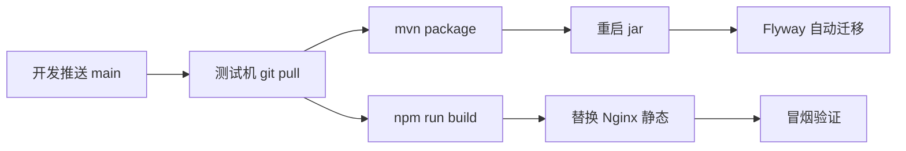

# 测试环境软件部署与更新手册

| 属性 | 说明 |
|------|------|
| **文档编号** | **D22** |
| **文档版本** | V1.0 |
| **编制日期** | 2026-07-25 |
| **适用范围** | 测试服务器首次部署、日常更新、故障诊断包协作 |
| **关联文档** | [D13](D13-框架部署手册.md)（本机 Compose）、[D18](D18-数据库联调清单.md)、[D07](D07-总体技术架构设计.md)（生产手工安装） |
| **排除** | 政务云生产终态（按 D07 无 Docker）；AEAI ESB 现场联调 |

---

## 一、文档定位

| 环境 | 文档 | 说明 |
|------|------|------|
| 开发本机 | D13 + README | Docker Compose 开源联调 + `mvnw` / `npm run dev` |
| **测试服务器** | **本文 D22** | Nginx + jar + MySQL/Redis；（可选）Compose 中间件 |
| 政务云生产 | D07 §6 | 手工安装，不使用 Docker |

代码仓库：`https://github.com/4v8kjnvhcc-rgb/chengde-smart-city.git`（默认分支 `main`）。

---

## 二、推荐拓扑（单机测试 VM）

```text
浏览器
  │
  ▼
Nginx :80/:443
  ├─ /          → 前端静态（platform-frontend/dist）
  └─ /api、/actuator → 反代 127.0.0.1:8080（Spring Boot jar）
         │
         ├─ MySQL :3306（smart_city + 分层库，见 D18）
         ├─ Redis :6379
         └─（可选）Compose 开源栈：OM/DE/DS/Kettle/ES/…（端口见 D13）
```

**内存建议**

| 部署范围 | 建议内存 |
|----------|----------|
| 仅门户 + 后端 + MySQL + Redis | ≥ 8 GB |
| 另开部分开源 profile（governance / etl 等） | ≥ 16 GB |
| 接近 D13 全栈 | ≥ 32 GB（可分 profile 启动） |

---

## 三、服务器前置条件

| 项 | 要求 |
|----|------|
| OS | Linux x86_64（命令以 bash 为准；Windows Server 见附录 A） |
| JDK | **17** |
| Node.js | **20+**（含 npm） |
| Git | 已安装，可访问 GitHub |
| Nginx | 1.18+ |
| MySQL | **8.0+ / 8.4**（本机安装或 Docker 二选一，端口 **3306**） |
| Redis | 6+（端口 **6379**） |
| Docker | 仅当启用开源中间件时需要；应用本身不强制容器化 |
| 防火墙 | 对外仅 **80/443**；8080、3306、中间件端口勿对公网 |

---

## 四、首次部署

### 4.1 拉取代码

```bash
sudo mkdir -p /opt/chengde && sudo chown "$USER":"$USER" /opt/chengde
cd /opt/chengde
git clone https://github.com/4v8kjnvhcc-rgb/chengde-smart-city.git
cd chengde-smart-city
git checkout main
git rev-parse HEAD   # 记录版本锚点
```

### 4.2 环境变量

```bash
cp local.env.example local.env
# 编辑 local.env：填 MYSQL_*、REDIS_*、（可选）INTEGRATION_* 与各 OSS URL
# 切勿将 local.env 提交到 Git
```

加载到当前 shell（示例）：

```bash
set -a
# shellcheck disable=SC1091
source <(grep -v '^#' local.env | sed '/^\s*$/d')
set +a
```

systemd 推荐用 `EnvironmentFile=/opt/chengde/chengde-smart-city/local.env`（见 §4.5）。

### 4.3 数据库

1. 创建业务库与用户：执行仓库内 `scripts/setup_smart_city.sql`（或按 [D18](D18-数据库联调清单.md) 手工建库）。
2. 分层库初始化：按需执行 `compose/init-layer-databases.sql`（见 D18）。
3. **Flyway**：后端首次启动自动迁移，无需手工跑全部 `V*.sql`。
4. 确认：

```sql
SELECT version, description, success, installed_on
FROM flyway_schema_history
ORDER BY installed_rank DESC
LIMIT 20;
```

### 4.4 构建应用

```bash
cd /opt/chengde/chengde-smart-city/platform-backend
./mvnw -DskipTests package
# 产物示例：target/platform-backend-*.jar（以实际 jar 名为准）

cd ../platform-frontend
npm ci
npm run build
# 产物：dist/
```

### 4.5 后端常驻（systemd 示例）

假设 jar 路径为 `/opt/chengde/chengde-smart-city/platform-backend/target/smart-city-*.jar`（以 `ls target/*.jar` 为准）。

`/etc/systemd/system/chengde-backend.service`：

```ini
[Unit]
Description=Chengde Smart City Backend
After=network.target mysql.service redis.service

[Service]
Type=simple
User=chengde
WorkingDirectory=/opt/chengde/chengde-smart-city/platform-backend
EnvironmentFile=/opt/chengde/chengde-smart-city/local.env
# 测试环境沿用 dev 配置键，由 local.env 覆盖库地址等
ExecStart=/usr/bin/java -jar /opt/chengde/chengde-smart-city/platform-backend/target/REPLACE_WITH_JAR.jar --spring.profiles.active=dev
Restart=on-failure
RestartSec=5
StandardOutput=append:/var/log/chengde/backend.log
StandardError=append:/var/log/chengde/backend.log

[Install]
WantedBy=multi-user.target
```

```bash
sudo mkdir -p /var/log/chengde
sudo systemctl daemon-reload
sudo systemctl enable --now chengde-backend
sudo systemctl status chengde-backend
curl -s http://127.0.0.1:8080/actuator/health
```

健康接口期望：`status=UP`（见 `HealthController`）。

### 4.6 前端 + Nginx

将构建产物放到固定目录（便于更新时原子切换）：

```bash
sudo mkdir -p /var/www/chengde
sudo rsync -a --delete /opt/chengde/chengde-smart-city/platform-frontend/dist/ /var/www/chengde/current/
```

`/etc/nginx/conf.d/chengde.conf` 示例：

```nginx
server {
    listen 80;
    server_name _;   # 改为测试域名

    root /var/www/chengde/current;
    index index.html;

    location / {
        try_files $uri $uri/ /index.html;
    }

    location /api/ {
        proxy_pass http://127.0.0.1:8080/api/;
        proxy_set_header Host $host;
        proxy_set_header X-Real-IP $remote_addr;
        proxy_set_header X-Forwarded-For $proxy_add_x_forwarded_for;
        proxy_set_header X-Forwarded-Proto $scheme;
        proxy_read_timeout 300s;
    }

    location /actuator/ {
        proxy_pass http://127.0.0.1:8080/actuator/;
        proxy_set_header Host $host;
        # 建议仅内网或加 IP 白名单
    }

    access_log /var/log/nginx/chengde.access.log;
    error_log  /var/log/nginx/chengde.error.log;
}
```

```bash
sudo nginx -t && sudo systemctl reload nginx
```

浏览器访问 `http://<测试机IP>/`，账号见 §六。

### 4.7（可选）开源中间件

与本机联调相同栈，细节以 **D13** 为准，勿在本文重复维护端口表。

```bash
cd /opt/chengde/chengde-smart-city
# 按内存分波，例如：
docker compose -f compose/oss-stack.yml --profile storage up -d
docker compose -f compose/oss-stack.yml --profile governance up -d
# …
# 探活：本机脚本为 PowerShell；Linux 可用 curl 对照 D13 端口
```

`local.env` 中 `INTEGRATION_ENABLED=true`，各 `*_URL` 指向测试机可达地址（容器映射到宿主机端口）。

---

## 五、健康检查清单（上线/更新后必做）

| # | 检查项 | 命令/操作 | 期望 |
|---|--------|-----------|------|
| 1 | 后端健康 | `curl -s http://127.0.0.1:8080/actuator/health` | `UP` |
| 2 | 经 Nginx API | `curl -s http://127.0.0.1/actuator/health` | `UP` |
| 3 | 登录门户 | 浏览器打开站点，`sys_admin` 登录 | 进入首页 |
| 4 | Flyway | 见 §4.3 SQL | 最新版本 success=1 |
| 5 | 版本一致 | `git rev-parse HEAD` 与发布记录一致 | 前后端同一次发布 |
| 6 | OSS（若启用） | 对照 D13 / `scripts/oss_health.ps1` | 组件探活通过 |

---

## 六、默认账号（测试）

| 系统 | 地址 | 账号 | 说明 |
|------|------|------|------|
| 门户 | `http://<host>/` | `sys_admin` / `Test@12345` | **上线后立即改密** |
| OpenMetadata | 见 D13 | admin@open-metadata.org / admin | 仅开源栈启用时 |
| DataEase | 见 D13 | admin / DataEase@123456 | 同上 |
| DolphinScheduler | 见 D13 | admin / dolphinscheduler123 | 同上 |
| Kettle Carte | 见 D13 | cluster / cluster | 同上 |

---

## 七、日常更新（开发修复 → 测试）



### 7.1 步骤

```bash
cd /opt/chengde/chengde-smart-city

# 0）记录当前版本，便于回滚
PREV=$(git rev-parse --short HEAD)
echo "prev=$PREV"

# 1）备份库（至少业务库）
mysqldump -u"$MYSQL_USER" -p"$MYSQL_PASSWORD" smart_city > "/opt/backup/smart_city_${PREV}_$(date +%Y%m%d%H%M).sql"

# 2）拉代码
git fetch origin
git checkout main
git pull origin main
NEW=$(git rev-parse --short HEAD)
echo "new=$NEW"

# 3）后端
cd platform-backend
./mvnw -DskipTests package
sudo systemctl restart chengde-backend
# 看启动与 Flyway
sudo tail -n 200 /var/log/chengde/backend.log

# 4）前端（保留上一版目录便于回滚）
cd ../platform-frontend
npm ci
npm run build
sudo mkdir -p "/var/www/chengde/releases/$NEW"
sudo rsync -a dist/ "/var/www/chengde/releases/$NEW/"
sudo ln -sfn "/var/www/chengde/releases/$NEW" /var/www/chengde/current
sudo nginx -t && sudo systemctl reload nginx

# 5）冒烟：登录 → 打开原先问题菜单；必要时对照 README 中 smoke 脚本
```

### 7.2 回滚（应用层）

```bash
# 前端：指回旧 release
sudo ln -sfn /var/www/chengde/releases/$PREV /var/www/chengde/current
sudo systemctl reload nginx

# 后端：检出旧 commit 重新 package 并重启（或保留旧 jar 副本）
# 数据库：Flyway 一般只向前迁移；结构回滚需 DBA 评估，优先用 §7.1 的 dump 恢复到维护窗口
```

### 7.3 中间件

仅当镜像或 `compose/oss-stack.yml` / 集成配置变更时：

```bash
docker compose -f compose/oss-stack.yml --profile <name> pull
docker compose -f compose/oss-stack.yml --profile <name> up -d
```

日常业务缺陷修复**不必**重启全栈。

---

## 八、故障诊断包（发给 Cursor / 开发）

### 8.1 原则

开发侧**不能**直连测试机日志库。请使用标准 **诊断包（diag pack）**：一键脚本打包 → 将 zip 或解压目录发到对话中。

有 **META + 后端日志 + 失败接口响应**，即可判断是前端、鉴权、业务 API、Flyway 还是中间件问题。

### 8.2 目录结构

```text
diag-YYYYMMDD-HHmm/
  META.txt
  version.txt
  backend.log
  nginx-error.log          # 可选
  browser-network.txt      # 人工粘贴
  browser-console.txt      # 人工粘贴
  env.redacted.txt
  flyway-tail.txt          # 可选
  screenshot.png           # 可选
```

### 8.3 一键打包

**Linux：**

```bash
cd /opt/chengde/chengde-smart-city
chmod +x scripts/collect_diag.sh
./scripts/collect_diag.sh -m "人口大数据点击无反应" -w 30
# 生成 diag-*.zip；按提示补全 browser-*.txt 后重新打包或直接把目录发来
```

**Windows（测试机或本机）：**

```powershell
cd E:\myProject\承德
powershell -ExecutionPolicy Bypass -File scripts\collect_diag.ps1 -Message "人口大数据点击无反应" -WindowMinutes 30
```

### 8.4 META.txt 模板（可手写）

```text
时间：2026-07-25 15:10（测试机时区）
环境：测试 / URL=http://x.x.x.x/
账号角色：sys_admin
菜单/页面：挖掘分析 → 人口大数据
操作步骤：1.登录 2.点击卡片 3.…
期望：进入五区设计 Hub
实际：无反应 / 白屏 / 报错文案…
是否必现：是/偶发
备注：
```

### 8.5 浏览器侧必填（脚本无法自动抓）

1. F12 → **Network**：失败请求的 Method、URL、Status、Response 正文（**打码** Authorization）。
2. F12 → **Console**：红色报错原文。
3. 写入 `browser-network.txt` / `browser-console.txt`。

### 8.6 禁止放入诊断包

- 明文数据库/中间件密码、完整 JWT、客户真实敏感业务数据。
- 将 `diag-*` / `diag-*.zip` **提交到 Git**（已在 `.gitignore` 忽略）。

### 8.7（可选）审计表辅助

业务操作轨迹可查 `audit_log`（按时间、username、action），作 P2 证据，不能替代 backend.log。

---

## 九、常见问题

| 现象 | 可能原因 | 处理 |
|------|----------|------|
| 点击菜单无反应 / 白屏 | 前端未重新 `build` 或 Nginx 仍指旧 dist；或 Vue 编译错误 | 按 §7 重发前端；看浏览器 Console |
| 登录后 API 全部 502 | 后端未起 / Nginx 反代错 | `systemctl status`、`curl :8080/actuator/health` |
| 401 / 403 | Token、权限、时钟 | Network 响应体 + backend.log |
| 接口 500 | 业务异常、缺表、Flyway 未跑完 | backend.log 栈；查 `flyway_schema_history` |
| Flyway 失败无法启动 | SQL 冲突或库权限 | 日志中 Flyway 段；修复后重启（勿随意改 success 标记） |
| DataEase 嵌入台账 | 未启 DE 或 `INTEGRATION_*` | D13；属预期 LEDGER，非假成功 |
| 本机开发正常测试不行 | commit 不一致、env 不同 | `version.txt` + `env.redacted.txt` |

---

## 十、安全注意

1. 公网只暴露 80/443；管理端口与中间件端口仅内网。
2. `local.env` 仅服务器本地；权限 `chmod 600`。
3. 测试默认口令首次登录后修改。
4. 诊断包对外发送前人工审一眼，去掉密钥。

---

## 附录 A、Windows Server 差异（摘要）

| 项 | 说明 |
|----|------|
| 后端 | NSSM / 计划任务 / 手动 `java -jar`，日志重定向到文件 |
| 前端 | IIS 或 Nginx for Windows；SPA 需 URL 重写到 `index.html` |
| 更新 | 同 §七，命令换 `mvnw.cmd`、`npm.cmd` |
| 诊断 | 使用 `scripts/collect_diag.ps1` |

生产政务云仍以 **D07 手工安装** 为准；测试机优先本手册 Linux 路径。

---

## 十一、修订记录

| 版本 | 日期 | 说明 |
|------|------|------|
| V1.0 | 2026-07-25 | 初版：测试部署、更新流程、诊断包与 collect_diag 脚本 |
