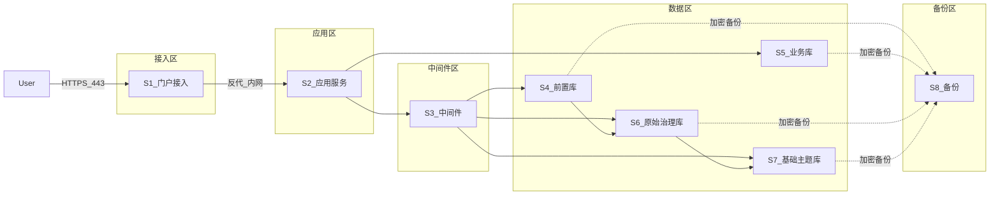
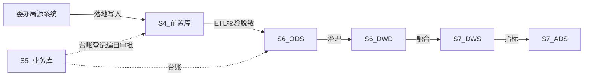

# 承德高新区智慧城市基础平台 — 服务器部署清单（等保）

| 属性 | 说明 |
|------|------|
| **文档编号** | **D24** |
| **文档版本** | **V1.0** |
| **编制日期** | 2026-08-04 |
| **文档性质** | 等保三级正式**分区分机**服务器部署清单；含端口、库分层、防火墙矩阵、备份与外链边界 |
| **上位基线** | [`D07-总体技术架构设计.md`](D07-总体技术架构设计.md)、[`D09-等保三级差距自查表.md`](D09-等保三级差距自查表.md) |
| **现网操作手册** | [`D23-生产环境傻瓜式部署手册.md`](D23-生产环境傻瓜式部署手册.md)（两机折叠实施） |
| **配套** | [`D12-数据库设计.md`](D12-数据库设计.md)、[`D18-数据库联调清单.md`](D18-数据库联调清单.md) |

---

## 一、文档说明与边界

### 1.1 定位

本文件给出**等保三级正式目标拓扑**（建议 8 台）：接入 / 应用 / 中间件 / 前置库 / 业务库 / 原始治理库 / 基础主题库 / 备份机分离，供扩容、测评配图与安全组落地。

现网若仍为两机（`.55` / `.51`），按 **§七** 折叠对照执行；测评材料仍按本文件分区描述，并登记补偿措施。

### 1.2 不纳入本平台部署（仅门户外链）

| 外部系统 | 处理方式 |
|----------|----------|
| 考核评估系统 | 门户菜单外链跳转 |
| 服务总线（AEAI ESB） | 外链/深链至既有 SMC（现网示例 `10.216.131.100:7000`）；本清单不部署 |
| 智能 BI 平台 | 外链；可对 ADS 开只读账号（网络策略单独审批） |
| 业务功能平台 | 门户外链 |

### 1.3 修订记录

| 版本 | 日期 | 说明 |
|------|------|------|
| V1.0 | 2026-08-04 | 初版：8 机分区、端口、库分层、防火墙矩阵、前置库规范、D23 折叠对照 |

---

## 二、安全分区（等保三级）

### 2.1 网络原则（运维/甲方配合项）

| # | 原则 |
|---|------|
| 1 | 互联网/政务外网仅放行 **S1:443**（WAF 前置）；80 仅跳转 HTTPS |
| 2 | 数据区 MySQL **3306** 禁止对应用区以外开放；**前置库不直连主题库** |
| 3 | SSH 22、Docker、组件管理台仅运维网段；组件原生 UI 不对甲方开放（经门户代理） |
| 4 | 主机防病毒、补丁、边界防火墙按等保主机/区域边界配合项执行（见 D09 §四） |

---

## 三、服务器部署清单（建议 8 台）

### 3.1 总览

| 编号 | 主机角色 | 安全区 | 主要软件 | 对外端口 |
|------|----------|--------|----------|----------|
| **S1** | 门户接入 | 接入区 | Nginx + frontend 静态 | **443** |
| **S2** | 应用服务 | 应用区 | platform-backend | 无（经 S1） |
| **S3** | 中间件 | 中间件区 | Redis/ES/Seaweed/Mongo/OM/DS/Kettle/Canal | 无 |
| **S4** | 前置库 | 数据区 | MySQL（`smart_city_front`） | 无 |
| **S5** | 业务库 | 数据区 | MySQL（`smart_city` + 可选组件元库） | 无 |
| **S6** | 原始治理库 | 数据区 | MySQL（`smart_city_ods`、`smart_city_dwd`） | 无 |
| **S7** | 基础主题库 | 数据区 | MySQL（`smart_city_dws`、`smart_city_ads`） | 无 |
| **S8** | 备份 | 备份区 | 备份工具 + 加密存储/NAS | 无业务口 |

> IP 由现场运维填写；现网折叠 IP 见 §七。

### 3.2 S1 — 门户接入服务器

| 项 | 内容 |
|----|------|
| **职责** | 统一 HTTPS 入口、静态门户、反向代理、TLS 终结 |
| **部署** | Nginx（或同等）；`platform-frontend` 静态资源 |
| **端口** | **443**（对外）；**80**→443；SSH 仅运维网 |
| **反代** | `/api` → S2:8080；可选 `/om/`、`/ds/`、`/kettle/` → S3 对应端口 |
| **安全** | TLS1.2+；HSTS；限流；隐藏后端；WAF 挂本区前 |
| **说明** | 考核/ESB/BI/业务平台菜单仅配置外链，本机不装对应软件 |

### 3.3 S2 — 应用服务器

| 项 | 内容 |
|----|------|
| **职责** | 业务 API、认证鉴权、审计、编排调用中间件与库 |
| **部署** | `platform-backend`（Java 17 / Spring Boot 3.2+）；可选 Redis 从节点 |
| **端口** | **8080**（仅 S1 可达）；Actuator 仅内网 |
| **连接** | 业务库 S5；Redis 主 S3；受控 JDBC → S4/S6/S7；ES/对象存储 → S3 |
| **安全** | JWT+双因素、RBAC、操作审计；无本地业务明文库；密码仅环境变量/密钥柜 |

### 3.4 S3 — 中间件服务器

| 组件 | 用途 | 宿主端口 | 对外 | 访问方 |
|------|------|----------|:----:|--------|
| Redis 7 | 会话/JWT 黑名单/限流/验证码 | **6379** | 否 | S2 |
| Elasticsearch 8 | 全文检索 + OM 检索 | **9200** | 否 | S2、OM |
| SeaweedFS | 非结构化对象 | **8333**(S3)、**9333**(master) | 否 | S2 |
| MongoDB 7 | 半结构化 | **27017** | 否 | S2 |
| OpenMetadata | 元数据/血缘增强 | **8585** | 否 | S1 代理 / S2 |
| DolphinScheduler | 工作流调度 | **12345**（内部 25333） | 否 | S1 代理 / S2 |
| Kettle Carte | 汇聚/治理 ETL | **18081** | 否 | S2 |
| Canal | MySQL CDC | **19090** | 否 | S2 / 运维 |
| 组件辅助 MySQL（可选） | OM/DS 元库 | **3307** | 否 | OM、DS |

**本机不部署**：DataEase（智能 BI 外链）、AEAI ESB（服务总线外链）。

**安全**：管理台不对甲方；Redis/ES/Mongo 启用认证；S3 桶最小化；ETL 账号按库分权（见 §五、§六）。

### 3.5 S4 — 前置库服务器

| 项 | 内容 |
|----|------|
| **职责** | **前置库**：委办局/源系统交换落地与隔离缓冲；**不作为**对外共享查询库 |
| **部署** | MySQL 8.0+ 独立实例；库名 **`smart_city_front`**（可按源分 schema，见 §六） |
| **端口** | **3306**（仅白名单源写入 + ETL 抽取；禁止门户业务查询、禁止直连 S7） |
| **流向** | 源 → 前置库 →（校验/必要脱敏）→ ODS（S6） |
| **安全** | 与业务库、主题库网络隔离；「源写入 / ETL 只读抽取」账号分离 |

### 3.6 S5 — 业务库服务器

| 项 | 内容 |
|----|------|
| **职责** | **业务库（控制面）**：用户权限、资产登记、供需、`gov_*`、审计等 |
| **部署** | MySQL 8.0+；主库 **`smart_city`**；可选同机：`openmetadata_db`、`dolphinscheduler`（若未用 S3:3307） |
| **端口** | **3306**（仅 S2、S3 组件账号） |
| **安全** | Flyway 管控结构；**不含** ODS～ADS 大批量表；定期备份至 S8 |

### 3.7 S6 — 原始治理库服务器

| 项 | 内容 |
|----|------|
| **职责** | **原始治理库**：汇聚原始层 + 治理明细层 |
| **库** | **`smart_city_ods`**（ODS）、**`smart_city_dwd`**（DWD） |
| **部署** | MySQL 8.0+ 独立实例（可同实例两 schema；主机与 S7 分离） |
| **端口** | **3306**（Kettle/Canal/汇聚、S2 受控访问） |
| **流向** | 前置/源 → ODS；治理 ODS → DWD；DWD 为过程层，默认不进目录门户共享 |
| **安全** | 高敏区；导出/查询强制脱敏；ODS 写入与 DWD 写入分权 |

### 3.8 S7 — 基础主题库服务器

| 项 | 内容 |
|----|------|
| **职责** | **基础主题库**：主题汇总与应用指标，供目录共享与外链 BI 消费 |
| **库** | **`smart_city_dws`**（DWS）、**`smart_city_ads`**（ADS） |
| **部署** | MySQL 8.0+ 独立实例 |
| **端口** | **3306**（融合任务、目录/资源中心；外链 BI **只读**账号） |
| **流向** | 融合 DWD → DWS；指标 → ADS |
| **安全** | 共享走目录+审批；对外接口不直连库 |

### 3.9 S8 — 备份服务器

| 项 | 内容 |
|----|------|
| **职责** | 等保备份恢复（D09：GB-BACKUP-001～004）；RPO≤24h；备份加密与完整性校验 |
| **部署** | mysqldump / XtraBackup、cron、加密卷或 NAS；校验清单（行数/哈希） |
| **备份对象** | S4～S7 全部 MySQL；可选 Redis RDB、SeaweedFS 关键元数据/卷；应用配置与镜像清单 |
| **端口** | 无业务服务口；仅运维 SSH / 备份协议至数据区 |
| **策略** | 业务库每日全量 + binlog；分层库每日增量 / 每周全量；异地或跨机柜 ≥1 份；季度 RTO 演练（目标 ≤4h） |
| **安全** | 备份加密（GB-BACKUP-003）；访问审计；恢复双人授权；与生产网最小化互通 |

### 3.10 关键端口速查

| 端口 | 服务 | 所在机 |
|------|------|--------|
| 443 / 80 | Nginx | S1 |
| 8080 | platform-backend | S2 |
| 3306 | 各 MySQL 实例 | S4/S5/S6/S7 |
| 3307 | 组件辅助 MySQL（可选） | S3 |
| 6379 | Redis | S3 |
| 9200 | Elasticsearch | S3 |
| 8333 / 9333 | SeaweedFS | S3 |
| 27017 | MongoDB | S3 |
| 8585 | OpenMetadata | S3 |
| 12345 | DolphinScheduler | S3 |
| 18081 | Kettle Carte | S3 |
| 19090 | Canal | S3 |

---

## 四、数据库分层对照

| 规划名称 | 物理位置 | 库 / Schema | 角色 |
|----------|----------|-------------|------|
| 前置库 | S4 | `smart_city_front` | 源交换落地、隔离缓冲 |
| 业务库 | S5 | `smart_city`（+ 可选组件元库） | 控制面台账 |
| 原始治理库 | S6 | `smart_city_ods`、`smart_city_dwd` | 汇聚原始 + 治理明细 |
| 基础主题库 | S7 | `smart_city_dws`、`smart_city_ads` | 主题 + 指标应用 |
| 备份 | S8 | 密文备份集 | 灾难恢复 |

**数据主路径**：`源 → 前置库(S4) → ODS(S6) → DWD(S6) → DWS/ADS(S7)`；控制面台账始终在业务库(S5)。

---

## 五、防火墙 / 安全组最小放行矩阵

规则：**默认拒绝**；仅开通下表。管理 SSH（22）一律仅运维网段 → 各主机，表中不重复列出。

| 源 | 目的 | 协议/端口 | 用途 |
|----|------|-----------|------|
| 用户/政务外网（经 WAF） | S1 | TCP **443** | 门户 HTTPS |
| 用户 | S1 | TCP **80** | 跳转 HTTPS（可选） |
| S1 | S2 | TCP **8080** | API 反代 |
| S1 | S3 | TCP **8585** | OM 代理（若启用） |
| S1 | S3 | TCP **12345** | DS 代理（若启用） |
| S1 | S3 | TCP **18081** | Kettle 代理（若启用） |
| S2 | S3 | TCP **6379** | Redis |
| S2 | S3 | TCP **9200** | Elasticsearch |
| S2 | S3 | TCP **8333** | SeaweedFS S3 |
| S2 | S3 | TCP **27017** | MongoDB |
| S2 | S3 | TCP **8585** | OM API |
| S2 | S3 | TCP **12345** | DS API |
| S2 | S3 | TCP **18081** | Carte API |
| S2 | S5 | TCP **3306** | 业务库 JDBC |
| S2 | S4 | TCP **3306** | 前置库受控查询/登记探活（最小权限） |
| S2 | S6 | TCP **3306** | ODS/DWD 受控访问 |
| S2 | S7 | TCP **3306** | DWS/ADS 受控访问 |
| S3（Kettle/Canal/DS） | S4 | TCP **3306** | 前置抽取 / CDC 源（白名单） |
| S3（Kettle/Canal/DS） | S6 | TCP **3306** | 写入 ODS/DWD |
| S3（Kettle/DS） | S7 | TCP **3306** | 写入 DWS/ADS |
| S3（OM/DS，若元库在 S5） | S5 | TCP **3306** | 组件元库 |
| S3 组件 | S3 | TCP **3307** | 本机辅助 MySQL（若启用） |
| 已登记源系统 IP | S4 | TCP **3306** | 源写入前置库（按源白名单） |
| 外链 BI（审批后） | S7 | TCP **3306** | ADS/DWS **只读**账号 |
| S8 | S4/S5/S6/S7 | TCP **3306** | 备份拉取（或反向由库机推送到 S8，二选一固化） |
| S8 | S3 | TCP 按需 | Redis/对象存储备份（可选） |

**明确禁止**

| 路径 | 原因 |
|------|------|
| 公网 → S2～S8 任意端口 | 仅 S1:443 对外 |
| S4 → S7 直连 | 前置不得绕过 ODS/治理进入主题库 |
| 甲方浏览器 → S3 组件原生端口 | 须经门户/S1 代理 |
| 未登记源 IP → S4 | 防未授权灌库 |
| 应用区任意主机 → 备份区写业务库 | 恢复须走变更与双人授权 |

现场将上表落入安全组/防火墙策略后，在附录填写实际 IP 与策略编号。

---

## 六、前置库 `smart_city_front` 规范

### 6.1 定位

前置库是源系统交换数据的**落地与隔离缓冲区**，对应归集「接入落地」能力；与 ODS/DWD/DWS/ADS、业务库**物理或至少实例级隔离**。现仓库历史文档未使用该库名，本规范为规划层新增约定，实施时须在 D18/联调清单与归集配置中登记连接串。

### 6.2 建库规范

| 项 | 约定 |
|----|------|
| 实例 | S4 独立 MySQL 8.0+；字符集 **utf8mb4**；排序规则 utf8mb4_unicode_ci（或与业务库一致） |
| 库名 | **`smart_city_front`** |
| Schema 扩展（可选） | 源系统多、隔离要求高时：`front_<部门编码>` 或多 schema，仍属 S4 实例 |
| 表命名 | 建议 `f_<源编码>_<原表名>` 或保留源表名但强制 `源编码` 前缀，避免冲突 |
| 必要技术字段 | `ingest_batch_id`、`ingest_time`、`source_system`、`row_hash`（可选）、`data_status`（raw/validated/rejected） |
| 保留周期 | 已成功入 ODS 且对账通过的数据，按策略归档或清理（建议可配置 7～90 天）；拒绝数据保留供审计 |
| 禁止 | 在前置库建对外共享视图供门户直接查业务明细；禁止主题库账号访问前置库 |

### 6.3 账号分权

| 账号角色 | 建议名示例 | 权限 | 使用方 |
|----------|------------|------|--------|
| 源写入 | `front_src_<源编码>` | 仅指定 schema/表 INSERT（及必要 CREATE 若由源建表） | 已登记源系统 |
| ETL 抽取 | `front_etl_ro` | SELECT（+ 对账所需最小权限） | Kettle / DS / Canal 读端 |
| 平台探活 | `front_app_ro` | 极少数元数据/对账表 SELECT | platform-backend |
| DBA 运维 | `front_dba` | 运维网段临时授权 | 运维 |
| **禁止** | 应用高权账号、主题库账号、BI 账号 | — | — |

密码轮换、失败锁定与业务库策略一致；账号清单纳入等保测评「人员与授权」材料。

### 6.4 入 ODS 任务约定

| 项 | 约定 |
|----|------|
| 调度 | DolphinScheduler / Kettle 作业；禁止无任务手工长期灌 ODS |
| 前置条件 | 资产已在业务库登记；源→前置连通性与表结构已校验 |
| 变换 | 字段映射、类型清洗、必要脱敏/加密后再写入 **`smart_city_ods`** |
| 幂等 | 以业务主键 + `ingest_batch_id` 或 `row_hash` 做幂等/去重 |
| 对账 | 批次行数、抽样哈希；失败标记 `data_status=rejected` 并告警，不静默入 ODS |
| 账号 | 读：`front_etl_ro`＠S4；写：`ods_etl_wr`＠S6（仅 ODS，不授 DWD） |
| 网络 | 仅 S3→S4、S3→S6；**不**开通 S4→S7 |
| 审计 | 批次号、起止时间、源表、目标表、行数、操作人/系统账号写入业务库台账 |

### 6.5 与分级分类 / 脱敏

高敏感字段在前置落库即按策略脱敏或列加密；入 ODS 任务继承数据分级分类结果，导出与门户浏览走脱敏策略（见平台脱敏模块与 D09 相关控制项）。

---

## 七、与 D07 / D23 两机折叠对照及等保补偿

### 7.1 折叠映射

| 正式机（本文件） | 折叠到现网（D23） |
|------------------|-------------------|
| S1 + S2 | **10.10.10.55**（Nginx + frontend + backend） |
| S3 + S5 组件元库 | **10.10.10.51**（中间件 + MySQL） |
| S4 / S6 / S7 | **同一 MySQL 实例逻辑库隔离**（`smart_city_front` / `ods` / `dwd` / `dws` / `ads`）；主机未物理分离 |
| S8 | NAS 或备份脚本挂 `.51` / 甲方备份域（D23 B0 + M073/M134） |
| 外链 ESB | **10.216.131.100:7000**（不在 Compose 内） |

D07 附录 B 历史「VM1/VM2」口径与上表等价；正式测评配图以本文件 **S1～S8** 为准，折叠部署在差距说明中引用本节。

### 7.2 折叠部署等保补偿措施

| 风险 | 补偿 | 责任方 |
|------|------|--------|
| 数据区未物理分机 | 库级账号分权 + 禁止交叉授权（前置账号不得访问 ADS 等） | 开发配置 + 运维 |
| 中间件与库同机 | 组件仅监听内网；管理口不对甲方；主机加固与防病毒 | 运维 |
| 备份与生产同机柜风险 | 备份集加密 + 异地/NAS 副本；定期恢复演练 | 运维 + 甲方 |
| 逻辑隔离被误配打穿 | 变更双人复核；定期 `SHOW GRANTS` 巡检 | 运维 |
| 测评描述与现网不一致 | 自评表标注「目标拓扑 D24 / 现网折叠 D23」及补偿项 | 项目组 |

折叠部署**不得**省略：RPO≤24h 备份、备份加密、审计、对外仅 443、组件不对甲方裸奔。

### 7.3 文档职责划分

| 文档 | 职责 |
|------|------|
| **D24（本文）** | 正式分区分机清单、防火墙矩阵、前置库规范、折叠补偿 |
| **D23** | 现网两机 Docker 操作步骤（装机、发版、回退） |
| **D07** | 架构契约；附录 A/B 拓扑与端口模板，实施细节以 D24/D23 为准 |
| **D09** | 等保控制项与差距；备份项 GB-BACKUP-* 与本文 §3.9 对齐 |

---

## 八、备份与数据安全摘要（对齐 D09）

| 控制项 | 落地 |
|--------|------|
| GB-BACKUP-001 周期自动备份 | S8 cron；业务库日备；分层库日增/周全 |
| GB-BACKUP-002 完整性 | 恢复后行数/哈希比对清单 |
| GB-BACKUP-003 备份加密 | S8 存储加密或备份文件加密 |
| GB-BACKUP-004 RPO≤24h | 备份频率策略文档化 |
| 身份鉴别 / 访问控制 | JWT+双因素、RBAC、库账号分权 |
| 数据保密性 | 传输 TLS；敏感字段脱敏/加密；备份加密 |
| 安全审计 | 应用审计 + 库访问审计（配合项） |

---

## 九、现场填写附录（测评用）

### 附录 A — 主机 IP 与规格

| 编号 | 主机名 | IP | CPU/内存/磁盘 | OS | 备注 |
|------|--------|-----|---------------|-----|------|
| S1 | | | | 麒麟 V10 等 | |
| S2 | | | | | |
| S3 | | | | | |
| S4 | | | | | |
| S5 | | | | | |
| S6 | | | | | |
| S7 | | | | | |
| S8 | | | | | |

### 附录 B — 安全组策略编号

| 矩阵行（源→目的:端口） | 策略编号 | 生效日期 | 维护人 |
|------------------------|----------|----------|--------|
| | | | |

### 附录 C — 库账号登记（摘）

| 库机 | 账号 | 权限摘要 | 归属系统 | 轮换周期 |
|------|------|----------|----------|----------|
| S4 | front_etl_ro | SELECT | ETL | |
| S6 | ods_etl_wr | ODS 写 | ETL | |
| S7 | bi_ro | ADS/DWS 只读 | 外链 BI | |

---

## 十、验收检查清单（部署/测评）

- [ ] 对外仅 S1:443（或折叠机等价）；中间件与库端口不对公网
- [ ] S4～S7（或逻辑库）已按分层创建；业务库无 ODS～ADS 混放大批量表
- [ ] 前置库账号分权与入 ODS 作业按 §六 落地
- [ ] 防火墙矩阵已配置且抽测「禁止项」不通
- [ ] S8（或 NAS）备份任务、加密、校验清单可用；RPO 策略已文档化
- [ ] 考核/ESB/BI/业务功能平台仅外链，本平台未误装
- [ ] 若两机折叠：§7.2 补偿措施已写入等保差距说明
