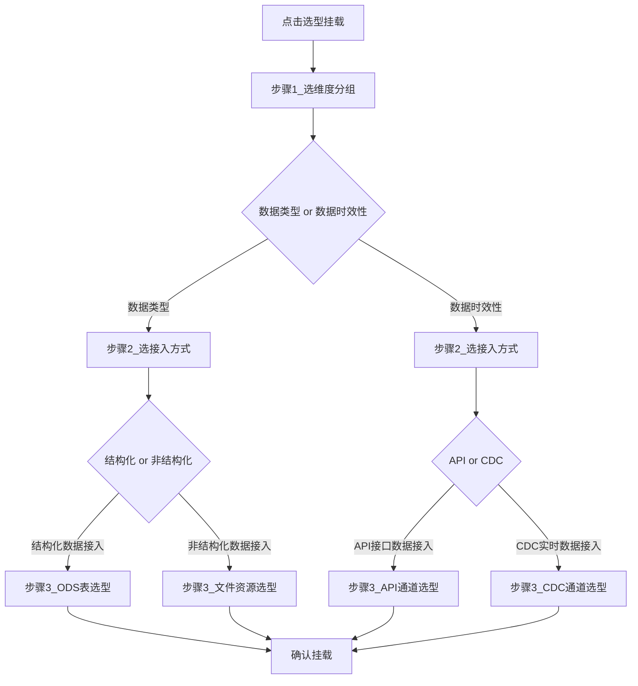

# 人口数据采集区「选型挂载」原型

| 属性 | 说明 |
|------|------|
| **关联页面** | `/analytics/population?tab=zone.collect`（人口数据采集区设计） |
| **入口** | Tab「资产挂载」→「选型挂载」 |
| **现状** | 单步对话框直接选元数据 ODS/SOURCE 表（最多 80 条），无类型/时效分支 |
| **本原型范围** | 交互线框与流程说明；**不改**前端/后端代码 |
| **落地参考** | `AnalyticsDomainHubView.vue`；规格见 `docs/superpowers/specs/2026-08-11-population-bigdata-support-design.md` |

---

## 1. 选型维度口径（纠正后）

选型维度分 **两级**，不是同屏四选一：

| 层级 | 选项 | 说明 |
|------|------|------|
| **第 1 级** | 数据类型 / 数据时效性 | 点「选型挂载」后先弹出，**二选一** |
| **第 2 级（数据类型）** | 结构化数据接入 / 非结构化数据接入 | 选「数据类型」后再弹出，**二选一** |
| **第 2 级（数据时效性）** | API 接口数据接入 / CDC 实时数据接入 | 选「数据时效性」后再弹出，**二选一** |
| **第 3 级** | 对象列表 | 按第 2 级选项进入对应列表并确认挂载 |

---

## 2. 交互总览



**步骤条：** `选维度分组` → `选接入方式` → `选择对象` →（确认后关闭，列表刷新）

---

## 3. 线框 0：采集区主页面（入口不变）

```text
┌─ 人口数据采集区设计 ─────────────────────────────────────┐
│ [资产挂载] [多源通道清单]                                  │
│                                                            │
│  工具栏: [选型挂载]  [打开数据归集]                        │
│  ┌──────────────────────────────────────────────────────┐  │
│  │ 已挂载资产列表（维度分组 / 接入方式 / 名称 / 操作）   │  │
│  └──────────────────────────────────────────────────────┘  │
└────────────────────────────────────────────────────────────┘
```

---

## 4. 线框 1：步骤「选维度分组」（点选型挂载后）

- **标题：** `选型挂载 — 选择数据类型或数据时效性`
- **宽度建议：** 480px

```text
┌─ 选型挂载 ───────────────────────────────────────────────┐
│ 步骤: ● 选维度分组  ○ 选接入方式  ○ 选择对象               │
│                                                            │
│  请选择挂载维度：                                          │
│  ┌────────────────────┐  ┌────────────────────┐            │
│  │ 数据类型            │  │ 数据时效性          │            │
│  │ 结构化/非结构化接入 │  │ API/CDC 实时接入    │            │
│  └────────────────────┘  └────────────────────┘            │
│                                                            │
│                              [取消]  [下一步]               │
└────────────────────────────────────────────────────────────┘
```

### 规则

1. **二选一**：数据类型 / 数据时效性。
2. 未选中时「下一步」禁用。

---

## 5. 线框 1A：选「数据类型」→ 接入方式

- **标题：** `选型挂载 — 选择数据类型接入方式`
- **上一步来自：** 线框 1 选了「数据类型」

```text
┌─ 选型挂载 ───────────────────────────────────────────────┐
│ 步骤: ○ 选维度分组  ● 选接入方式  ○ 选择对象               │
│ 面包屑: 数据类型                                           │
│                                                            │
│  ┌────────────────────┐  ┌────────────────────┐            │
│  │ 结构化数据接入      │  │ 非结构化数据接入    │            │
│  │ ODS 贴源表          │  │ 文件资源管理        │            │
│  └────────────────────┘  └────────────────────┘            │
│                                                            │
│                    [上一步]  [取消]  [下一步：选择对象]     │
└────────────────────────────────────────────────────────────┘
```

---

## 6. 线框 1B：选「数据时效性」→ 接入方式

- **标题：** `选型挂载 — 选择数据时效性接入方式`
- **上一步来自：** 线框 1 选了「数据时效性」

```text
┌─ 选型挂载 ───────────────────────────────────────────────┐
│ 步骤: ○ 选维度分组  ● 选接入方式  ○ 选择对象               │
│ 面包屑: 数据时效性                                         │
│                                                            │
│  ┌────────────────────┐  ┌────────────────────┐            │
│  │ API 接口数据接入    │  │ CDC 实时数据接入    │            │
│  │ 归集 API 通道       │  │ 归集 CDC 通道       │            │
│  └────────────────────┘  └────────────────────┘            │
│                                                            │
│                    [上一步]  [取消]  [下一步：选择对象]     │
└────────────────────────────────────────────────────────────┘
```

---

## 7. 线框 2A：数据类型 → 结构化 → ODS 表（分页 + 查询）

- **标题：** `选型挂载 — 选择 ODS 表`
- **面包屑：** `数据类型 / 结构化数据接入`
- **数据来源：** 数据源管理中 **ODS 层** 数据源下的表

```text
┌─ 选型挂载 ───────────────────────────────────────────────┐
│ 步骤: ○ 选维度分组  ○ 选接入方式  ● 选择对象               │
│ 面包屑: 数据类型 / 结构化数据接入                          │
│                                                            │
│  ODS数据源 [下拉选择 ▼]   表名/备注 [________] [查询][重置] │
│                                                            │
│  ┌──────────────────────────────────────────────────────┐  │
│  │ ○ 表名          中文名        数据源         分层    │  │
│  │ ○ t_person_base 人员基本信息  公安ODS源      ODS    │  │
│  │ ● t_hukou       户籍信息      公安ODS源      ODS    │  │
│  │ ...                                                  │  │
│  └──────────────────────────────────────────────────────┘  │
│  共 N 条   < 1 2 3 >   每页 10                              │
│                                                            │
│                    [上一步]  [取消]  [确认挂载]             │
└────────────────────────────────────────────────────────────┘
```

### 要点

- 单选一行；**分页 + keyword 查询**。
- 仅 ODS（及必要时 SOURCE）层；禁止默认挂载过程层 DWD。
- 未选表时「确认挂载」禁用。

---

## 8. 线框 2B：数据类型 → 非结构化 → 文件资源列表

- **标题：** `选型挂载 — 选择文件资源`
- **面包屑：** `数据类型 / 非结构化数据接入`
- **数据来源：** 非结构数据融合治理平台「文件资源管理」列表

```text
┌─ 选型挂载 ───────────────────────────────────────────────┐
│ 面包屑: 数据类型 / 非结构化数据接入                        │
│                                                            │
│  关键词 [________]  分类 [▼]  发布状态 [▼]  [查询][重置]  │
│                                                            │
│  ┌──────────────────────────────────────────────────────┐  │
│  │ ○ 标题        分类      来源     发布状态   更新时间 │  │
│  │ ● 电子证照A   证照类    本地上传  已发布    ...      │  │
│  │ ○ 扫描件B     档案类    外部平台  草稿      ...      │  │
│  └──────────────────────────────────────────────────────┘  │
│  分页同左                                                  │
│                    [上一步]  [取消]  [确认挂载]             │
└────────────────────────────────────────────────────────────┘
```

---

## 9. 线框 2C：数据时效性 → API / CDC

### API 接口数据接入

- **面包屑：** `数据时效性 / API接口数据接入`
- **数据来源：** 归集 API 通道列表

```text
┌─ 选型挂载 — API 接口数据接入 ────────────────────────────┐
│ 面包屑: 数据时效性 / API接口数据接入                       │
│  通道名 [________] [查询]                                  │
│  ○ 通道编码 | 名称 | 状态 | 最近同步                       │
│  ● API_POP_001 | 人口核验接口 | 启用 | ...                 │
│                    [上一步]  [取消]  [确认挂载]             │
└────────────────────────────────────────────────────────────┘
```

### CDC 实时数据接入

- **面包屑：** `数据时效性 / CDC实时数据接入`
- **数据来源：** 归集 CDC 通道列表

```text
┌─ 选型挂载 — CDC 实时数据接入 ────────────────────────────┐
│ 面包屑: 数据时效性 / CDC实时数据接入                       │
│  ○ 通道编码 | 源库/表 | 状态 | 延迟                        │
│  ● CDC_HJ_01 | 户籍主表 | 运行中 | 2s                      │
│                    [上一步]  [取消]  [确认挂载]             │
└────────────────────────────────────────────────────────────┘
```

---

## 10. 线框 3：确认后列表展示（主表增强示意）

| 名称 | 维度分组 | 接入方式 | 来源类型 | 操作 |
|------|----------|----------|----------|------|
| t_hukou | 数据类型 | 结构化数据接入 | ODS表 | 解除 |
| 电子证照A | 数据类型 | 非结构化数据接入 | 文件资源 | 解除 |
| API_POP_001 | 数据时效性 | API接口数据接入 | API通道 | 解除 |
| CDC_HJ_01 | 数据时效性 | CDC实时数据接入 | CDC通道 | 解除 |

状态展示须中文化（`statusLabel`），禁止裸英文码。

---

## 11. 落地时可复用能力（本原型阶段不实现）

| 分支 | 复用 |
|------|------|
| ODS 表 | 元数据数据源/表接口（如 `meta-data-sources/{id}/tables`）+ 前端分页查询 |
| 文件 | `GET /unstructured/platform/documents`（`UnstructuredHubView`） |
| API/CDC | 归集 `ingestionApi.channels('API'\|'CDC')`（`CollectIngestView`） |
| 绑定落库 | 现有 `POST .../zones/collect/bindings`；后续扩展：`dimGroup`（DATATYPE/LATENCY）/ `accessMode`（STRUCT/UNSTRUCT/API/CDC） |

---

## 12. 口径自检

1. 点「选型挂载」→ 先弹 **数据类型 / 数据时效性**（二选一）— 线框 1  
2. 选「数据类型」→ 再弹 **结构化 / 非结构化** — 线框 1A  
3. 选「数据时效性」→ 再弹 **API / CDC** — 线框 1B  
4. 结构化 → ODS 表（分页可查）；非结构化 → 文件列表 — 线框 2A/2B  
5. API/CDC → 对应通道列表 — 线框 2C  

---

## 13. 下一步（另开任务，不在本原型交付内）

1. 用多步向导替换 `AnalyticsDomainHubView` 现有单步 `bindDialog`。  
2. 扩展 `ana_zone_binding`（及 Flyway / `sql/patch`）写入维度分组与接入方式。  
3. 按分支懒加载列表（并行请求 ≤3，仅当前步骤所需接口）。  
4. 更新 D17 迭代记录。  
