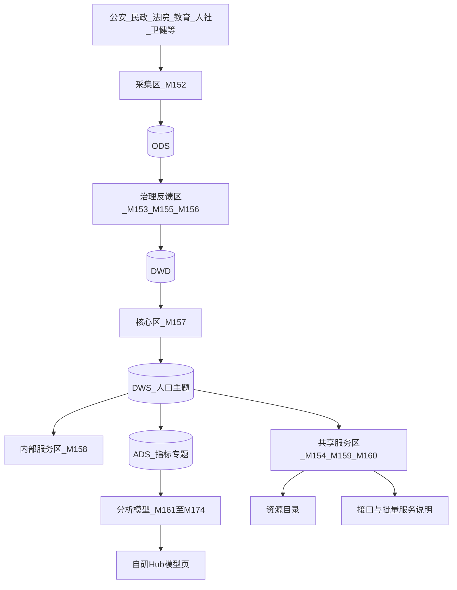
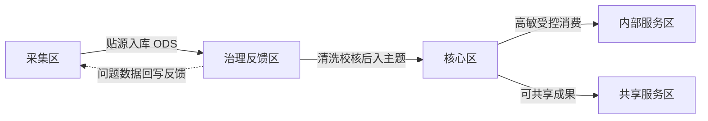
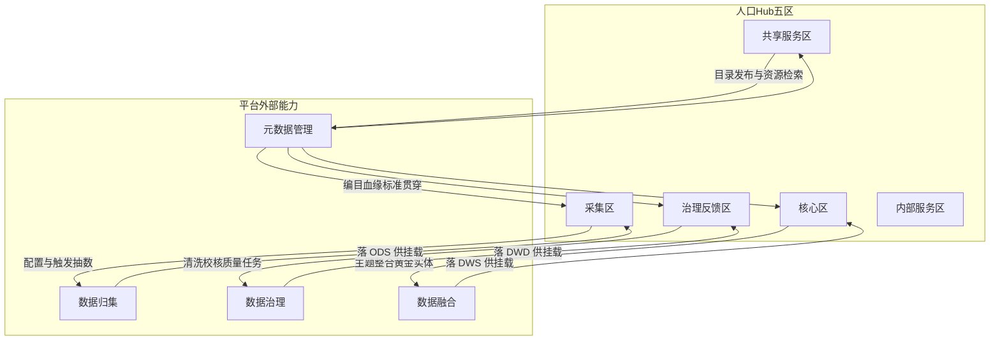

# 人口大数据支撑系统 · 设计规格

## 背景与决策

来源：V3 需求 `1.1.3.2.1` 人口大数据支撑系统（见 repair 摘要回链）；基线 [`docs/D02-需求基线说明.md`](../../D02-需求基线说明.md)、模块映射 [`docs/D06-Mxxx实现映射表.md`](../../D06-Mxxx实现映射表.md)、总体架构 [`docs/D07-总体技术架构设计.md`](../../D07-总体技术架构设计.md) §9.2；主链路 [`docs/repair/主业务流程.md`](../../repair/主业务流程.md)。

现网形态：业务支撑入口 → `/analytics/population` 五区 Hub（M152～M174），深链复用归集 / 治理 / 资源中心 / 目录；共享区含指标库与 14 个分析模型台账。

已确认决策：

| 项 | 结论 |
|----|------|
| 建设深度 | **方案 A**：补齐正式设计规格；不改业务代码 |
| 架构策略 | **能力映射叠加**：保留现有 Hub / 模块码，不新建独立人口子系统 |
| 展示 | **取消 DataEase**；人口域**不使用 BI**；模型以自研台账 + 指标 SQL + 样例/结果表呈现 |
| ETL 中间件 | 与三模块一致：**DolphinScheduler** 编排 + **Kettle Carte** 执行；人口域不自建 Spring 扫表定时 |

口径修正：D06/D07 中人口模型「DataEase iframe」映射**仅作历史记录**；本规格起人口域以自研展示为准。法人 / 宏观是否跟进不在本规格范围。

现网 Hub 人口域模型预览已改为自研样例表；签发 DataEase embed 对 `domain=population` **后端拒绝**。法人域等仍可走历史嵌入路径。其余主题表/校核/真接口属后续工程。

## 范围

**在范围内**

1. 五区逻辑设计、内部关系、与元数据/归集/治理/融合的外部关系
2. M152～M174 与五区 / 平台落点映射
3. 人员更新 / 校核 / 存储 / 双重授权 / 服务方式的设计口径
4. 十四模型设计卡（自研展示，无 BI）
5. 缺口与分期、文档验收口径
6. 更新 [`docs/repair/人口大数据支撑系统.md`](../../repair/人口大数据支撑系统.md) 摘要并回链本规格

**明确不在本规格文档阶段（工程分期另跟）**

- 人员主题库全量 DDL、真实多源校核引擎、生产级接口与批量前置全链路（B 余项 / C）
- 法人 / 宏观域强制去 DataEase（仅人口域已收敛）
- git 提交（按需由人工发起）

## 目标心智模型

```
部门源 → 归集(Kettle/DS) → ODS（采集区挂载）
       → 治理(Kettle/DS) → DWD（治理反馈区挂载）
       → 融合(Kettle/DS) → DWS（核心区挂载）→ 内部服务 / 共享服务
       → ADS 指标专题 → 自研 Hub 模型页（M161～M174）
元数据管理横切：编目 / 血缘 / 标准 / 目录发布
```

- 人口系统 = **域设计器 + 消费入口**，不独占 ETL。
- 真正跑数在归集 → 治理 → 融合；Hub 做五区资产挂载、授权边界、指标/模型编排与自研结果展示。
- **明确不用**：DataEase、第三方 BI、人口 IOC iframe。



## 内部五区关系

五区不是五个并列业务系统，而是**同一条人口数据链路上的五个逻辑分区**（管线 + 分流）。

口诀：**采集进、治理净、核心存、内部严、共享出。**



| 从 → 到 | 关系性质 | 说明 |
|---------|----------|------|
| 采集 → 治理反馈 | 上游供数 | 采集区只负责多源汇入与贴源存放；不在采集区做主题整合 |
| 治理反馈 → 核心 | 加工产出 | 检核/清洗/标准化/时点事实后，形成可进核心的权威人口数据；问题数据留在反馈区并回流原单位 |
| 核心 → 内部服务 | 受控分流 | 核心是「一数一源」权威库；内部服务区面向高敏感、高权限场景，绑定双重授权 |
| 核心 → 共享服务 | 对外分流 | 目录可发布资源、接口/批量、指标与 14 模型均消费核心（及 ADS 专题）成果 |
| 治理 ↔ 采集 | 反馈闭环 | 校核发现问题不直接改核心权威值，而是反馈采集侧/源部门更正后再入链 |
| 五区之间 | 禁止旁路 | 共享/内部不得绕过核心直接挂未治理贴源当权威；采集不得直接对共享发布 |

## 五区与外部系统关系

人口五区是**逻辑域视图**；元数据管理、数据归集、数据治理、数据融合是**平台能力**。关系是「挂载 + 深链复用」，人口域不另造一套 ETL。



| 外部系统 | 主要对接的人口区 | 关系定义 |
|----------|------------------|----------|
| 数据归集 | 采集区 | 归集 = 执行面（Kettle + DS 定时）；采集区 = 人口域对「哪些人口源进 ODS」的设计与资产挂载入口 |
| 数据治理 | 治理反馈区 | 治理 = 检核/清洗/质量/问题库；治理反馈区挂 DWD 过程与问题数据，承载更新维护(M155)、校核(M156) 设计口径 |
| 数据融合 | 核心区（延伸供给内部/共享） | 融合 = 多源人员实体整合、主题宽表/多维；核心区挂 DWS 人口主题成果 |
| 元数据管理 | 贯穿五区，共享区最显式 | 标准、编目、血缘、资源登记；M154 人口源目录与目录深链直接消费；各区挂载表须可追溯 |

边界口诀：

- 人口 Hub：设计、挂载、授权边界、指标/模型消费
- 归集 / 治理 / 融合：真正跑数与落库
- 元数据：是什么、从哪来、能否共享（横切，不是第五条加工链）

现网深链：采集 → `/exchange/ingestion`；治理反馈 → `/governance`；核心 / 内部 → `/resource-center`；共享 → `/catalog`。

## 模块与五区映射

| 需求能力 | M 码 | Hub 区 | 平台落点 |
|----------|------|--------|----------|
| 人口数据采集 | M152 | collect | `/exchange/ingestion`，ODS 挂载 |
| 分区 / 治理反馈定位 | M153 | govern | `/governance`，DWD |
| 人口源目录 | M154 | share | `/catalog` |
| 更新维护 | M155 | govern | 归集定时 + 治理规范（设计口径） |
| 信息校核 | M156 | govern | 质量/校核任务设计口径；问题回写部门 |
| 存储管理 | M157 | core | 资源中心分区/备份策略 |
| 双重授权 | M158 | internal | 对齐 M048/M211：系统管理员不授跨部门数据访问权 |
| 接口服务 | M159 | share | 共享区「接口」页 + 目录/ESB 封装口径 |
| 批量应用 | M160 | share | 共享区「批量」页 + 交换前置口径 |
| 14 分析模型 | M161～M174 | share·models | 自研模型台账 + 指标 SQL + 样例/结果表 |

## 五区设计口径

每区均标明：**逻辑要求** vs **现网形态（挂载 + 深链，本期不改代码）**。七维度：定位 / 数据模型 / 加工处理 / 存储周期 / 数据来源 / 使用者 / 更新频度。

### 采集区（M152）

| 维度 | 口径 |
|------|------|
| 定位 | 多源异构人口数据统一汇入大数据平台；含结构化（人员基本/教育/婚姻等）与非结构化（电子证照等）；按时效区分行为类高时效与档案类低时效通道 |
| 数据模型 | 贴源结构为主；通道类型覆盖库表、文件、API |
| 加工处理 | 本区不做主题整合；仅接入、落 ODS、登记元数据 |
| 存储周期 | 长期可存；容量策略随存储扩展 |
| 数据来源 | 公安、民政、法院及教育/人社/民政/卫健等业务系统 |
| 使用者 | 治理反馈区 |
| 更新频度 | 默认月更；可按日/周/季/半年/年配置（走 ExecCycle + DS） |
| 现网形态 | Hub 采集区挂载 ODS/SOURCE 候选；深链归集 |

### 治理及反馈区（M153 / M155 / M156）

| 维度 | 口径 |
|------|------|
| 定位 | 存放问题数据、半结构化、非结构化转结构化结果；提供周期脏数据供质量分析与问题反馈 |
| 数据模型 | 贴源 + 规范化；流水类周期增量切片 |
| 加工处理 | 技术性/合法性检核清洗；时点记录变更事实；半结构/非结构预处理与结构化 |
| 存储周期 | 长期可存；预处理/反馈库中等体量、高吞吐 |
| 数据来源 | 采集区；外部数据区 |
| 使用者 | 核心区；服务区（经核心分流，不旁路权威） |
| 更新频度 | 默认月更；可按日/周/季/半年/年 |
| 现网形态 | Hub 治理区挂载 DWD；深链数据治理；M155/M156 为设计与台账口径 |

### 核心区（M157）

| 维度 | 口径 |
|------|------|
| 定位 | 统一标准的人口基础/主题权威区；「一数一源」；按业务分类存放；可集成前端回流指标 |
| 数据模型 | 宽表、多维；允许冗余；结构化为主；可在基础/主题之上扩展专业库（户籍、征信、刑侦等，逻辑分层） |
| 加工处理 | 多源合并到同一人员实体；跨业务应用计算；提取服务区特征 |
| 存储周期 | 长期可存；垂直分片（如相片独立库）、水平分区；历史/审计近线 |
| 数据来源 | 治理及反馈区（经融合落入 DWS） |
| 使用者 | 内部服务区；共享服务区 |
| 更新频度 | 默认月更；可按业务配置 |
| 现网形态 | Hub 核心区挂载资源中心纳管表（逻辑层 DWS）；深链资源中心 |

### 内部服务区（M158）

| 维度 | 口径 |
|------|------|
| 定位 | 高权限、高敏感人口基础数据应用场景的独立服务边界 |
| 数据模型 | 消费核心区权威结构化数据；不另建第二权威源 |
| 加工处理 | 按分级分类与双重授权做受控查询/应用；系统管理员可授部门管理员角色，**不可**直接授跨部门数据访问权 |
| 存储周期 | 跟随核心；访问审计日志可近线 |
| 数据来源 | 核心区 |
| 使用者 | 部门内高敏业务应用与管理员 |
| 更新频度 | 跟随核心供数节奏 |
| 现网形态 | Hub 内部区挂载 + 资源中心深链；授权语义对齐全局 RBAC（M048/M211） |

### 共享服务区（M154 / M159 / M160 + M161～M174）

| 维度 | 口径 |
|------|------|
| 定位 | 人口资源目录、接口/批量共享、指标与分析模型消费 |
| 数据模型 | 可发布目录项、接口契约、批量交换库、ADS 指标/专题结果 |
| 加工处理 | 目录梳理与发布；小流量接口（校核/比对/基准叠加）；大批量前置交换；自研模型结果展示 |
| 存储周期 | 目录与接口元数据长期；批量结果库按交换周期清理或归档 |
| 数据来源 | 核心区（及 ADS） |
| 使用者 | 共建单位应用、目录用户、人口 Hub 分析用户 |
| 更新频度 | 跟随核心/专题；模型结果随指标任务 |
| 现网形态 | 共享区设计器：挂载 / 目录深链 / 接口·批量说明 / 指标 / 模型列表；模型不进侧栏独立系统 |

## 人员信息三大机制

### 更新维护（M155）

- 户籍基准由公安定时维护；各部门负责本域基础数据增改（教育/人社/民政/卫健等）。
- 平台主动从业务系统采集至原始库（ODS），再标准化进入资源库（经治理/融合至 DWS）。
- 管理机制保障鲜活性与真实性；技术落点复用归集定时（DS + Kettle），非人口域自建调度。

### 校核（M156）

- 各部门信息入原始库后做检查与基准校核，使业务信息与人员基础信息对应。
- 多源校核覆盖：注销人员、出生未申报户口、婚姻状况等。
- 质量问题反馈信息提供单位，业务侧更正后再走维护流程入链；**不在核心区静默篡改权威值**。

### 存储管理（M157）

- 垂直分片：如相片与基础信息分库。
- 水平分区：按业务/时间等切分。
- 历史库与安全审计：量大、实时性低 → 近线/低成本存储。
- 预处理与反馈库：中等体量、高吞吐 → 高性能存储。
- 现网：资源中心分区/备份策略承载设计；物理专项落地属后续分期。

## 服务方式

| 方式 | 适用 | 设计口径 |
|------|------|----------|
| 服务接口（M159） | 小数据量 | 应用校核、核查比对、基准叠加；政务外网向共建单位应用提供 |
| 大批量应用（M160） | 大数据量 | 共建单位前置批量库 ↔ 交换系统 ↔ 共享平台批量结果库往返 |

现网诚实表述：Hub 共享区提供设计页与目录/交换深链；真实生产 API 与批量全链路属后续工程分期。

## 十四模型设计卡（自研展示）

统一展示形态：**模型台账 + 关联指标 SQL + 样例/结果表（≥100 行样例可验收）**；可选自研图类型仅作结果页增强，**不依赖 BI**。默认消费层：指标在 ADS，明细/维表在 DWS。

| M 码 | 模型 | 分析对象 | 核心维度 | 建议指标 | 自研展示 |
|------|------|----------|----------|----------|----------|
| M161 | 户籍人口统计 | 户籍人口 | 地域、年龄、职业 | 户籍人口数、分区占比、年龄结构比 | 台账 + 分区汇总表 |
| M162 | 城镇人口统计 | 城镇人口 | 数量、增长、流动 | 城镇人口数、增长率、流入/流出 | 台账 + 趋势表 |
| M163 | 年龄结构 | 全口径人口 | 年龄段、时间 | 各年龄段占比、老龄化率 | 台账 + 年龄段占比表 |
| M164 | 学历结构 | 劳动/教育相关人口 | 学历、地域 | 各学历占比、分布 | 台账 + 学历占比表 |
| M165 | 出生人口 | 出生登记人口 | 时间、性别、生育 | 出生数、出生性别比、生育率 | 台账 + 分年汇总表 |
| M166 | 离异统计 | 离异人口 | 时间、原因（若可得） | 离异人数、离婚率 | 台账 + 分年汇总表 |
| M167 | 贫困人口 | 贫困/救助对象 | 地域、致贫因、政策效果 | 贫困人口数、分布、脱贫相关指标 | 台账 + 分区汇总表 |
| M168 | 重点人口 | 重点关注人员 | 类别、地域、管控状态 | 重点人口数、类别占比 | 台账 + 分类汇总表 |
| M169 | 残疾人口 | 残疾人口 | 类型、地域、康复需求 | 残疾人口数、类型占比 | 台账 + 类型汇总表 |
| M170 | 党员统计 | 党员人口 | 地域、时间、发展趋势 | 党员数、分布、增长 | 台账 + 分区汇总表 |
| M171 | 常住同比 | 常住人口 | 同比时间段、地域 | 常住人口数、同比增速 | 台账 + 同比对比表 |
| M172 | 死亡同比 | 死亡人口 | 同比时间段、地域 | 死亡人数、同比变化 | 台账 + 同比对比表 |
| M173 | 人口空间分析 | 人口空间分布 | 行政区/网格 | 密度、热点分区人口数 | 台账 + 分区空间汇总表 |
| M174 | 义务教育阶段空间 | 义务教育适龄人口 | 学区/行政区 | 适龄人口数、学位相关占比 | 台账 + 分区汇总表 |

验收：按模型名称与上表最小指标集出表即可；不要求 DataEase 出图。

## 与主业务链路及中间件

对齐主业务流程：归集 + 治理融合 → 人口域模型/指标 → **自研 Hub 展示**（不再经 DataEase IOC）。

ETL：执行面 Kettle Carte；定时编排主路径 DolphinScheduler；手动执行直调 Carte。详见 [`2026-08-11-etl-ds-only-schedule-design.md`](./2026-08-11-etl-ds-only-schedule-design.md)。

## 缺口与分期

| 分期 | 内容 |
|------|------|
| 本期 A | 本规格 + repair 回链（含取消 DataEase、五区内外关系）— **已完成** |
| 后续 B | 主题表/指标落地、校核台账、接口骨架；**收敛现网 DataEase embed 为自研结果页** — **自研结果页部分已落地**（Hub 样例表 + 后端拒绝人口 embed）；主题表/校核/接口骨架仍待做 |
| 后续 C | 部门真源、双重授权数据权引擎、批量前置生产链路、物理分区策略落地 |

## 验收口径（本期文档）

1. 本规格无占位矛盾；五区与 M152～M174 全覆盖映射。
2. 内部五区关系、与归集/治理/融合/元数据关系两节完整。
3. 全文不将 DataEase/BI 列为人口域依赖；模型展示路径为自研。
4. repair 文可跳转本规格；明确「现网可演示（台账/样例）」与「逻辑设计待工程」分界。
