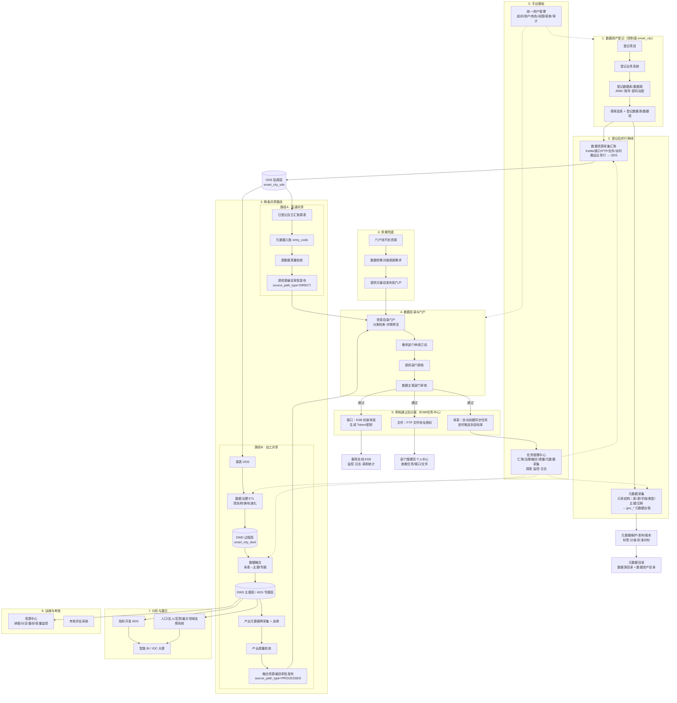

# 智慧城市大数据平台 — 主业务流程图

> 依据 `docs/repair/主业务流程.md`、`docs/D17-系统优化流程及方式.md`（R5/R6 双路径架构）整理。  
> 更新日期：2026-08-08

---

## 一、总览流程图



---

## 二、结构化主链（登记 → 归集 → 台账）

```text
登记外部数据源（地址/端口/库名/用户名/加密密码）
→ 测试连接
→ 探库并勾选源表
→ 登记表和字段（collect_status=PENDING）
→ 手动或定时执行 Kettle 汇聚
→ 业务行写入 smart_city_ods
→ 汇聚成功回写 SUCCESS、physical_table_name
→ 自动登记 SOURCE/TABLE/COLUMN 元数据并生成血缘
```

| 环节 | 负责内容 | 是否搬运业务行 | 主要落库 |
|------|----------|:--------------:|----------|
| 数据资产登记 | 首次登记外部系统连接、库表结构、字段、主键、责任信息 | 否 | `smart_city.ing_*` |
| 数据资源采集汇聚 | 按任务从外部系统读取真实业务数据 | 是 | 结构化 → `smart_city_ods`；文件/半结构化 → SeaweedFS、MongoDB、ES 等 |
| 元数据采集 | JDBC / `information_schema` 探测表、字段、类型、主键、注释 | 否 | `smart_city.gov_*` |
| 治理/融合加工 | 清洗、转换、标准化、聚合并形成新数据资产 | 是 | `smart_city_dwd` / `smart_city_dws` / `smart_city_ads` |

---

## 三、分阶段说明

### 阶段 0：平台基础

- **统一用户管理**：全平台组织、用户、角色、权限、菜单、应用、授权、审计
- **任务管理中心**：元数据采集、汇聚、治理、融合、质量、指标等任务的调度、监控、日志

### 阶段 1：数据资产登记（一切起点）

```text
项目 → 业务系统 → 数据库/数据源 → 数据表 → 数据项
```

- 外部系统连接参数**只允许在数据源登记时首次填写**；密码后端加密保存
- 后续治理、质量、融合、编目等模块**必须从已登记对象下拉选择**，不得重复填写 JDBC

### 阶段 2：登记后并行两线

| 环节 | 做什么 | 落库 |
|------|--------|------|
| **元数据采集** | 扫库/表/字段结构，增量发现 DDL 变更 | `gov_*` 元数据台账 |
| **采集汇聚** | 单表/多表/整库/接口/FTP/文件/实时等方式接入 | `smart_city_ods` |

元数据经维护、发布、版本管理后进入 **元数据目录**（数据源目录 + 数据资产目录），作为数据家底台账。

### 阶段 3：两条共享路径

#### 路径 A · 直通共享

源表已达标、可直接对外共享时使用：

```text
已登记且已汇聚源表
→ 元数据入账（entry_code）
→ 源数据质量检核
→ 源资源编目审批发布（source_path_type=DIRECT）
→ 门户可见
```

#### 路径 B · 加工共享

需经治理、融合后再共享时使用：

```text
源表 ODS
→ 数据治理 ETL（清洗/转换/标准化）→ DWD 过程层
→ 数据融合（多表→主题/专题）→ DWS / ADS
→ 产出元数据再采集 + 源→产出血缘
→ 产出质量检核
→ 融合资源编目审批发布（source_path_type=PROCESSED）
→ 门户可见
```

**分层口径（硬约束）**

| 层级 | 库 | 是否默认进门户 |
|------|-----|:--------------:|
| ODS 源层 | `smart_city_ods` | 直通达标源可编目 |
| DWD 过程层 | `smart_city_dwd` | 否（过程数据） |
| DWS 主题层 | `smart_city_dws` | 加工后可编目 |
| ADS 专题层 | `smart_city_ads` | 加工后可编目 |

### 阶段 4：数据目录与门户

门户可展示两类已发布目录：

1. **归集侧**：数据资源采集汇聚 → 指标与目录体系构建 → 发布
2. **治理侧**：大数据融合治理平台 → 数据目录管理 → 编目审批发布

申请审批链：

```text
门户检索 → 申请订阅 → 提供部门审核 → 数据主管部门审核 → 通过
```

共享权限包括：**无条件共享**、**有条件共享**（需上传依据文件）。

### 阶段 5：审核通过后分发

| 共享形式 | 处理方式 | 管理方 |
|----------|----------|--------|
| **库表** | 任务中心自动创建同步任务，定时推送到目标数据库 | 任务管理中心 |
| **接口** | ESB 封装转发，生成 Token/密钥 | 服务总线 ESB |
| **文件** | 授权 FTP 文件服务器地址 | 部门个人中心查看 |

### 阶段 6：供需兜底

```text
门户未找到所需资源
→ 数据供需对接系统填报需求
→ 提供方通过编目模块发布到门户
→ 需求方再次申请
```

### 阶段 7：分析与展示

- **数据指标系统**：治理/融合后的数据开发指标，结果落 ADS
- **智能 BI 平台**：ADS 层表制作 IOC 大屏（基础库统计、重点领域、领导决策门户等）
- **业务支撑系统**：人口、法人、宏观经济及工业运行、重点领域示范应用等，复用归集与治理能力

### 阶段 8：运维与考核

- **资源中心**：主题/专题纳管、分区策略、逻辑备份、容量监控
- **考核评估系统**：各部门数据共享与任务执行考核

---

## 四、核心对象与模块映射

### 4.1 entry_code 全链路串联

```text
元数据台账（gov_metadata_registry）
→ 质量任务/运行（gov_quality_*）
→ 目录资源（gov_catalog_resource）
→ 订阅申请（gov_catalog_subscription）
→ 授权台账（gov_catalog_authorization）
→ 资产 360 一屏联动
```

### 4.2 子系统职责一览

| 子系统 | 核心职责 |
|--------|----------|
| 统一用户管理 | 组织、用户、角色、权限、菜单、审计 |
| 数据资产登记管理 | 项目/系统/库/表/项登记，连接与责任申报 |
| 数据资源采集汇聚 | 多源接入、业务行搬运、归集侧编目 |
| 元数据管理系统 | 结构采集、维护、版本、目录、血缘/关联分析 |
| 数据治理系统 | 单表/多表 ETL 清洗，产出 DWD |
| 数据融合系统 | 多表融合为主题/专题，产出 DWS/ADS |
| 数据质量管理系统 | 规则配置、任务执行、监控、评估、报告 |
| 数据目录管理系统 | 资源编制、注册发布、审批、门户、申请订阅 |
| 部门数据共享门户 | 目录展示、申请、审批、个人中心 |
| 数据供需对接 | 需求填报与供需匹配 |
| 服务总线 ESB | 接口开发、封装转发、运行监控 |
| 任务管理中心 | 全平台任务调度与监控 |
| 大数据平台资源中心 | 纳管、分区、备份、检索、统计、监控 |
| 智能 BI / 业务支撑 | 指标展示、IOC 大屏、领域分析 |

---

## 五、关键边界（开发/验收须遵守）

1. **元数据采集只采结构，不搬业务行**；Kettle 汇聚才写 ODS。
2. **JDBC 连接参数只在登记环节填写一次**，密码加密、不回显明文。
3. **DWD 过程层默认不可编目进门户**；目录挂直通源或加工主题/专题。
4. **治理与融合分域**：治理任务 `GOVERNANCE`（ODS→DWD）；融合任务 `FUSION`（DWD→DWS/ADS）。
5. **ESB 是订阅审批后的真实对外交换通道**；本地授权台账为当前验收主路径，ESB 联调为增强项。
6. **`sys_admin` 系统管理员拥有全量操作权限**，不因项目/数据授权配置而削减。

---

## 六、相关文档

- [`docs/repair/主业务流程.md`](repair/主业务流程.md) — 子系统职责原文
- [`docs/D17-系统优化流程及方式.md`](D17-系统优化流程及方式.md) — R5 双路径架构、R6 黄金路径
- [`docs/D07-总体技术架构设计.md`](D07-总体技术架构设计.md) — 分层与模块边界
- [`docs/承德高新区智慧城市基础平台建设.md`](承德高新区智慧城市基础平台建设.md) — 投标功能说明原文
